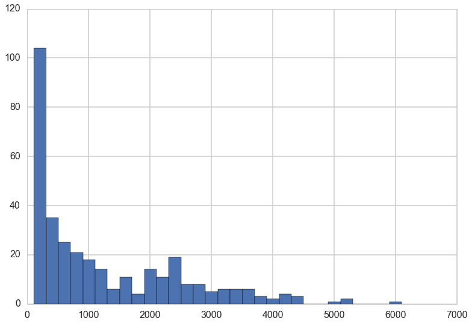
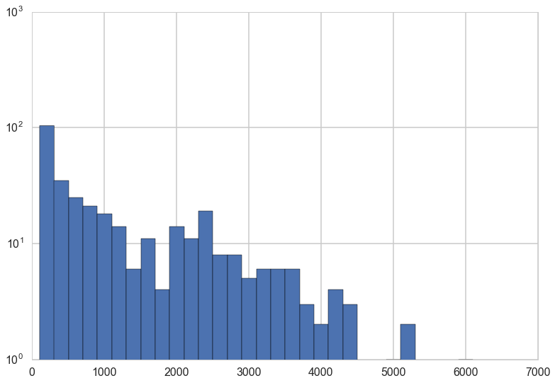
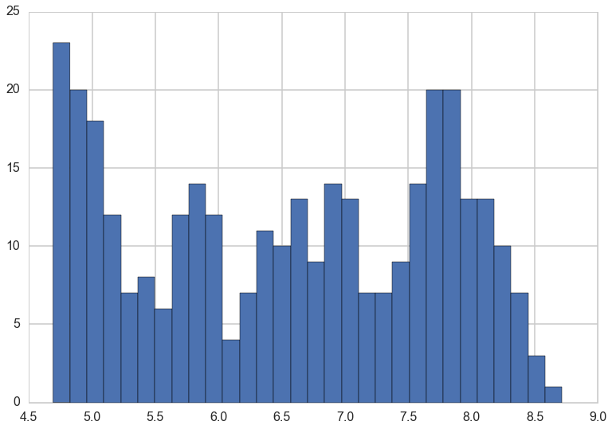
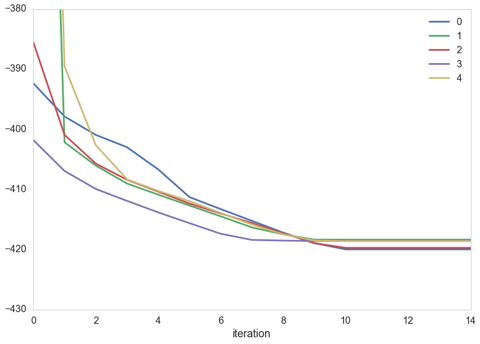
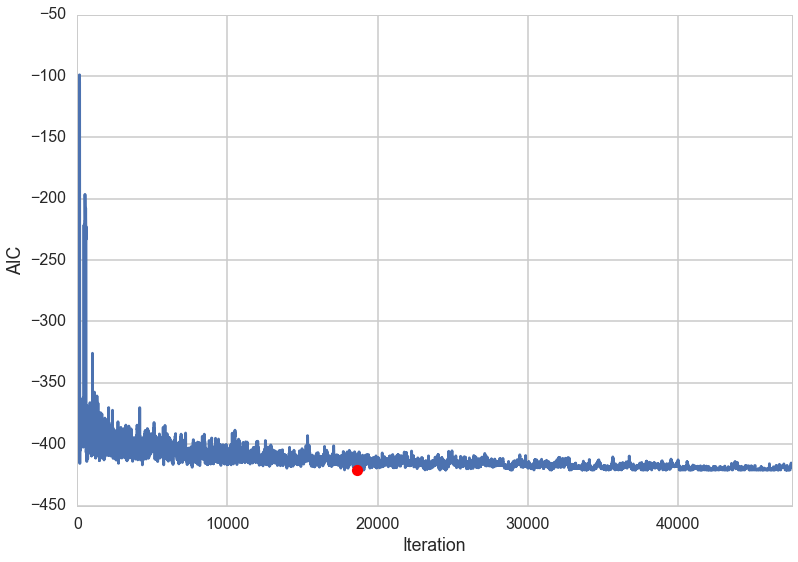



## Contents
{:.no_toc}
*  
{: toc}


## Contents
{:.no_toc}
* 
{: toc}

## The baseball data set

(from Givens and Hoeting, which this discussion follows)

```
Source: Baseball data from M.R. Watnik (1998), "Pay for Play: Are
Baseball Salaries Based on Performance", Journal of Statistics
Education, Volume 6, number 2
(http://www.amstat.org/publications/jse/v6n2/datasets.watnik.html)

Description: Salaries in 1992 and 27 performance statistics for 337 baseball
players (no pitchers) in 1991.


salary ($1000s)
average = batting average
obp = on base percentage
runs = runs scored
hits
doubles
triples
homeruns
rbis = runs batted in
walks
sos = strike outs
sbs = stolen bases
errors
freeagent (or eligible for free agency)
arbitration (or eligible for arbitration)
runsperso = runs/sos
hitsperso = hits/sos
hrsperso = homeruns/sos
rbisperso = rbis/sos
walksperso = walks/sos
obppererror = obp/errors
runspererror = runs/errors
hitspererror = hits/errors
hrspererror = homeruns/errors
soserrors = sos*errors
sbsobp = sbs*obp
sbsruns = sbs*runs
sbshits = sbs*hits
```

We wish to solve a prediction problem:  can we predict baseball player salaries from various statistics about the player? Specifically, we would like to choose an optimal set of features that would give us good predictions, and we want to be parsimonius about these features so that we dont overfit.

With 27 features, there are possibly $2^{27}$ models! So there is no way we are going to be able to do an exhaustive search.


```python
baseball = pd.read_table("data/baseball.dat", sep='\s+')
baseball.head()
```


<div>
<table border="1" class="dataframe">
  <thead>
    <tr style="text-align: right;">
      <th></th>
      <th>salary</th>
      <th>average</th>
      <th>obp</th>
      <th>runs</th>
      <th>hits</th>
      <th>doubles</th>
      <th>triples</th>
      <th>homeruns</th>
      <th>rbis</th>
      <th>walks</th>
      <th>sos</th>
      <th>sbs</th>
      <th>errors</th>
      <th>freeagent</th>
      <th>arbitration</th>
      <th>runsperso</th>
      <th>hitsperso</th>
      <th>hrsperso</th>
      <th>rbisperso</th>
      <th>walksperso</th>
      <th>obppererror</th>
      <th>runspererror</th>
      <th>hitspererror</th>
      <th>hrspererror</th>
      <th>soserrors</th>
      <th>sbsobp</th>
      <th>sbsruns</th>
      <th>sbshits</th>
    </tr>
  </thead>
  <tbody>
    <tr>
      <th>0</th>
      <td>3300</td>
      <td>0.272</td>
      <td>0.302</td>
      <td>69</td>
      <td>153</td>
      <td>21</td>
      <td>4</td>
      <td>31</td>
      <td>104</td>
      <td>22</td>
      <td>80</td>
      <td>4</td>
      <td>4</td>
      <td>1</td>
      <td>0</td>
      <td>0.8625</td>
      <td>1.9125</td>
      <td>0.3875</td>
      <td>1.3000</td>
      <td>0.2750</td>
      <td>0.0755</td>
      <td>17.2500</td>
      <td>38.2500</td>
      <td>7.7500</td>
      <td>320</td>
      <td>1.208</td>
      <td>276</td>
      <td>612</td>
    </tr>
    <tr>
      <th>1</th>
      <td>2600</td>
      <td>0.269</td>
      <td>0.335</td>
      <td>58</td>
      <td>111</td>
      <td>17</td>
      <td>2</td>
      <td>18</td>
      <td>66</td>
      <td>39</td>
      <td>69</td>
      <td>0</td>
      <td>4</td>
      <td>1</td>
      <td>0</td>
      <td>0.8406</td>
      <td>1.6087</td>
      <td>0.2609</td>
      <td>0.9565</td>
      <td>0.5652</td>
      <td>0.0838</td>
      <td>14.5000</td>
      <td>27.7500</td>
      <td>4.5000</td>
      <td>276</td>
      <td>0.000</td>
      <td>0</td>
      <td>0</td>
    </tr>
    <tr>
      <th>2</th>
      <td>2500</td>
      <td>0.249</td>
      <td>0.337</td>
      <td>54</td>
      <td>115</td>
      <td>15</td>
      <td>1</td>
      <td>17</td>
      <td>73</td>
      <td>63</td>
      <td>116</td>
      <td>6</td>
      <td>6</td>
      <td>1</td>
      <td>0</td>
      <td>0.4655</td>
      <td>0.9914</td>
      <td>0.1466</td>
      <td>0.6293</td>
      <td>0.5431</td>
      <td>0.0562</td>
      <td>9.0000</td>
      <td>19.1667</td>
      <td>2.8333</td>
      <td>696</td>
      <td>2.022</td>
      <td>324</td>
      <td>690</td>
    </tr>
    <tr>
      <th>3</th>
      <td>2475</td>
      <td>0.260</td>
      <td>0.292</td>
      <td>59</td>
      <td>128</td>
      <td>22</td>
      <td>7</td>
      <td>12</td>
      <td>50</td>
      <td>23</td>
      <td>64</td>
      <td>21</td>
      <td>22</td>
      <td>0</td>
      <td>1</td>
      <td>0.9219</td>
      <td>2.0000</td>
      <td>0.1875</td>
      <td>0.7812</td>
      <td>0.3594</td>
      <td>0.0133</td>
      <td>2.6818</td>
      <td>5.8182</td>
      <td>0.5455</td>
      <td>1408</td>
      <td>6.132</td>
      <td>1239</td>
      <td>2688</td>
    </tr>
    <tr>
      <th>4</th>
      <td>2313</td>
      <td>0.273</td>
      <td>0.346</td>
      <td>87</td>
      <td>169</td>
      <td>28</td>
      <td>5</td>
      <td>8</td>
      <td>58</td>
      <td>70</td>
      <td>53</td>
      <td>3</td>
      <td>9</td>
      <td>0</td>
      <td>1</td>
      <td>1.6415</td>
      <td>3.1887</td>
      <td>0.1509</td>
      <td>1.0943</td>
      <td>1.3208</td>
      <td>0.0384</td>
      <td>9.6667</td>
      <td>18.7778</td>
      <td>0.8889</td>
      <td>477</td>
      <td>1.038</td>
      <td>261</td>
      <td>507</td>
    </tr>
  </tbody>
</table>
</div>


```python
baseball.salary.hist(bins=30)
```


    <matplotlib.axes._subplots.AxesSubplot at 0x1170f9dd8>





```python
baseball.salary.hist(bins=30)
plt.yscale('log')
```





Since the salaries are highly skewed, a log transform on the salaries is a good idea.


```python
predictors = baseball.copy()
logsalary = predictors.pop('salary').apply(np.log)
nrows, ncols = predictors.shape
```


```python
plt.hist(logsalary,  bins=30);
```





## AIC for linear regression

The AIC for a model is the training deviance plus twice the number of parameters.

$$AIC = D_{train} + 2p$$

where the deviance is defined as:

$$D(q) = -2 \sum_i log(q_i)$$,

That is, -2 times the log likelihood of the model.

So, one we find the MLE solution for the linear regression, we plugin the values we get, which are

$$\sigma_{MLE}^2 =  \frac{1}{N} SSE $$

where SSE is the sum of the  squares of the errors.

$$AIC = -2(-\frac{N}{2}(log(2\pi) + log(\sigma^2)) -2(-\frac{1}{2\sigma_{MLE}^2} \times SSE) + 2p$$

Thus:

$$AIC = Nlog(SSE/N) + 2p + constant$$


```python
from sklearn.linear_model import LinearRegression
aic = lambda g, X, y: len(y) * np.log(sum((g.predict(X) - y)**2)/len(y)) + 2*g.rank_
```


## Local Search with random starts

The code for this part is taken from Chris Fonnesbeck's Bios 8366 Lecture Notes.

Combinatoric  problems are hard, so we turn to **Heuristics**. These have no guarantee of a global minimum, but do reasonably well, especially if you run them multiple times and try different starts.

The basic idea is to start with some solution, and perturb it a bit to get another solution in the **"local"** neighborhood of the initial solution. The point here is to not be exhaustive, but rather, to limit the search.

We want to start with different randomly chosen solutions, since local search can get trapped in local minima.

Here we start at 5 different initial solutions as to which features to choose, and run the local search algorithm for 15 iterations, starting from each of these 5 initial solutions.


```python
nstarts = 5
iterations = 15
runs = np.random.binomial(1, 0.5, ncols*nstarts).reshape((nstarts,ncols)).astype(bool)
runs
```


    array([[False,  True, False,  True, False,  True,  True, False,  True,
            False, False,  True, False,  True, False,  True, False, False,
            False, False, False, False,  True, False, False,  True,  True],
           [ True, False,  True,  True, False, False,  True,  True, False,
             True, False, False, False, False, False, False,  True, False,
            False,  True, False, False,  True, False, False, False, False],
           [False,  True,  True, False,  True, False,  True, False,  True,
            False,  True,  True, False,  True, False,  True, False, False,
            False,  True,  True, False, False,  True,  True, False,  True],
           [False,  True,  True,  True, False, False,  True, False, False,
            False, False,  True,  True, False, False, False, False, False,
            False,  True,  True,  True,  True,  True, False, False, False],
           [False,  True,  True, False,  True,  True, False, False, False,
            False, False,  True, False, False, False, False,  True, False,
            False,  True, False,  True, False,  True, False, False,  True]], dtype=bool)


Here is our algorithm.

1. For each start,for each iteration
    1. with our initial predictors we fit for the regression and calculate the aic
    2. we now get the 1-change neighborhhod by:
        1. systematically flipping each column and calculating the aic
        2. find the minimum aic for the process and record the predictors
    3. go to A and repeat for the latest  predictors
    4. record the solution for this starting point and go to 1.


```python
from sklearn.linear_model import LinearRegression

runs_aic = np.empty((nstarts, iterations))

for i in range(nstarts):
    
    run_current = runs[i]
    
    for j in range(iterations):
        
        # Extract current set of predictors
        run_vars = predictors[predictors.columns[run_current]]
        g = LinearRegression().fit(X=run_vars, y=logsalary)
        run_aic = aic(g, run_vars, logsalary)
        run_next = run_current
        
        # Test all models in 1-neighborhood and select lowest AIC
        for k in range(ncols):
            run_step = run_current.copy()
            run_step[k] = not run_current[k]
            run_vars = predictors[predictors.columns[run_step]]
            g = LinearRegression().fit(X=run_vars, y=logsalary)
            step_aic = aic(g, run_vars, logsalary)
            if step_aic < run_aic:
                run_next = run_step.copy()
                run_aic = step_aic
            
        run_current = run_next.copy()
        runs_aic[i,j] = run_aic
        
    runs[i] = run_current
                
```


These are the final variable selections for our runs.


```python
runs
```


    array([[False,  True,  True, False, False,  True, False,  True, False,
             True, False,  True,  True,  True,  True,  True, False, False,
            False, False, False, False, False, False,  True,  True, False],
           [ True, False,  True, False, False, False, False,  True, False,
             True, False, False,  True,  True,  True,  True, False, False,
            False, False, False, False, False,  True, False, False, False],
           [False,  True,  True, False, False, False, False,  True, False,
             True, False, False,  True,  True,  True,  True, False, False,
            False, False, False, False, False,  True,  True, False,  True],
           [False, False,  True, False, False,  True, False,  True, False,
             True, False, False,  True,  True, False, False, False, False,
            False,  True,  True,  True, False,  True,  True, False, False],
           [False, False,  True, False, False,  True, False,  True, False,
             True, False, False,  True,  True, False, False, False, False,
            False,  True,  True,  True, False,  True,  True, False, False]], dtype=bool)


We can plot how the aic evolves in the 5 random starts


```python
pd.DataFrame(runs_aic).T.plot(grid=False)
plt.xlabel('iteration')
plt.ylim([-430, -380])
```


    (-430, -380)





```python
for i in range(5):
    print(i, np.min(runs_aic[i]))
```


    0 -420.000042669
    1 -418.380197435
    2 -419.743167044
    3 -418.611888647
    4 -418.611888647


To see which features are really important, see how many of the 5 starts solutions do they appear in...


```python
pd.Series(runs.sum(0), index=predictors.columns).sort_values(ascending=False)
```


    arbitration     5
    rbis            5
    freeagent       5
    obppererror     4
    sos             4
    hitsperso       3
    sbshits         3
    hitspererror    3
    sbsobp          3
    soserrors       2
    runs            2
    hrsperso        2
    runsperso       2
    triples         2
    walks           2
    walksperso      1
    hits            1
    average         1
    sbsruns         1
    rbisperso       1
    sbs             0
    errors          0
    homeruns        0
    hrspererror     0
    doubles         0
    obp             0
    runspererror    0
    dtype: int64


And we can also query what the use of features in the final solutions was...


```python
for i in range(nstarts):
    print(np.where(runs[i]==True))
```


    (array([ 1,  2,  5,  7,  9, 11, 12, 13, 14, 15, 24, 25]),)
    (array([ 0,  2,  7,  9, 12, 13, 14, 15, 23]),)
    (array([ 1,  2,  7,  9, 12, 13, 14, 15, 23, 24, 26]),)
    (array([ 2,  5,  7,  9, 12, 13, 19, 20, 21, 23, 24]),)
    (array([ 2,  5,  7,  9, 12, 13, 19, 20, 21, 23, 24]),)


## Simulated Annealing


```python
bbinits=dict(solution=np.random.binomial(1, 0.5, ncols).astype(bool),
               length=100, T=100)
```


```python
def efunc(solution):
    solution_vars = predictors[predictors.columns[solution]]
    g = LinearRegression().fit(X=solution_vars, y=logsalary)
    return aic(g, solution_vars, logsalary)
def pfunc(solution):
    flip = np.random.randint(0, ncols)
    solution_new = solution.copy()
    solution_new[flip] = not solution_new[flip]
    return solution_new
```


```python
def sa(energyfunc, initials, epochs, tempfunc, iterfunc, proposalfunc):
    accumulator=[]
    best_solution = old_solution = initials['solution']
    T=initials['T']
    length=initials['length']
    best_energy = old_energy = energyfunc(old_solution)
    accepted=0
    total=0
    for index in range(epochs):
        print("Epoch", index)
        if index > 0:
            T = tempfunc(T)
            length=iterfunc(length)
        print("Temperature", T, "Length", length)
        for it in range(length):
            total+=1
            new_solution = proposalfunc(old_solution)
            new_energy = energyfunc(new_solution)
            
            alpha = min(1, np.exp((old_energy - new_energy)/T))
            if ((new_energy < old_energy) or (np.random.uniform() < alpha)):
                # Accept proposed solution
                accepted+=1
                accumulator.append((T, new_solution, new_energy))
                if new_energy < best_energy:
                    # Replace previous best with this one
                    best_energy = new_energy
                    best_solution = new_solution
                    best_index=total
                    best_temp=T
                old_energy = new_energy
                old_solution = new_solution
            else:
                # Revert solution
                accumulator.append((T, old_solution, old_energy))
    
    best_meta=dict(index=best_index, temp=best_temp)
    print("frac accepted", accepted/total, "total iterations", total, 'bmeta', best_meta)
    return best_meta, best_solution, best_energy, accumulator
```


```python
import math
tf2 = lambda temp: 0.8*temp
itf2 = lambda length: math.ceil(1.2*length)
bb_bmeta, bb_bs, bb_be, bb_out = sa(efunc, bbinits, 25, tf2, itf2, pfunc)
```


    Epoch 0
    Temperature 100 Length 100
    Epoch 1
    Temperature 80.0 Length 120
    Epoch 2
    Temperature 64.0 Length 144
    Epoch 3
    Temperature 51.2 Length 173
    Epoch 4
    Temperature 40.96000000000001 Length 208
    Epoch 5
    Temperature 32.76800000000001 Length 250
    Epoch 6
    Temperature 26.21440000000001 Length 300
    Epoch 7
    Temperature 20.97152000000001 Length 360
    Epoch 8
    Temperature 16.777216000000006 Length 432
    Epoch 9
    Temperature 13.421772800000006 Length 519
    Epoch 10
    Temperature 10.737418240000006 Length 623
    Epoch 11
    Temperature 8.589934592000004 Length 748
    Epoch 12
    Temperature 6.871947673600004 Length 898
    Epoch 13
    Temperature 5.497558138880003 Length 1078
    Epoch 14
    Temperature 4.398046511104003 Length 1294
    Epoch 15
    Temperature 3.5184372088832023 Length 1553
    Epoch 16
    Temperature 2.814749767106562 Length 1864
    Epoch 17
    Temperature 2.25179981368525 Length 2237
    Epoch 18
    Temperature 1.8014398509482001 Length 2685
    Epoch 19
    Temperature 1.4411518807585602 Length 3222
    Epoch 20
    Temperature 1.1529215046068482 Length 3867
    Epoch 21
    Temperature 0.9223372036854786 Length 4641
    Epoch 22
    Temperature 0.7378697629483829 Length 5570
    Epoch 23
    Temperature 0.5902958103587064 Length 6684
    Epoch 24
    Temperature 0.4722366482869651 Length 8021
    frac accepted 0.37204513458427013 total iterations 47591 bmeta {'index': 18619, 'temp': 1.4411518807585602}


```python
bb_bmeta, bb_bs, bb_be
```


    ({'index': 18619, 'temp': 1.4411518807585602},
     array([False,  True,  True, False, False,  True, False,  True, False,
             True, False, False,  True,  True,  True,  True, False, False,
            False, False, False, False, False,  True,  True,  True, False], dtype=bool),
     -420.94721143715481)


```python
aic_values = [e[2] for e in bb_out]
plt.plot(aic_values)
plt.xlim(0, len(aic_values))
plt.xlabel('Iteration')
plt.ylabel('AIC')
print('Best AIC: {0}\nBest solution: {1}\nDiscovered at iteration {2}'.format(bb_be, 
            np.where(bb_bs==True),
            np.where(aic_values==bb_be)[0][0]))
plt.plot(np.where(aic_values==bb_be)[0][0], bb_be, 'ro')
```


    Best AIC: -420.9472114371548
    Best solution: (array([ 1,  2,  5,  7,  9, 12, 13, 14, 15, 23, 24, 25]),)
    Discovered at iteration 18618


    [<matplotlib.lines.Line2D at 0x11a648f28>]




