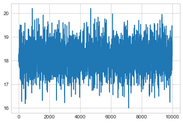



## Contents
{:.no_toc}
*  
{: toc}


## The Normal Model

 
 A random variable $Y$ is normally distributed with mean $\mu$ and variance $\sigma^2$. Thus its density is given by :
 
 $$ p(y \vert \mu, \sigma^2) =  \frac{1}{ \sqrt{ 2 \pi \sigma^2}} e^{-( \frac{y-\mu}{2 \sigma})^2} $$
 
 
Suppose our model is $\{y_1, \ldots, y_n \vert \mu, \sigma^2 \} \sim N(\mu, \sigma^2)$ then
the likelihood is 

$$
p(y_1, \ldots, y_n \vert \mu, \sigma^2) = 
\prod_{i=1}^{n} p(y_i \vert \mu, \sigma^2)=\prod_{i=1}^{n}  \frac{1}{ \sqrt{ 2 \pi \sigma^2}} e^{-( \frac{(y_i-\mu)^2}{2\sigma^2})} = 
\frac{1}{ \sqrt{ 2 \pi \sigma^2}}   \exp \left\{  - \frac{1}{2}  \sum_i \frac{(y_i-\mu)^2}{\sigma^2} \right\} 
$$

We can now write the posterior for this model thus:

$$ p( \mu, \sigma^2 \vert  y_1, \ldots, y_n, \sigma^2)  \propto \frac{1}{ \sqrt{ 2 \pi \sigma^2}} e^{ - \frac{1}{2\sigma^2} \sum (y_i - \mu)^2 } \, p(\mu, \sigma^2)$$

Say we have the prior

$$ p(\mu \vert \sigma^2) = \exp \left\{ -\frac{1}{2 \tau^2} (\hat{\mu}-\mu)^2 \right\} $$

Now, keeping in mind that $p(\mu, \sigma^2) = p(\mu \vert \sigma^2) p(\sigma^2)$, we will need tp specify the prior on the variance. Our sample estimate is 1, so we can be fairly informative if we consider a half-normal with a standard deviation of 10.

## Example of the normal model for $\sigma$ to be sampled.

We have data on the wing length in millimeters of a nine members of a particular species of moth. We wish to make inferences from those measurements on the population mean $\mu$. Other studies show the wing length to be around 19 mm. We also know that the length must be positive. We can choose a prior on $\mu$ that is normal and most of the density is above zero ($\mu=19.5,\tau=10$). This is only a **marginally informative** prior.

Many bayesians would prefer you choose relatively uninformative priors.

The measurements were: 16.4, 17.0, 17.2, 17.4, 18.2, 18.2, 18.2, 19.9, 20.8 giving $\bar{y}=18.14$. 


```python
Y = [16.4, 17.0, 17.2, 17.4, 18.2, 18.2, 18.2, 19.9, 20.8]
#Data Quantities
sig_data = np.std(Y) # sample estimatge of $\sigma$
mu_data = np.mean(Y)
n = len(Y)
print("sigma", sig_data, "mu", mu_data, "n", n)
```


    sigma 1.33092374864 mu 18.1444444444 n 9


```python
# normal prior for mean parameter
# Prior mean
mu_prior = 19.5
# prior std
std_prior = 10 
```


## Sampling by code

We now set up code to do metropolis using logs of distributions:


```python
def metropolis(logp, qdraw, stepsize, nsamp, xinit):
    samples=np.empty(nsamp)
    x_prev = xinit
    accepted = 0
    for i in range(nsamp):
        x_star = qdraw(x_prev, stepsize)
        logp_star = logp(x_star)
        logp_prev = logp(x_prev)
        logpdfratio = logp_star -logp_prev
        u = np.random.uniform()
        if np.log(u) <= logpdfratio:
            samples[i] = x_star
            x_prev = x_star
            accepted += 1
        else:#we always get a sample
            samples[i]= x_prev
            
    return samples, accepted

# this code is taken and adapted from https://github.com/fonnesbeck/Bios8366/blob/master/notebooks/Section4_2-MCMC.ipynb

rnorm = np.random.normal
runif = np.random.rand

def metropolis(logp, n_iterations, initial_values, prop_std=[1,1]):
    #################################################################
    # function to sample using Metropolis 
    # (assumes proposal distribution is symmetric)
    # 
    # n_iterations:  number of iterations
    # initial_values: multidimensional start position for our chain
    # prop_std: standard deviation for Gaussian proposal distribution 
    ##################################################################
    
    
    #np.random.seed(seed=1)
    n_params = len(initial_values)
            
    # Initial proposal standard deviations
    # generates a list of length n_params
    #prop_sd = [prop_std]*n_params
    prop_sd = prop_std
    
    # Initialize trace for parameters
    trace = np.empty((n_iterations+1, n_params))
    
    # Set initial values
    trace[0] = initial_values
        
    # Calculate joint posterior for initial values
    # the * assigns the arguments of the function according to the list elements
    current_prob = logp(*trace[0])
    
    # Initialize acceptance counts
    # We can use this to tune our step size
    accepted = [0]*n_params
    
    for i in range(n_iterations):
    
        if not i%10000: 
            print('Iterations left: ', n_iterations-i)
    
        # Grab current parameter values
        current_params = trace[i]
    
        # Get current value for parameter j
        p = trace[i].copy() 
        
        # loop over all dimensions
        for j in range(n_params):
            # proposed new value
            theta = rnorm(current_params[j], prop_sd[j])
            
            # Insert new value 
            p[j] = theta
    
            # Calculate posterior with proposed value
            proposed_prob = logp(*p)
    
            # Log-acceptance rate
            logalpha = proposed_prob - current_prob
    
            # Sample a uniform random variate
            u = runif()
    
            # Test proposed value
            if np.log(u) < logalpha:
                # Accept
                trace[i+1,j] = theta
                current_prob = proposed_prob
                accepted[j] += 1
            else:
                # Stay put
                trace[i+1,j] = trace[i,j]
            
            # update p so we search the next dimension according
            # to the current result
            p[j] = trace[i+1,j]
    
    # return our samples and the number of accepted steps
    return trace, accepted

```


```python
4000 % 1000
```


    0


Remember, that up to normalization, the posterior is the likelihood times the prior. Thus the log of the posterior is the sum of the logs of the likelihood and the prior.


```python
from scipy.stats import norm, halfcauchy
logprior = lambda mu, sigma: norm.logpdf(mu, loc=mu_prior, scale=std_prior) + norm.logpdf(sigma, loc=sig_data, scale=2)
loglike = lambda mu, sigma: np.sum(norm.logpdf(Y, loc=mu, scale=sigma))
logpost = lambda mu, sigma: loglike(mu, sigma) + logprior(mu, sigma)
```


Now we sample:


```python
x0=[mu_data, sig_data]
p_std = [1.0, 1.0]
nsamps=30000
samps, acc = metropolis(logpost, nsamps, x0, prop_std=p_std)
```


    Iterations left:  30000
    Iterations left:  20000
    Iterations left:  10000


The acceptance rate is reasonable. You should shoot for somewhere between 20 and 50%.


```python
np.array(acc)/nsamps

```


    array([ 0.50543333,  0.3768    ])


```python
def corrplot(trace, maxlags=50):
    plt.acorr(trace-np.mean(trace),  normed=True, maxlags=maxlags);
    plt.xlim([0, maxlags])
```


```python
samps[20000::,:].shape
```


    (10001, 2)


```python
sns.jointplot(pd.Series(samps[20000::,0], name="$\mu$"), pd.Series(samps[20000::,1], name="$\sigma$"), alpha=0.02).plot_joint(sns.kdeplot, zorder=0, n_levels=6, alpha=1)
```


    <seaborn.axisgrid.JointGrid at 0x122342b38>


```python
musamps = samps[:,0]
sigsamps = samps[:,1]
```


```python
plt.plot(musamps[20000::])
```


    [<matplotlib.lines.Line2D at 0x11cd598d0>]





```python
plt.plot(sigsamps[20000::])
```


    [<matplotlib.lines.Line2D at 0x11d203748>]


```python
plt.hist(musamps[20000::], bins=50);
```


```python
plt.hist(sigsamps[20000::], bins=50);
```


```python
corrplot(musamps[20000::])
```


```python
corrplot(sigsamps[20000::])
```


```python
post_pred_func = lambda postmu, postsig: norm.rvs(loc = postmu, scale = postsig)
post_pred_samples = post_pred_func(samps[20000::,0], samps[20000::,1])
sns.distplot(post_pred_samples)
```


    <matplotlib.axes._subplots.AxesSubplot at 0x11fe86f60>


