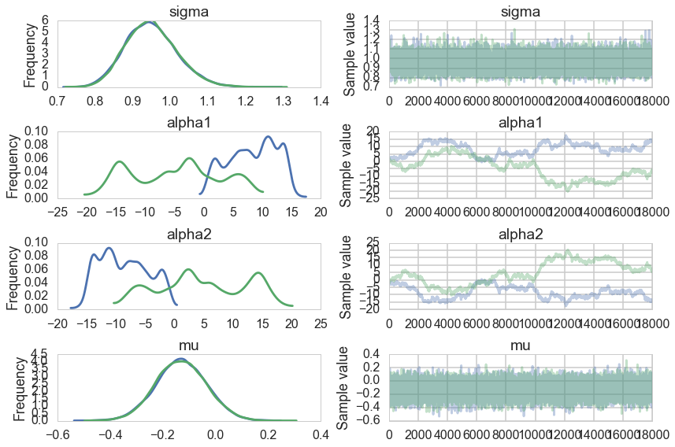
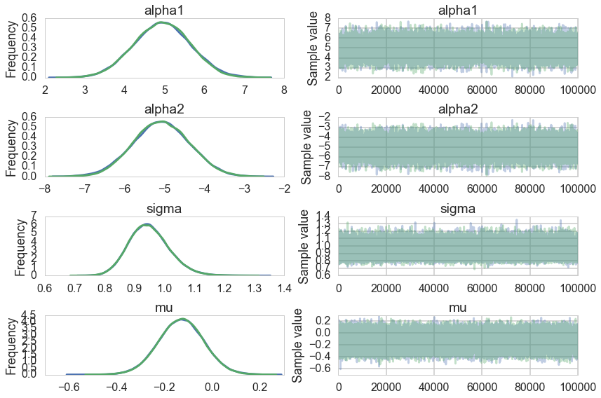



## Contents
{:.no_toc}
*  
{: toc}


## Contents
{:.no_toc}
* 
{: toc}


```python
%matplotlib inline
import numpy as np
import scipy as sp
import matplotlib as mpl
import matplotlib.cm as cm
import matplotlib.pyplot as plt
import pandas as pd
pd.set_option('display.width', 500)
pd.set_option('display.max_columns', 100)
pd.set_option('display.notebook_repr_html', True)
import seaborn as sns
sns.set_style("whitegrid")
sns.set_context("poster")
```


We generate some test data from $N(0,1)$:


```python
from scipy.stats import norm
data = norm.rvs(size=100)
data
```


    array([ 0.03962073,  0.03290953,  0.98544195,  0.04596463,  0.64626776,
           -1.51917579, -0.47099774, -0.79274817, -1.510941  ,  0.62187968,
           -1.58463447, -0.31167464,  1.09177345,  1.86007596, -0.34114228,
           -0.35475686,  0.70235072, -0.87451605, -1.14164176, -1.33450384,
           -1.66049335,  0.42916234, -1.45189161, -1.80733019, -1.34731763,
            0.5692819 , -1.54416497,  0.06534625, -1.42065169, -0.20115099,
            1.13634278,  0.33987116,  0.40928055, -0.79304293, -1.42792586,
           -0.49092787, -0.40731762,  0.36158092,  0.55836612,  0.94629738,
            0.37472964,  0.67798211,  0.47590639, -0.00241526,  1.84591318,
            0.24104702,  0.22500321, -1.71406405,  2.17130125, -0.4478053 ,
            0.51994149, -0.56184292,  0.2997452 , -0.27366469, -0.90988938,
            1.0146704 , -0.99058279, -0.29684026, -1.43256059,  0.03973359,
            1.09712035,  0.46719219,  0.80223718,  1.54859038, -0.94135931,
           -0.20712364, -0.21525818, -0.84091686,  0.16319026, -0.35566993,
           -0.17525355, -0.13103397, -0.9963371 ,  0.62021913, -0.29783109,
           -1.4712209 , -0.06468791,  0.85275671,  1.48148843,  0.15819005,
            1.45768006, -0.536146  , -0.01650962, -0.07422125, -0.33416329,
            1.64273025,  0.55148576,  1.14837232, -0.37978736, -0.57564425,
           -0.11643753,  0.52559572, -1.73441951, -0.79981563,  0.0109395 ,
           -0.93453305, -0.46059307, -2.31094356, -1.03155391,  0.22409766])


We fit this data using the following model:

$$
y \sim N(\mu, \sigma)\\
\mu = \alpha_1 + \alpha_2\\
\alpha_1 \sim Unif(-\infty, \infty)\\
\alpha_2 \sim Unif(-\infty, \infty)\\
\sigma \sim HalfCauchy(0,1)
$$


```python
import pymc3 as pm
```


In our sampler, we have chosen `njobs=2` which allows us to run on multiple processes, generating two separate chains.


```python
with pm.Model() as ni:
    sigma = pm.HalfCauchy("sigma", beta=1)
    alpha1=pm.Uniform('alpha1', lower=-10**6, upper=10**6)
    alpha2=pm.Uniform('alpha2', lower=-10**6, upper=10**6)
    mu = pm.Deterministic("mu", alpha1 + alpha2)
    y = pm.Normal("data", mu=mu, sd=sigma, observed=data)
    stepper=pm.Metropolis()
    traceni = pm.sample(100000, step=stepper, njobs=2)
```


    100%|██████████| 100000/100000 [01:17<00:00, 1286.59it/s]| 1/100000 [00:00<3:20:31,  8.31it/s]


```python
pm.traceplot(traceni);
```





Look at our traces for $\alpha_1$ and $\alpha_2$. These are bad, and worse, they look entirely different for two chains. Despite this, $\mu$ looks totally fine. Our trac


```python
df=pm.trace_to_dataframe(traceni)
df.corr()
```


<div>
<table border="1" class="dataframe">
  <thead>
    <tr style="text-align: right;">
      <th></th>
      <th>sigma</th>
      <th>mu</th>
      <th>alpha1</th>
      <th>alpha2</th>
    </tr>
  </thead>
  <tbody>
    <tr>
      <th>sigma</th>
      <td>1.000000</td>
      <td>-0.000115</td>
      <td>-0.003153</td>
      <td>0.003152</td>
    </tr>
    <tr>
      <th>mu</th>
      <td>-0.000115</td>
      <td>1.000000</td>
      <td>0.002844</td>
      <td>0.008293</td>
    </tr>
    <tr>
      <th>alpha1</th>
      <td>-0.003153</td>
      <td>0.002844</td>
      <td>1.000000</td>
      <td>-0.999938</td>
    </tr>
    <tr>
      <th>alpha2</th>
      <td>0.003152</td>
      <td>0.008293</td>
      <td>-0.999938</td>
      <td>1.000000</td>
    </tr>
  </tbody>
</table>
</div>


Just like in our uncentered regression example, we have $\alpha_1$ and $\alpha_2$ sharing information: they are totally negatively correlated and unidentifiable. Indeed our intuition probably told us as much.


```python
pm.summary(traceni)
```


    
    sigma:
    
      Mean             SD               MC Error         95% HPD interval
      -------------------------------------------------------------------
      
      0.950            0.068            0.000            [0.821, 1.086]
    
      Posterior quantiles:
      2.5            25             50             75             97.5
      |--------------|==============|==============|--------------|
      
      0.827          0.903          0.947          0.994          1.095
    
    
    alpha1:
    
      Mean             SD               MC Error         95% HPD interval
      -------------------------------------------------------------------
      
      1.730            9.037            0.897            [-15.433, 14.707]
    
      Posterior quantiles:
      2.5            25             50             75             97.5
      |--------------|==============|==============|--------------|
      
      -16.135        -4.079         3.764          8.813          14.291
    
    
    alpha2:
    
      Mean             SD               MC Error         95% HPD interval
      -------------------------------------------------------------------
      
      -1.859           9.038            0.897            [-14.814, 15.325]
    
      Posterior quantiles:
      2.5            25             50             75             97.5
      |--------------|==============|==============|--------------|
      
      -14.420        -8.950         -3.904         3.960          16.012
    
    
    mu:
    
      Mean             SD               MC Error         95% HPD interval
      -------------------------------------------------------------------
      
      -0.130           0.096            0.001            [-0.319, 0.057]
    
      Posterior quantiles:
      2.5            25             50             75             97.5
      |--------------|==============|==============|--------------|
      
      -0.317         -0.195         -0.130         -0.065         0.059
    


A look at the effective number of samples using two chains tells us that we have only one effective sample for $\alpha_1$ and $\alpha_2$.


```python
pm.effective_n(traceni)
```


    {'alpha1': 1.0,
     'alpha1_interval_': 1.0,
     'alpha2': 1.0,
     'alpha2_interval_': 1.0,
     'mu': 26411.0,
     'sigma': 39215.0,
     'sigma_log_': 39301.0}


The Gelman-Rubin statistic is awful for them. No convergence.


```python
pm.gelman_rubin(traceni)
```


    {'alpha1': 1.7439881580327452,
     'alpha1_interval_': 1.7439881580160093,
     'alpha2': 1.7438626593529831,
     'alpha2_interval_': 1.7438626593368223,
     'mu': 0.99999710182062695,
     'sigma': 1.0000248056117549,
     'sigma_log_': 1.0000261752214563}


Its going to be hard to break this unidentifiability. We try by forcing $\alpha_2$ to be negative in our prior


```python
with pm.Model() as ni2:
    sigma = pm.HalfCauchy("sigma", beta=1)
    alpha1=pm.Normal('alpha1', mu=5, sd=1)
    alpha2=pm.Normal('alpha2', mu=-5, sd=1)
    mu = pm.Deterministic("mu", alpha1 + alpha2)
    y = pm.Normal("data", mu=mu, sd=sigma, observed=data)
    #stepper=pm.Metropolis()
    #traceni2 = pm.sample(100000, step=stepper, njobs=2)
    traceni2 = pm.sample(100000, njobs=2)
```


    Average ELBO = -143.13: 100%|██████████| 200000/200000 [00:18<00:00, 10759.64it/s], 9912.87it/s]
    100%|██████████| 100000/100000 [06:30<00:00, 255.83it/s]


Notice we are using the built in NUTS sampler. It takes longer but explores the distributions far better: more on this after our course break.


```python
pm.traceplot(traceni2);
```





Our extremely strong priors have helped us do a much better job.


```python
pm.summary(traceni2)
```


    
    alpha1:
    
      Mean             SD               MC Error         95% HPD interval
      -------------------------------------------------------------------
      
      4.944            0.707            0.004            [3.560, 6.314]
    
      Posterior quantiles:
      2.5            25             50             75             97.5
      |--------------|==============|==============|--------------|
      
      3.562          4.465          4.946          5.424          6.319
    
    
    alpha2:
    
      Mean             SD               MC Error         95% HPD interval
      -------------------------------------------------------------------
      
      -5.074           0.707            0.004            [-6.471, -3.712]
    
      Posterior quantiles:
      2.5            25             50             75             97.5
      |--------------|==============|==============|--------------|
      
      -6.450         -5.552         -5.076         -4.593         -3.690
    
    
    sigma:
    
      Mean             SD               MC Error         95% HPD interval
      -------------------------------------------------------------------
      
      0.950            0.067            0.000            [0.820, 1.083]
    
      Posterior quantiles:
      2.5            25             50             75             97.5
      |--------------|==============|==============|--------------|
      
      0.828          0.903          0.946          0.992          1.093
    
    
    mu:
    
      Mean             SD               MC Error         95% HPD interval
      -------------------------------------------------------------------
      
      -0.129           0.094            0.000            [-0.313, 0.057]
    
      Posterior quantiles:
      2.5            25             50             75             97.5
      |--------------|==============|==============|--------------|
      
      -0.315         -0.192         -0.129         -0.066         0.056
    


Our effective sample size is still poor and our traces still look dodgy, but things are better. 


```python
pm.effective_n(traceni2)
```


    {'alpha1': 21779.0,
     'alpha2': 21771.0,
     'mu': 200000.0,
     'sigma': 155001.0,
     'sigma_log_': 156987.0}


```python
pm.gelman_rubin(traceni2)
```


    {'alpha1': 1.0000646992489557,
     'alpha2': 1.0000681135686484,
     'mu': 0.99999730757810168,
     'sigma': 1.0000011955172152,
     'sigma_log_': 1.000002093954572}


..and this shows in our Gelman-Rubin statistics as well...


```python
pm.trace_to_dataframe(traceni2).corr()
```


<div>
<table border="1" class="dataframe">
  <thead>
    <tr style="text-align: right;">
      <th></th>
      <th>alpha1</th>
      <th>alpha2</th>
      <th>mu</th>
      <th>sigma</th>
    </tr>
  </thead>
  <tbody>
    <tr>
      <th>alpha1</th>
      <td>1.000000</td>
      <td>-0.991091</td>
      <td>0.066087</td>
      <td>0.000749</td>
    </tr>
    <tr>
      <th>alpha2</th>
      <td>-0.991091</td>
      <td>1.000000</td>
      <td>0.067395</td>
      <td>-0.000322</td>
    </tr>
    <tr>
      <th>mu</th>
      <td>0.066087</td>
      <td>0.067395</td>
      <td>1.000000</td>
      <td>0.003204</td>
    </tr>
    <tr>
      <th>sigma</th>
      <td>0.000749</td>
      <td>-0.000322</td>
      <td>0.003204</td>
      <td>1.000000</td>
    </tr>
  </tbody>
</table>
</div>


..but our unidentifiability is still high when we look at the correlation. This reflects the fundamental un-identifiability and sharing of information in our model since $\mu = \alpha_1 +\alpha_2$: all the priors do is artificially peg one of the parameters. And once one is pegged the other is too because of the symmetry.
