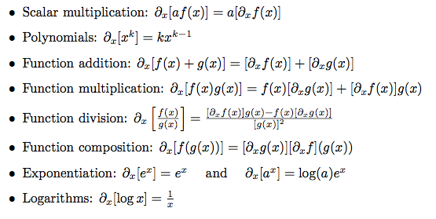
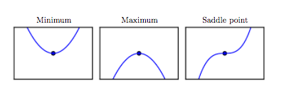



## Contents
{:.no_toc}
*  
{: toc}

Here we will go through some examples of solving math questions in calculus, vectors and matrices. We'll revisit these at other points in the course, as needed, but hopefully this notebook provides you some practice, some cheatsheet, etc

A lot of the material here is taken from Daume's "Math for machine learning" and  Bengio's book on deep learning.

## Differential calculus

The derivative of a function is the slope of the function at that point. For example, velocity is the derivative of the position.

Its defined thus

$$\frac{df}{dx}\Big{\vert}_{x=x_0} = \lim_{h \to 0}\frac{f(x_0 + h) - f(x_0)}{h}$$

We'll abuse the notation $\partial_x$ for derivative with respect to x for now, as its more concise.

Some formulae:

Let's try.

**Q1.** Differentiate  $\frac{e^x + 1}{e^{-x}}$

A function is said to be **convex** if it looks like a bowl. In other words, you are guaranteed a **global** minimum. Its second derivative must be positive everywhere.

A **concave function** is an inverted bowl. It has a global maximum, and its second derivative must be negative everywhere.

Critical points in 1D, from Bengio.

**Q2.** What kind of a function is $2x^2 - 3x + 1$.

## Integral Calculus

There are two separate concepts here. One is the anti-derivative, or "find the function whose derivative I am". The second concept is the area under the curve, also called the integral. The fundamental theorem of calculus tells us that the antiderivative is the integral. 

This diagram, taken from wikipedia, illustrates this theorem:

**Q3.** Integrate  $\int_{-\infty}^{\infty} e^{-x^2}$

**Q4.** What is the antiderivative of $x^2$; ie $\int x^2 dx$.

## Vectors

I am going to assume that you are familiar with vectors like  ${\bf v}$, and their dot product ${\bf v} \cdot {\bf w}$. 

**Q5.** Write down the vector which has equal weight in all three directions, and is a unit vector (ie of length 1.)

You can learn much more about vectors here http://www.feynmanlectures.caltech.edu/I_11.html .

## Multidimensional Calculus

This is where the partial symbol comes into its own. If $f$ is a function like $x^2 + y^2$, you can take derivatives with respect to both x and y, which gives us:

$$\frac{\partial{f}}{\partial{x}} = 2x$$

You can combine partials into a vector. This vector is known as the gradient vector

$$\nabla f = (2x, 2y)$$

The gradient will always give you the direction of the greatest change of a function. Why is this?

** Q6.** Compute the gradient of $f(\mathbf{w}) = \mathbf{w}^T\mathbf{w}$

## The Jacobian and the Hessian

We saw the Jacobian in class. The Hessian is a matrix of second derivatives, and can be used to probe curvature

**Q7.** Calculate the Hessian of $$f(x) = x_1^2 + x_2^2$$.

## Continuity

**Q8.** What is the derivative of $f(x) = \vert x \vert$. 

**Q9.** What is the derivative of the step function which is 0 for all x less than 0 and 1 otherwise

## Taylor Series

The taylor series expansion for a function about a point a is given as

$$f(x) = \sum_i  \frac{f^{(n)}(x-a)}{n!}x^n$$

where $f^{(n)}$ is the nth derivative.

**Q10** Show that the ikelihood function of one parameter $\theta$ is normally distributed near its maximum.
