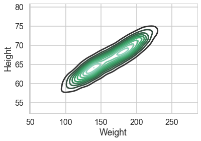
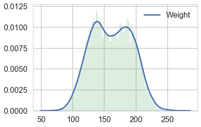
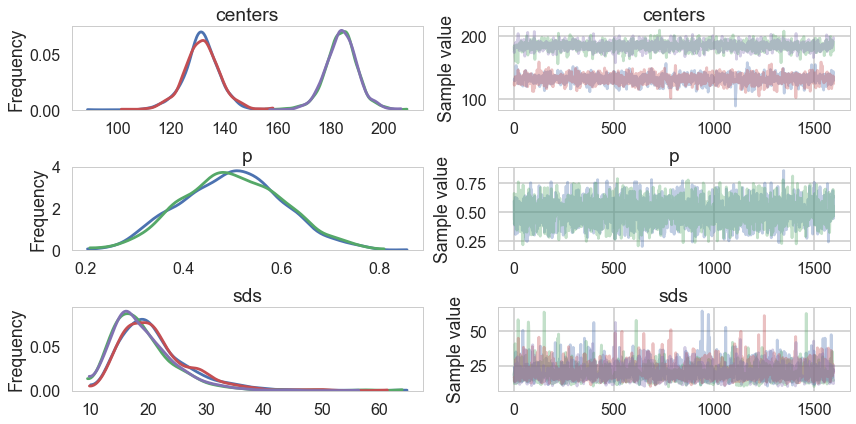
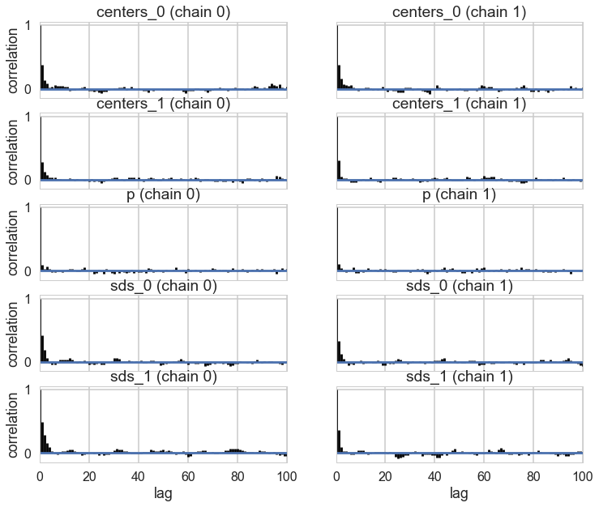
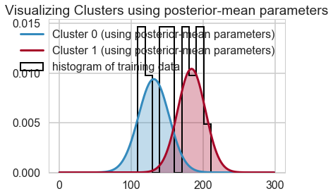
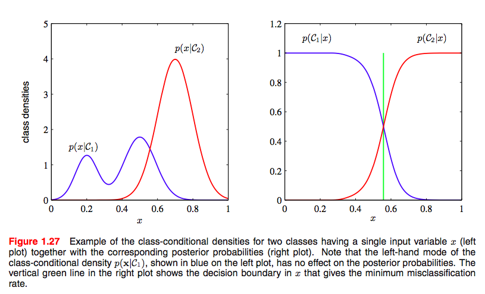
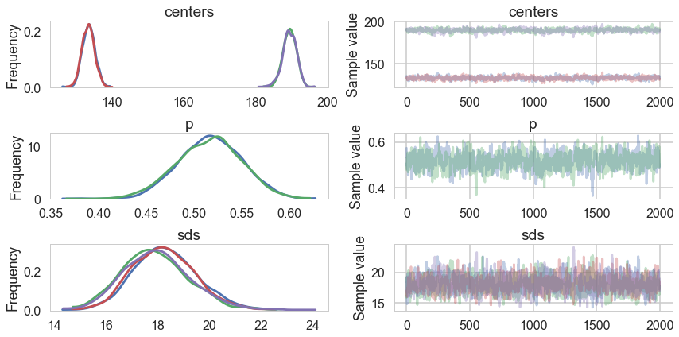
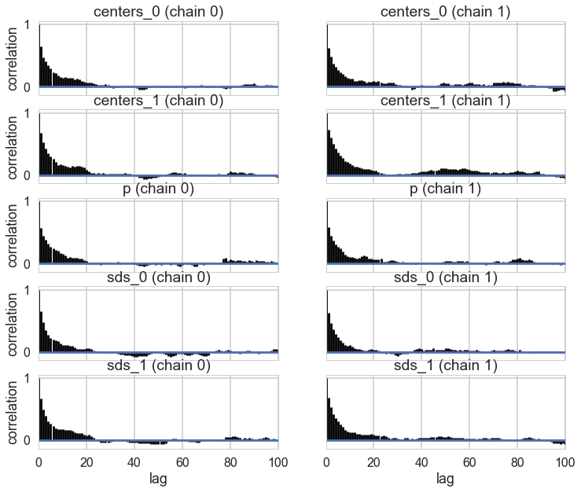
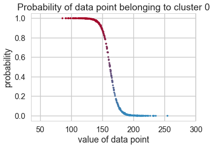



## Contents
{:.no_toc}
*  
{: toc}


We now do a study of learning mixture models with MCMC. We have already done this in the case of the Zero-Inflated Poisson Model, and will stick to Gaussian Mixture models for now.


```python
%matplotlib inline
import numpy as np
import scipy as sp
import matplotlib as mpl
import matplotlib.cm as cm
import matplotlib.pyplot as plt
import pandas as pd
pd.set_option('display.width', 500)
pd.set_option('display.max_columns', 100)
pd.set_option('display.notebook_repr_html', True)
import seaborn as sns
sns.set_style("whitegrid")
sns.set_context("poster")
import pymc3 as pm
import theano.tensor as tt
```


## Supervised and semi-supervised Learning

In other notes, we used mixture models to categorize the various types of learning. The key difference was how we wrote the likelihoods. Lets use those likelihoods to untertake sampling in supervised and semi-supervised ways. We have already seen unsupervised sampling

We'll use the heights-weights data set as we do have a story for why these outght to be separately gaussianly distributed for men and women.


```python
df=pd.read_csv("data/01_heights_weights_genders.csv")
df.head()
```


<div>
<style>
    .dataframe thead tr:only-child th {
        text-align: right;
    }

    .dataframe thead th {
        text-align: left;
    }

    .dataframe tbody tr th {
        vertical-align: top;
    }
</style>
<table border="1" class="dataframe">
  <thead>
    <tr style="text-align: right;">
      <th></th>
      <th>Gender</th>
      <th>Height</th>
      <th>Weight</th>
    </tr>
  </thead>
  <tbody>
    <tr>
      <th>0</th>
      <td>Male</td>
      <td>73.847017</td>
      <td>241.893563</td>
    </tr>
    <tr>
      <th>1</th>
      <td>Male</td>
      <td>68.781904</td>
      <td>162.310473</td>
    </tr>
    <tr>
      <th>2</th>
      <td>Male</td>
      <td>74.110105</td>
      <td>212.740856</td>
    </tr>
    <tr>
      <th>3</th>
      <td>Male</td>
      <td>71.730978</td>
      <td>220.042470</td>
    </tr>
    <tr>
      <th>4</th>
      <td>Male</td>
      <td>69.881796</td>
      <td>206.349801</td>
    </tr>
  </tbody>
</table>
</div>


```python
df.describe()
```


<div>
<style>
    .dataframe thead tr:only-child th {
        text-align: right;
    }

    .dataframe thead th {
        text-align: left;
    }

    .dataframe tbody tr th {
        vertical-align: top;
    }
</style>
<table border="1" class="dataframe">
  <thead>
    <tr style="text-align: right;">
      <th></th>
      <th>Height</th>
      <th>Weight</th>
    </tr>
  </thead>
  <tbody>
    <tr>
      <th>count</th>
      <td>10000.000000</td>
      <td>10000.000000</td>
    </tr>
    <tr>
      <th>mean</th>
      <td>66.367560</td>
      <td>161.440357</td>
    </tr>
    <tr>
      <th>std</th>
      <td>3.847528</td>
      <td>32.108439</td>
    </tr>
    <tr>
      <th>min</th>
      <td>54.263133</td>
      <td>64.700127</td>
    </tr>
    <tr>
      <th>25%</th>
      <td>63.505620</td>
      <td>135.818051</td>
    </tr>
    <tr>
      <th>50%</th>
      <td>66.318070</td>
      <td>161.212928</td>
    </tr>
    <tr>
      <th>75%</th>
      <td>69.174262</td>
      <td>187.169525</td>
    </tr>
    <tr>
      <th>max</th>
      <td>78.998742</td>
      <td>269.989699</td>
    </tr>
  </tbody>
</table>
</div>


A KDEplot confirms our intuition


```python
sns.kdeplot(df.Weight, df.Height)
```


    <matplotlib.axes._subplots.AxesSubplot at 0x113eaa860>





To keep things simple, we'll keep to one dimension by sticking with the weight marginal. Plotting it, there definitely seems to be a double humped distribution:


```python
sns.kdeplot(df.Weight)
plt.hist(df.Weight, bins=100, alpha=0.2, normed=True);
```





```python
df.shape
```


    (10000, 3)


We do the train-test split. Notice we will keep a very small number of points in the training set.


```python
makesmall=np.random.choice(range(df.shape[0]), size=500, replace=False)
datax=df.Weight.values
dataz=1*(df.Gender=='Male')
datax=datax[makesmall]
dataz=dataz.values[makesmall]
from sklearn.model_selection import train_test_split
itr, ite = train_test_split(range(dataz.shape[0]), train_size=0.04, stratify=dataz)
xte=datax[ite]
xtr=datax[itr]
zte=dataz[ite]
ztr=dataz[itr]

```


```python
zte.shape, zte.mean(), ztr.mean(), ztr.shape
```


    ((480,), 0.48749999999999999, 0.5, (20,))


We use 2-D categoricals to make cluster assignments. Notice that these training assignments are also observed stochastics now, in addition to the $x$. 


```python
with pm.Model() as classmodel1:
    p1 = pm.Uniform('p', 0, 1)
    p2 = 1 - p1
    p = tt.stack([p1, p2])
    #Notice the "observed" below
    assignment_tr = pm.Categorical("assignment_tr", p, 
                                observed=ztr)
    sds = pm.Uniform("sds", 0, 100, shape=2)
    centers = pm.Normal("centers", 
                        mu=np.array([130, 170]), 
                        sd=np.array([20, 20]), 
                        shape=2)
    p_min_potential = pm.Potential('lam_min_potential', tt.switch(tt.min(p) < .1, -np.inf, 0))
    order_centers_potential = pm.Potential('order_centers_potential',
                                         tt.switch(centers[1]-centers[0] < 0, -np.inf, 0))
    
    # and to combine it with the observations:
    observations = pm.Normal("obs", mu=centers[assignment_tr], sd=sds[assignment_tr], observed=xtr)
    
```


```python
with classmodel1:
    step1 = pm.Metropolis(vars=[p, sds, centers])
    trace_cm1_full = pm.sample(10000, step=[step1], njobs=2)
```


    Multiprocess sampling (2 chains in 2 jobs)
    CompoundStep
    >Metropolis: [centers]
    >Metropolis: [sds_interval__]
    >Metropolis: [p_interval__]
    100%|██████████| 10500/10500 [00:05<00:00, 1864.73it/s]
    The number of effective samples is smaller than 10% for some parameters.


```python
trace_cm1 = trace_cm1_full[2000::5]
pm.traceplot(trace_cm1);
```





```python
pm.autocorrplot(trace_cm1);
```





```python
center_trace = trace_cm1["centers"]
std_trace = trace_cm1["sds"]
#identify the clusters
colors = ["#348ABD", "#A60628"] \
if center_trace[-1, 0] > center_trace[-1, 1] \
    else ["#A60628", "#348ABD"]
norm = sp.stats.norm
x = np.arange(0, 300, 1)
posterior_center_means = center_trace.mean(axis=0)
posterior_std_means = std_trace.mean(axis=0)
posterior_p_mean = 1 - ztr.mean()


y = posterior_p_mean * norm.pdf(x, loc=posterior_center_means[0],
                                scale=posterior_std_means[0])
plt.plot(x, y, label="Cluster 0 (using posterior-mean parameters)", color=colors[1], lw=3)
plt.fill_between(x, y, color=colors[1], alpha=0.3)

y = (1 - posterior_p_mean) * norm.pdf(x, loc=posterior_center_means[1],
                                      scale=posterior_std_means[1])
plt.plot(x, y, label="Cluster 1 (using posterior-mean parameters)", color=colors[0], lw=3)
plt.fill_between(x, y, color=colors[0], alpha=0.3)
plt.hist(xtr, bins=10, histtype="step", normed=True, color="k",
     lw=2, label="histogram of training data")
# plt.hist(xte, bins=20, histtype="step", normed=True, color="k",
#      lw=2, label="histogram of  test data")
plt.legend(loc="upper right")
plt.title("Visualizing Clusters using posterior-mean parameters")
```


    <matplotlib.text.Text at 0x1208c2ac8>





We use the $p(x \vert z)$ to do our classification. What we really want is $p(z \vert x)$, but we can use bayes theorem to inver this, as shown in the diagram below.





```python
xgivenz0 = lambda x: norm.pdf(x, loc=posterior_center_means[0],
                                scale=posterior_std_means[0])
xgivenz1 = lambda x: norm.pdf(x, loc=posterior_center_means[1],
                                      scale=posterior_std_means[1])
zpred1 = 1*(xgivenz1(xte) > xgivenz0(xte))
from sklearn.metrics import confusion_matrix, accuracy_score
confusion_matrix(zte, zpred1)
```


    array([[223,  23],
           [ 13, 221]])


```python
accuracy_score(zte, zpred1)
```


    0.92500000000000004


## Semi-Supervised Learning

In the previous section we did the work on the testing set separately. Here we'd like to model the fact that we have a partial likelihood available for the testing set: we have observed the $x$s, but not the $z$s.

Thus in our model we will include both training and testing $x$s, but only training $z$s as observations, fitting for the testing $z$s.
We now want the trace of the testing assignments. That is we want $p(z \vert x)$ and we'll use the MCMC model to do the whole bayes theorem inversion for us!


```python
with pm.Model() as classmodel2:
    p1 = pm.Uniform('p', 0, 1)
    p2 = 1 - p1
    p = tt.stack([p1, p2])
    assignment_tr = pm.Categorical("assignment_tr", p, 
                                observed=ztr)
    # we do not know the test assignments
    assignment_te = pm.Categorical("assignment_te", p, 
                                shape=xte.shape[0])
    sds = pm.Uniform("sds", 0, 100, shape=2)
    centers = pm.Normal("centers", 
                        mu=np.array([130, 170]), 
                        sd=np.array([20, 20]), 
                        shape=2)
    p_min_potential = pm.Potential('lam_min_potential', tt.switch(tt.min(p) < .1, -np.inf, 0))
    order_centers_potential = pm.Potential('order_centers_potential',
                                         tt.switch(centers[1]-centers[0] < 0, -np.inf, 0))
    
    # and to combine it with the observations:
    observations_tr = pm.Normal("obs_tr", mu=centers[assignment_tr], sd=sds[assignment_tr], observed=xtr)
    observations_te = pm.Normal("obs_te", mu=centers[assignment_te], sd=sds[assignment_te], observed=xte)
```


```python
with classmodel2:
    step1 = pm.Metropolis(vars=[p, sds, centers])
    step2 = pm.ElemwiseCategorical(vars=[assignment_te])
    trace_cm2_full = pm.sample(15000, step=[step1, step2])
```


    //anaconda/envs/py3l/lib/python3.6/site-packages/ipykernel_launcher.py:3: DeprecationWarning: ElemwiseCategorical is deprecated, switch to CategoricalGibbsMetropolis.
      This is separate from the ipykernel package so we can avoid doing imports until
    Multiprocess sampling (2 chains in 2 jobs)
    CompoundStep
    >CompoundStep
    >>Metropolis: [centers]
    >>Metropolis: [sds_interval__]
    >>Metropolis: [p_interval__]
    >ElemwiseCategorical: [assignment_te]
    100%|██████████| 15500/15500 [03:07<00:00, 82.60it/s]
    The estimated number of effective samples is smaller than 200 for some parameters.


```python
pm.summary(trace_cm2_full)
```


<div>
<style>
    .dataframe thead tr:only-child th {
        text-align: right;
    }

    .dataframe thead th {
        text-align: left;
    }

    .dataframe tbody tr th {
        vertical-align: top;
    }
</style>
<table border="1" class="dataframe">
  <thead>
    <tr style="text-align: right;">
      <th></th>
      <th>mean</th>
      <th>sd</th>
      <th>mc_error</th>
      <th>hpd_2.5</th>
      <th>hpd_97.5</th>
      <th>n_eff</th>
      <th>Rhat</th>
    </tr>
  </thead>
  <tbody>
    <tr>
      <th>assignment_te__0</th>
      <td>0.002533</td>
      <td>0.050268</td>
      <td>0.000324</td>
      <td>0.000000</td>
      <td>0.000000</td>
      <td>28072.0</td>
      <td>0.999982</td>
    </tr>
    <tr>
      <th>assignment_te__1</th>
      <td>0.002700</td>
      <td>0.051891</td>
      <td>0.000370</td>
      <td>0.000000</td>
      <td>0.000000</td>
      <td>30000.0</td>
      <td>1.000017</td>
    </tr>
    <tr>
      <th>assignment_te__2</th>
      <td>0.348267</td>
      <td>0.476421</td>
      <td>0.005942</td>
      <td>0.000000</td>
      <td>1.000000</td>
      <td>7151.0</td>
      <td>1.000092</td>
    </tr>
    <tr>
      <th>assignment_te__3</th>
      <td>0.993433</td>
      <td>0.080768</td>
      <td>0.000493</td>
      <td>1.000000</td>
      <td>1.000000</td>
      <td>29885.0</td>
      <td>0.999967</td>
    </tr>
    <tr>
      <th>assignment_te__4</th>
      <td>0.356933</td>
      <td>0.479095</td>
      <td>0.006023</td>
      <td>0.000000</td>
      <td>1.000000</td>
      <td>7371.0</td>
      <td>0.999968</td>
    </tr>
    <tr>
      <th>assignment_te__5</th>
      <td>0.000900</td>
      <td>0.029986</td>
      <td>0.000169</td>
      <td>0.000000</td>
      <td>0.000000</td>
      <td>30000.0</td>
      <td>0.999968</td>
    </tr>
    <tr>
      <th>assignment_te__6</th>
      <td>0.002700</td>
      <td>0.051891</td>
      <td>0.000293</td>
      <td>0.000000</td>
      <td>0.000000</td>
      <td>27560.0</td>
      <td>0.999967</td>
    </tr>
    <tr>
      <th>assignment_te__7</th>
      <td>0.081333</td>
      <td>0.273346</td>
      <td>0.002749</td>
      <td>0.000000</td>
      <td>1.000000</td>
      <td>12044.0</td>
      <td>0.999967</td>
    </tr>
    <tr>
      <th>assignment_te__8</th>
      <td>0.000400</td>
      <td>0.019996</td>
      <td>0.000118</td>
      <td>0.000000</td>
      <td>0.000000</td>
      <td>25748.0</td>
      <td>1.000067</td>
    </tr>
    <tr>
      <th>assignment_te__9</th>
      <td>0.000167</td>
      <td>0.012909</td>
      <td>0.000073</td>
      <td>0.000000</td>
      <td>0.000000</td>
      <td>30000.0</td>
      <td>0.999973</td>
    </tr>
    <tr>
      <th>assignment_te__10</th>
      <td>0.998100</td>
      <td>0.043548</td>
      <td>0.000268</td>
      <td>1.000000</td>
      <td>1.000000</td>
      <td>29204.0</td>
      <td>0.999995</td>
    </tr>
    <tr>
      <th>assignment_te__11</th>
      <td>0.006100</td>
      <td>0.077864</td>
      <td>0.000525</td>
      <td>0.000000</td>
      <td>0.000000</td>
      <td>28606.0</td>
      <td>0.999989</td>
    </tr>
    <tr>
      <th>assignment_te__12</th>
      <td>0.997700</td>
      <td>0.047903</td>
      <td>0.000257</td>
      <td>1.000000</td>
      <td>1.000000</td>
      <td>28382.0</td>
      <td>0.999990</td>
    </tr>
    <tr>
      <th>assignment_te__13</th>
      <td>0.045233</td>
      <td>0.207815</td>
      <td>0.001690</td>
      <td>0.000000</td>
      <td>0.000000</td>
      <td>19230.0</td>
      <td>0.999976</td>
    </tr>
    <tr>
      <th>assignment_te__14</th>
      <td>0.002367</td>
      <td>0.048591</td>
      <td>0.000328</td>
      <td>0.000000</td>
      <td>0.000000</td>
      <td>24049.0</td>
      <td>1.000046</td>
    </tr>
    <tr>
      <th>assignment_te__15</th>
      <td>0.995133</td>
      <td>0.069592</td>
      <td>0.000396</td>
      <td>1.000000</td>
      <td>1.000000</td>
      <td>28033.0</td>
      <td>1.000025</td>
    </tr>
    <tr>
      <th>assignment_te__16</th>
      <td>0.001700</td>
      <td>0.041196</td>
      <td>0.000256</td>
      <td>0.000000</td>
      <td>0.000000</td>
      <td>30000.0</td>
      <td>0.999973</td>
    </tr>
    <tr>
      <th>assignment_te__17</th>
      <td>0.977300</td>
      <td>0.148945</td>
      <td>0.001122</td>
      <td>1.000000</td>
      <td>1.000000</td>
      <td>19770.0</td>
      <td>0.999969</td>
    </tr>
    <tr>
      <th>assignment_te__18</th>
      <td>0.999467</td>
      <td>0.023088</td>
      <td>0.000131</td>
      <td>1.000000</td>
      <td>1.000000</td>
      <td>30000.0</td>
      <td>0.999975</td>
    </tr>
    <tr>
      <th>assignment_te__19</th>
      <td>0.012967</td>
      <td>0.113131</td>
      <td>0.000892</td>
      <td>0.000000</td>
      <td>0.000000</td>
      <td>21124.0</td>
      <td>0.999974</td>
    </tr>
    <tr>
      <th>assignment_te__20</th>
      <td>0.031900</td>
      <td>0.175734</td>
      <td>0.001611</td>
      <td>0.000000</td>
      <td>0.000000</td>
      <td>13911.0</td>
      <td>0.999970</td>
    </tr>
    <tr>
      <th>assignment_te__21</th>
      <td>0.996733</td>
      <td>0.057061</td>
      <td>0.000340</td>
      <td>1.000000</td>
      <td>1.000000</td>
      <td>29198.0</td>
      <td>0.999972</td>
    </tr>
    <tr>
      <th>assignment_te__22</th>
      <td>0.004233</td>
      <td>0.064926</td>
      <td>0.000359</td>
      <td>0.000000</td>
      <td>0.000000</td>
      <td>30000.0</td>
      <td>0.999980</td>
    </tr>
    <tr>
      <th>assignment_te__23</th>
      <td>0.882233</td>
      <td>0.322332</td>
      <td>0.002970</td>
      <td>0.000000</td>
      <td>1.000000</td>
      <td>12202.0</td>
      <td>0.999969</td>
    </tr>
    <tr>
      <th>assignment_te__24</th>
      <td>0.000467</td>
      <td>0.021597</td>
      <td>0.000125</td>
      <td>0.000000</td>
      <td>0.000000</td>
      <td>30000.0</td>
      <td>0.999967</td>
    </tr>
    <tr>
      <th>assignment_te__25</th>
      <td>0.997800</td>
      <td>0.046853</td>
      <td>0.000255</td>
      <td>1.000000</td>
      <td>1.000000</td>
      <td>30000.0</td>
      <td>0.999975</td>
    </tr>
    <tr>
      <th>assignment_te__26</th>
      <td>0.013033</td>
      <td>0.113417</td>
      <td>0.000792</td>
      <td>0.000000</td>
      <td>0.000000</td>
      <td>27063.0</td>
      <td>0.999986</td>
    </tr>
    <tr>
      <th>assignment_te__27</th>
      <td>0.018133</td>
      <td>0.133434</td>
      <td>0.001063</td>
      <td>0.000000</td>
      <td>0.000000</td>
      <td>22463.0</td>
      <td>0.999997</td>
    </tr>
    <tr>
      <th>assignment_te__28</th>
      <td>0.996700</td>
      <td>0.057351</td>
      <td>0.000342</td>
      <td>1.000000</td>
      <td>1.000000</td>
      <td>23843.0</td>
      <td>0.999983</td>
    </tr>
    <tr>
      <th>assignment_te__29</th>
      <td>0.653367</td>
      <td>0.475898</td>
      <td>0.005825</td>
      <td>0.000000</td>
      <td>1.000000</td>
      <td>6356.0</td>
      <td>1.000146</td>
    </tr>
    <tr>
      <th>...</th>
      <td>...</td>
      <td>...</td>
      <td>...</td>
      <td>...</td>
      <td>...</td>
      <td>...</td>
      <td>...</td>
    </tr>
    <tr>
      <th>assignment_te__455</th>
      <td>0.999467</td>
      <td>0.023088</td>
      <td>0.000147</td>
      <td>1.000000</td>
      <td>1.000000</td>
      <td>30000.0</td>
      <td>1.000000</td>
    </tr>
    <tr>
      <th>assignment_te__456</th>
      <td>0.999467</td>
      <td>0.023088</td>
      <td>0.000122</td>
      <td>1.000000</td>
      <td>1.000000</td>
      <td>30000.0</td>
      <td>0.999975</td>
    </tr>
    <tr>
      <th>assignment_te__457</th>
      <td>0.000000</td>
      <td>0.000000</td>
      <td>0.000000</td>
      <td>0.000000</td>
      <td>0.000000</td>
      <td>30000.0</td>
      <td>NaN</td>
    </tr>
    <tr>
      <th>assignment_te__458</th>
      <td>0.974033</td>
      <td>0.159036</td>
      <td>0.001079</td>
      <td>1.000000</td>
      <td>1.000000</td>
      <td>24994.0</td>
      <td>0.999968</td>
    </tr>
    <tr>
      <th>assignment_te__459</th>
      <td>0.001867</td>
      <td>0.043165</td>
      <td>0.000280</td>
      <td>0.000000</td>
      <td>0.000000</td>
      <td>29178.0</td>
      <td>1.000026</td>
    </tr>
    <tr>
      <th>assignment_te__460</th>
      <td>0.891267</td>
      <td>0.311304</td>
      <td>0.002964</td>
      <td>0.000000</td>
      <td>1.000000</td>
      <td>15793.0</td>
      <td>1.000008</td>
    </tr>
    <tr>
      <th>assignment_te__461</th>
      <td>0.974933</td>
      <td>0.156328</td>
      <td>0.001106</td>
      <td>1.000000</td>
      <td>1.000000</td>
      <td>22775.0</td>
      <td>1.000055</td>
    </tr>
    <tr>
      <th>assignment_te__462</th>
      <td>0.004767</td>
      <td>0.068876</td>
      <td>0.000523</td>
      <td>0.000000</td>
      <td>0.000000</td>
      <td>29477.0</td>
      <td>1.000113</td>
    </tr>
    <tr>
      <th>assignment_te__463</th>
      <td>0.544267</td>
      <td>0.498037</td>
      <td>0.006115</td>
      <td>0.000000</td>
      <td>1.000000</td>
      <td>6374.0</td>
      <td>1.000008</td>
    </tr>
    <tr>
      <th>assignment_te__464</th>
      <td>0.826533</td>
      <td>0.378650</td>
      <td>0.003447</td>
      <td>0.000000</td>
      <td>1.000000</td>
      <td>11093.0</td>
      <td>1.000141</td>
    </tr>
    <tr>
      <th>assignment_te__465</th>
      <td>0.976833</td>
      <td>0.150433</td>
      <td>0.001156</td>
      <td>1.000000</td>
      <td>1.000000</td>
      <td>22704.0</td>
      <td>0.999969</td>
    </tr>
    <tr>
      <th>assignment_te__466</th>
      <td>0.001533</td>
      <td>0.039128</td>
      <td>0.000238</td>
      <td>0.000000</td>
      <td>0.000000</td>
      <td>30000.0</td>
      <td>0.999970</td>
    </tr>
    <tr>
      <th>assignment_te__467</th>
      <td>0.003500</td>
      <td>0.059057</td>
      <td>0.000430</td>
      <td>0.000000</td>
      <td>0.000000</td>
      <td>28636.0</td>
      <td>1.000038</td>
    </tr>
    <tr>
      <th>assignment_te__468</th>
      <td>0.000267</td>
      <td>0.016328</td>
      <td>0.000090</td>
      <td>0.000000</td>
      <td>0.000000</td>
      <td>30000.0</td>
      <td>1.000033</td>
    </tr>
    <tr>
      <th>assignment_te__469</th>
      <td>0.254200</td>
      <td>0.435411</td>
      <td>0.005559</td>
      <td>0.000000</td>
      <td>1.000000</td>
      <td>6911.0</td>
      <td>1.000004</td>
    </tr>
    <tr>
      <th>assignment_te__470</th>
      <td>0.978400</td>
      <td>0.145373</td>
      <td>0.000986</td>
      <td>1.000000</td>
      <td>1.000000</td>
      <td>24908.0</td>
      <td>1.000021</td>
    </tr>
    <tr>
      <th>assignment_te__471</th>
      <td>0.632167</td>
      <td>0.482216</td>
      <td>0.006195</td>
      <td>0.000000</td>
      <td>1.000000</td>
      <td>6355.0</td>
      <td>0.999973</td>
    </tr>
    <tr>
      <th>assignment_te__472</th>
      <td>0.000200</td>
      <td>0.014141</td>
      <td>0.000092</td>
      <td>0.000000</td>
      <td>0.000000</td>
      <td>30000.0</td>
      <td>0.999989</td>
    </tr>
    <tr>
      <th>assignment_te__473</th>
      <td>1.000000</td>
      <td>0.000000</td>
      <td>0.000000</td>
      <td>1.000000</td>
      <td>1.000000</td>
      <td>30000.0</td>
      <td>NaN</td>
    </tr>
    <tr>
      <th>assignment_te__474</th>
      <td>0.000133</td>
      <td>0.011546</td>
      <td>0.000065</td>
      <td>0.000000</td>
      <td>0.000000</td>
      <td>30000.0</td>
      <td>1.000000</td>
    </tr>
    <tr>
      <th>assignment_te__475</th>
      <td>0.998300</td>
      <td>0.041196</td>
      <td>0.000281</td>
      <td>1.000000</td>
      <td>1.000000</td>
      <td>29067.0</td>
      <td>0.999967</td>
    </tr>
    <tr>
      <th>assignment_te__476</th>
      <td>0.016967</td>
      <td>0.129146</td>
      <td>0.001001</td>
      <td>0.000000</td>
      <td>0.000000</td>
      <td>22061.0</td>
      <td>0.999986</td>
    </tr>
    <tr>
      <th>assignment_te__477</th>
      <td>0.999933</td>
      <td>0.008165</td>
      <td>0.000047</td>
      <td>1.000000</td>
      <td>1.000000</td>
      <td>30000.0</td>
      <td>1.000033</td>
    </tr>
    <tr>
      <th>assignment_te__478</th>
      <td>0.205700</td>
      <td>0.404212</td>
      <td>0.004851</td>
      <td>0.000000</td>
      <td>1.000000</td>
      <td>6375.0</td>
      <td>0.999970</td>
    </tr>
    <tr>
      <th>assignment_te__479</th>
      <td>0.962967</td>
      <td>0.188843</td>
      <td>0.001394</td>
      <td>1.000000</td>
      <td>1.000000</td>
      <td>15035.0</td>
      <td>0.999968</td>
    </tr>
    <tr>
      <th>centers__0</th>
      <td>133.514264</td>
      <td>1.777552</td>
      <td>0.070120</td>
      <td>130.176436</td>
      <td>137.083078</td>
      <td>463.0</td>
      <td>1.000104</td>
    </tr>
    <tr>
      <th>centers__1</th>
      <td>189.559856</td>
      <td>1.942276</td>
      <td>0.081149</td>
      <td>185.929568</td>
      <td>193.411621</td>
      <td>428.0</td>
      <td>0.999968</td>
    </tr>
    <tr>
      <th>p</th>
      <td>0.517260</td>
      <td>0.033518</td>
      <td>0.001251</td>
      <td>0.452766</td>
      <td>0.582704</td>
      <td>580.0</td>
      <td>0.999972</td>
    </tr>
    <tr>
      <th>sds__0</th>
      <td>18.286038</td>
      <td>1.217578</td>
      <td>0.042751</td>
      <td>15.778710</td>
      <td>20.579906</td>
      <td>783.0</td>
      <td>0.999990</td>
    </tr>
    <tr>
      <th>sds__1</th>
      <td>17.934786</td>
      <td>1.345961</td>
      <td>0.053764</td>
      <td>15.344399</td>
      <td>20.467248</td>
      <td>497.0</td>
      <td>1.000131</td>
    </tr>
  </tbody>
</table>
<p>485 rows × 7 columns</p>
</div>


Since this is partially an unsupervized scenario, it takes much longer to sample, and we stop sampling even though there is some correlation left over


```python
trace_cm2 = trace_cm2_full[5000::5]
pm.traceplot(trace_cm2, varnames=['centers', 'p', 'sds']);
```





```python
pm.autocorrplot(trace_cm2, varnames=['centers', 'p', 'sds']);
```





There is still quite a bit of autocorrelation and we might want to sample longer. But let us see how we did.


```python
assign_trace = trace_cm2['assignment_te']
```


```python
zpred2=1*(assign_trace.mean(axis=0) > 0.5)
confusion_matrix(zte, zpred2)
```


    array([[233,  13],
           [ 17, 217]])


```python
accuracy_score(zte, zpred2)
```


    0.9375


The accuracy has improved just by having some additional terms in the likelihood!


```python

cmap = mpl.colors.LinearSegmentedColormap.from_list("BMH", colors)
plt.scatter(xte, 1 - assign_trace.mean(axis=0), cmap=cmap,
        c=assign_trace.mean(axis=0), s=10)
plt.ylim(-0.05, 1.05)
plt.xlim(35, 300)
plt.title("Probability of data point belonging to cluster 0")
plt.ylabel("probability")
plt.xlabel("value of data point")
```


    <matplotlib.text.Text at 0x124ba7b38>




