

## Contents
{:.no_toc}
*  
{: toc}


```python
%matplotlib inline
import numpy as np
import scipy as sp
import matplotlib as mpl
import matplotlib.cm as cm
import matplotlib.pyplot as plt
import pandas as pd
pd.set_option('display.width', 500)
pd.set_option('display.max_columns', 100)
pd.set_option('display.notebook_repr_html', True)
import seaborn as sns
sns.set_style("whitegrid")
sns.set_context("poster")
import pymc3 as pm
```


## Monks who drink: the Zero-Inflated Poisson Model

From McElreath:

>Now imagine that the monks take breaks on some days. On those days, no manuscripts are completed. Instead, the wine cellar is opened and more earthly delights are practiced. As the monastery owner, you'd like to know how often the monks drink. The obstacle for inference is that there will be zeros on honest non-drinking days, as well, just by chance. So how can you estimate the number of days spent drinking?


The kind of model used to solve this problem is called a **Mixture Model**. We'll see these in more detail next week, but here is a simple version that arises in Poisson regression.

Let $p$ be the probability that the monks spend the day drinking, and $\lambda$ be the mean number of manuscripts completed, when they work.


### Likelihood

The likelihood of observing 0 manuscripts produced is is:

 $$\cal{L}(y=0) = p + (1-p) e^{-\lambda},$$

since the Poisson likelihood of $y$ is $ \lambda^y exp(–\lambda)/y!$

Likelihood of a non-zero $y$ is:

 $$\cal{L}(y \ne 0) = (1-p) \frac{\lambda^y e^{-\lambda}}{y!}$$

This model can be described by this diagram, taken from Mc-Elreath


### Generating the data

We're throwing bernoullis for whether a given day in the year is a drinking day or not...


```python
from scipy.stats import binom
p_drink=0.2
rate_work=1
N=365
drink=binom.rvs(n=1, p=p_drink, size=N)
drink
```


    array([0, 0, 0, 0, 0, 0, 0, 0, 0, 0, 1, 1, 0, 0, 0, 0, 1, 0, 0, 0, 0, 0, 0,
           0, 0, 0, 0, 0, 0, 1, 0, 0, 1, 0, 0, 0, 0, 0, 0, 0, 0, 0, 0, 0, 1, 0,
           0, 1, 0, 0, 0, 0, 1, 0, 0, 0, 0, 0, 1, 1, 0, 0, 0, 0, 0, 1, 0, 0, 0,
           0, 0, 1, 0, 0, 0, 0, 0, 1, 0, 1, 1, 0, 1, 0, 0, 0, 0, 0, 0, 1, 0, 1,
           0, 0, 0, 0, 0, 0, 0, 0, 0, 0, 0, 0, 0, 1, 0, 0, 1, 1, 0, 0, 0, 0, 0,
           0, 0, 0, 0, 0, 0, 0, 0, 0, 1, 1, 0, 0, 0, 1, 0, 0, 0, 1, 0, 0, 1, 0,
           0, 0, 0, 0, 0, 1, 0, 0, 0, 0, 0, 0, 0, 0, 0, 1, 0, 0, 0, 0, 0, 0, 0,
           1, 0, 1, 0, 0, 0, 1, 1, 0, 0, 0, 0, 0, 0, 0, 1, 0, 1, 0, 0, 0, 1, 0,
           0, 0, 1, 1, 1, 0, 0, 0, 0, 1, 1, 0, 0, 0, 0, 0, 0, 0, 0, 0, 0, 0, 0,
           0, 1, 0, 0, 0, 0, 1, 0, 1, 0, 0, 0, 0, 1, 1, 0, 0, 0, 0, 0, 0, 1, 0,
           1, 1, 0, 1, 0, 0, 1, 0, 1, 0, 0, 0, 0, 0, 0, 0, 0, 0, 0, 0, 0, 0, 0,
           1, 0, 0, 0, 0, 0, 0, 0, 0, 1, 0, 0, 0, 0, 0, 1, 0, 0, 0, 1, 1, 0, 0,
           0, 0, 0, 0, 0, 0, 0, 0, 0, 0, 0, 0, 0, 0, 0, 0, 0, 0, 0, 0, 1, 0, 1,
           0, 0, 1, 0, 1, 1, 0, 0, 0, 0, 0, 0, 0, 0, 0, 0, 0, 0, 0, 0, 0, 0, 0,
           1, 0, 0, 1, 0, 0, 0, 0, 1, 0, 0, 0, 0, 0, 0, 0, 0, 1, 0, 0, 0, 0, 0,
           1, 1, 0, 0, 0, 0, 1, 0, 0, 0, 0, 1, 0, 0, 0, 0, 0, 0, 0, 0])


On days we dont drink, we produce some work...though it might be 0 work...


```python
from scipy.stats import poisson
y = ( 1 - drink)*poisson.rvs(mu=rate_work, size=N)
y
```


    array([1, 2, 1, 0, 0, 1, 1, 0, 1, 0, 0, 0, 1, 0, 0, 1, 0, 1, 0, 1, 3, 2, 3,
           2, 1, 2, 0, 1, 2, 0, 1, 1, 0, 1, 0, 0, 0, 4, 0, 1, 5, 2, 3, 0, 0, 1,
           2, 0, 0, 0, 1, 3, 0, 2, 2, 1, 1, 0, 0, 0, 1, 0, 1, 0, 2, 0, 0, 1, 0,
           1, 0, 0, 0, 1, 1, 1, 3, 0, 1, 0, 0, 1, 0, 0, 0, 0, 0, 2, 2, 0, 1, 0,
           2, 1, 1, 1, 0, 1, 1, 2, 1, 0, 0, 1, 2, 0, 3, 3, 0, 0, 0, 1, 1, 2, 0,
           0, 1, 1, 0, 0, 1, 2, 1, 3, 0, 0, 2, 0, 0, 0, 0, 0, 1, 0, 1, 2, 0, 0,
           0, 1, 1, 2, 2, 0, 2, 1, 1, 1, 1, 4, 2, 0, 1, 0, 1, 3, 0, 1, 1, 0, 1,
           0, 1, 0, 1, 3, 1, 0, 0, 0, 2, 1, 0, 1, 2, 2, 0, 3, 0, 1, 2, 1, 0, 0,
           0, 0, 0, 0, 0, 1, 1, 3, 0, 0, 0, 0, 2, 0, 1, 0, 0, 2, 2, 0, 1, 1, 1,
           0, 0, 0, 1, 1, 0, 0, 2, 0, 0, 0, 1, 2, 0, 0, 0, 0, 2, 2, 1, 1, 0, 0,
           0, 0, 0, 0, 0, 0, 0, 0, 0, 3, 0, 0, 3, 1, 1, 1, 2, 1, 2, 0, 1, 0, 1,
           0, 2, 1, 0, 4, 2, 0, 0, 0, 0, 1, 2, 2, 2, 4, 0, 1, 3, 1, 0, 0, 3, 1,
           1, 1, 1, 0, 1, 1, 3, 0, 0, 1, 0, 1, 1, 2, 2, 1, 0, 1, 2, 1, 0, 1, 0,
           0, 0, 0, 1, 0, 0, 1, 1, 0, 0, 0, 2, 0, 1, 1, 0, 1, 4, 1, 3, 1, 0, 1,
           0, 1, 1, 0, 0, 0, 0, 0, 0, 2, 0, 0, 3, 1, 0, 0, 0, 0, 1, 1, 1, 1, 0,
           0, 0, 1, 1, 1, 0, 0, 2, 4, 2, 1, 0, 0, 2, 1, 0, 0, 0, 3, 0])


Lets manufacture a histogram of manuscripts produced in a day.


```python
zeros_drink=np.sum(drink)
a=drink==0
b=y==0
zeros_work=np.sum(a & b)
zeros_drink, zeros_work, np.sum(b)
```


    (69, 103, 172)


```python
plt.hist(zeros_work*[0], bins=np.arange(10))
plt.hist(y, bins=np.arange(10), alpha=0.5)
```


    (array([ 172.,  117.,   49.,   20.,    6.,    1.,    0.,    0.,    0.]),
     array([0, 1, 2, 3, 4, 5, 6, 7, 8, 9]),
     <a list of 9 Patch objects>)


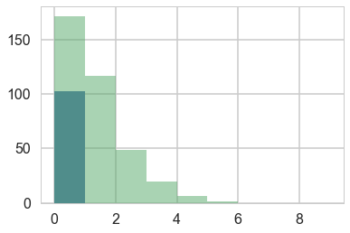


### Lets throw in some domain expertise

*A survey of Abbey Heads has told us, that the most a monk could produce, ever, was 10 manuscripts in a day.*

## First model: just do a poisson


```python
import theano.tensor as t
```


```python
def model_poisson(data):
    with pm.Model() as model1:
        alpha=pm.Normal("alpha", 0,100)
        logmu = alpha
        like = pm.Poisson("obsv", mu=t.exp(logmu), observed=data)
        lambda0 = pm.Deterministic("lambda0", t.exp(alpha))
    return model1
model1 = model_poisson(y)
```


```python
with model1:
    trace1=pm.sample(3000, tune=1000)
```


    Auto-assigning NUTS sampler...
    Initializing NUTS using jitter+adapt_diag...
    Multiprocess sampling (2 chains in 2 jobs)
    NUTS: [alpha]
    100%|██████████| 4000/4000 [00:02<00:00, 1799.36it/s]


```python
pm.traceplot(trace1)
```


    array([[<matplotlib.axes._subplots.AxesSubplot object at 0x115817588>,
            <matplotlib.axes._subplots.AxesSubplot object at 0x11586df98>],
           [<matplotlib.axes._subplots.AxesSubplot object at 0x115820e80>,
            <matplotlib.axes._subplots.AxesSubplot object at 0x114bf5eb8>]], dtype=object)


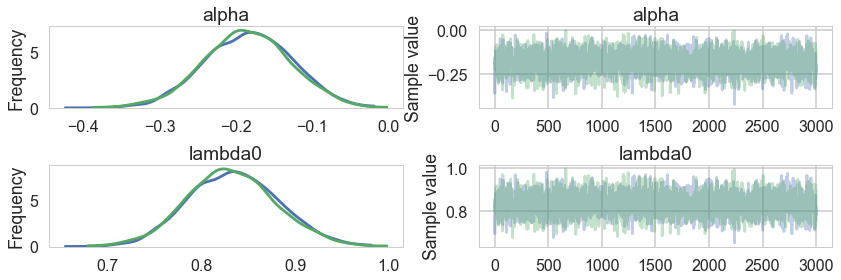


```python
pm.summary(trace1)
```


<div>
<style>
    .dataframe thead tr:only-child th {
        text-align: right;
    }

    .dataframe thead th {
        text-align: left;
    }

    .dataframe tbody tr th {
        vertical-align: top;
    }
</style>
<table border="1" class="dataframe">
  <thead>
    <tr style="text-align: right;">
      <th></th>
      <th>mean</th>
      <th>sd</th>
      <th>mc_error</th>
      <th>hpd_2.5</th>
      <th>hpd_97.5</th>
      <th>n_eff</th>
      <th>Rhat</th>
    </tr>
  </thead>
  <tbody>
    <tr>
      <th>alpha</th>
      <td>-0.184371</td>
      <td>0.057111</td>
      <td>0.001032</td>
      <td>-0.297168</td>
      <td>-0.075473</td>
      <td>2562.0</td>
      <td>1.000351</td>
    </tr>
    <tr>
      <th>lambda0</th>
      <td>0.832983</td>
      <td>0.047501</td>
      <td>0.000864</td>
      <td>0.742139</td>
      <td>0.926474</td>
      <td>2554.0</td>
      <td>1.000351</td>
    </tr>
  </tbody>
</table>
</div>


## Some proper workflow

Notice the prior specification though: at the 2$\sigma$ level, $\lambda$ could range from exp(-200) to exp(200), ie from 0 to an extremely large number to an extremely large "mean" of counts. Not possible. Indeed, the max count is around 10. For a poisson, since the variance is equal to the mean, this means that (at 3$\sigma):

$$max(\lambda + 3\sqrt{\lambda}) < 10$$

Any prior should only take us marginally outside this range:


```python
5+3*np.sqrt(5)
```


    11.708203932499369


### Limiting the prior

Thus a prior should mainly limit $\lambda$ to values upto 5. To so this consider:


```python
from scipy.stats import halfnorm
halfnorm.ppf(0.99, loc=0,scale=4)
```


    10.303317214195602


### Simulating the Bayesian Joint distribution

This should be way enough!, So lets go again:

First we create a decorator using code from https://github.com/ColCarroll/sampled


```python
class ObserverModel(pm.Model):
    """Stores observed variables until the model is created."""
    def __init__(self, observed):
        self.observed = observed
        super(ObserverModel, self).__init__()

    def Var(self, name, dist, data=None, total_size=None):
        return super(ObserverModel, self).Var(name, dist,
                                              data=self.observed.get(name, data),
                                              total_size=total_size)


def sampled(f):
    """Decorator to delay initializing pymc3 model until data is passed in."""
    def wrapped_f(**observed):
        try:
            with ObserverModel(observed) as model:
                f(**observed)
        except TypeError:
            with ObserverModel(observed) as model:
                f()
        return model
    return wrapped_f
```


```python
@sampled
def model_poisson1(verbose=0):
    mu = pm.HalfNormal("mu", 3)
    like = pm.Poisson("obsv", mu=mu)
```


```python
with model_poisson1():
    t_nodata = pm.sample(1000, chains=1)
```


    Sequential sampling (1 chains in 1 job)
    CompoundStep
    >NUTS: [mu_log__]
    >Metropolis: [obsv]
     93%|█████████▎| 1395/1500 [00:01<00:00, 1255.15it/s]//anaconda/envs/py3l/lib/python3.6/site-packages/numpy/core/fromnumeric.py:2909: RuntimeWarning: Mean of empty slice.
      out=out, **kwargs)
    100%|██████████| 1500/1500 [00:01<00:00, 1251.33it/s]
    Tuning was enabled throughout the whole trace.
    Only one chain was sampled, this makes it impossible to run some convergence checks


```python
pm.traceplot(t_nodata);
```


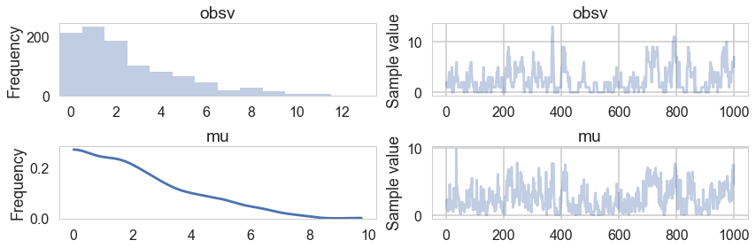


```python
plt.hist(t_nodata['obsv'], bins=np.arange(0,20,1));
```


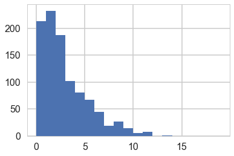


```python
mus = t_nodata.get_values('mu')
mus.shape
```


### Simulating replicate prior predictives


```python
replicate_pp = np.empty((200,200))
```


```python
for i,mu in enumerate(mus):
    if i%10==0:
        print("iter", i)
    with model_poisson1(mu=mu):
        temp_nodata = pm.sample(200, progressbar=False, chains=1)
    replicate_pp[i,:] = temp_nodata.get_values('obsv')
```


    iter 0


    Sequential sampling (1 chains in 1 job)
    Metropolis: [obsv]
    Only one chain was sampled, this makes it impossible to run some convergence checks
    Sequential sampling (1 chains in 1 job)
    Metropolis: [obsv]
    Only one chain was sampled, this makes it impossible to run some convergence checks
    Sequential sampling (1 chains in 1 job)
    Metropolis: [obsv]
    Only one chain was sampled, this makes it impossible to run some convergence checks
    Sequential sampling (1 chains in 1 job)
    Metropolis: [obsv]
    Only one chain was sampled, this makes it impossible to run some convergence checks
    Sequential sampling (1 chains in 1 job)
    Metropolis: [obsv]
    Only one chain was sampled, this makes it impossible to run some convergence checks
    Sequential sampling (1 chains in 1 job)
    Metropolis: [obsv]
    Only one chain was sampled, this makes it impossible to run some convergence checks
    Sequential sampling (1 chains in 1 job)
    Metropolis: [obsv]
    Only one chain was sampled, this makes it impossible to run some convergence checks
    Sequential sampling (1 chains in 1 job)
    Metropolis: [obsv]
    Only one chain was sampled, this makes it impossible to run some convergence checks
    Sequential sampling (1 chains in 1 job)
    Metropolis: [obsv]
    Only one chain was sampled, this makes it impossible to run some convergence checks
    Sequential sampling (1 chains in 1 job)
    Metropolis: [obsv]
    Only one chain was sampled, this makes it impossible to run some convergence checks


    iter 10


    Sequential sampling (1 chains in 1 job)
    Metropolis: [obsv]
    Only one chain was sampled, this makes it impossible to run some convergence checks
    Sequential sampling (1 chains in 1 job)
    Metropolis: [obsv]
    Only one chain was sampled, this makes it impossible to run some convergence checks
    Sequential sampling (1 chains in 1 job)
    Metropolis: [obsv]
    Only one chain was sampled, this makes it impossible to run some convergence checks
    Sequential sampling (1 chains in 1 job)
    Metropolis: [obsv]
    Only one chain was sampled, this makes it impossible to run some convergence checks
    Sequential sampling (1 chains in 1 job)
    Metropolis: [obsv]
    Only one chain was sampled, this makes it impossible to run some convergence checks
    Sequential sampling (1 chains in 1 job)
    Metropolis: [obsv]
    Only one chain was sampled, this makes it impossible to run some convergence checks
    Sequential sampling (1 chains in 1 job)
    Metropolis: [obsv]
    Only one chain was sampled, this makes it impossible to run some convergence checks
    Sequential sampling (1 chains in 1 job)
    Metropolis: [obsv]
    Only one chain was sampled, this makes it impossible to run some convergence checks
    Sequential sampling (1 chains in 1 job)
    Metropolis: [obsv]
    Only one chain was sampled, this makes it impossible to run some convergence checks
    Sequential sampling (1 chains in 1 job)
    Metropolis: [obsv]
    Only one chain was sampled, this makes it impossible to run some convergence checks


    iter 20


    Sequential sampling (1 chains in 1 job)
    Metropolis: [obsv]
    Only one chain was sampled, this makes it impossible to run some convergence checks
    Sequential sampling (1 chains in 1 job)
    Metropolis: [obsv]
    Only one chain was sampled, this makes it impossible to run some convergence checks
    Sequential sampling (1 chains in 1 job)
    Metropolis: [obsv]
    Only one chain was sampled, this makes it impossible to run some convergence checks
    Sequential sampling (1 chains in 1 job)
    Metropolis: [obsv]
    Only one chain was sampled, this makes it impossible to run some convergence checks
    Sequential sampling (1 chains in 1 job)
    Metropolis: [obsv]
    Only one chain was sampled, this makes it impossible to run some convergence checks
    Sequential sampling (1 chains in 1 job)
    Metropolis: [obsv]
    Only one chain was sampled, this makes it impossible to run some convergence checks
    Sequential sampling (1 chains in 1 job)
    Metropolis: [obsv]
    Only one chain was sampled, this makes it impossible to run some convergence checks
    Sequential sampling (1 chains in 1 job)
    Metropolis: [obsv]
    Only one chain was sampled, this makes it impossible to run some convergence checks
    Sequential sampling (1 chains in 1 job)
    Metropolis: [obsv]
    Only one chain was sampled, this makes it impossible to run some convergence checks
    Sequential sampling (1 chains in 1 job)
    Metropolis: [obsv]
    Only one chain was sampled, this makes it impossible to run some convergence checks


    iter 30


    Sequential sampling (1 chains in 1 job)
    Metropolis: [obsv]
    Only one chain was sampled, this makes it impossible to run some convergence checks
    Sequential sampling (1 chains in 1 job)
    Metropolis: [obsv]
    Only one chain was sampled, this makes it impossible to run some convergence checks
    Sequential sampling (1 chains in 1 job)
    Metropolis: [obsv]
    Only one chain was sampled, this makes it impossible to run some convergence checks
    Sequential sampling (1 chains in 1 job)
    Metropolis: [obsv]
    Only one chain was sampled, this makes it impossible to run some convergence checks
    Sequential sampling (1 chains in 1 job)
    Metropolis: [obsv]
    Only one chain was sampled, this makes it impossible to run some convergence checks
    Sequential sampling (1 chains in 1 job)
    Metropolis: [obsv]
    Only one chain was sampled, this makes it impossible to run some convergence checks
    Sequential sampling (1 chains in 1 job)
    Metropolis: [obsv]
    Only one chain was sampled, this makes it impossible to run some convergence checks
    Sequential sampling (1 chains in 1 job)
    Metropolis: [obsv]
    Only one chain was sampled, this makes it impossible to run some convergence checks
    Sequential sampling (1 chains in 1 job)
    Metropolis: [obsv]
    Only one chain was sampled, this makes it impossible to run some convergence checks
    Sequential sampling (1 chains in 1 job)
    Metropolis: [obsv]
    Only one chain was sampled, this makes it impossible to run some convergence checks


    iter 40


    Sequential sampling (1 chains in 1 job)
    Metropolis: [obsv]
    Only one chain was sampled, this makes it impossible to run some convergence checks
    Sequential sampling (1 chains in 1 job)
    Metropolis: [obsv]
    Only one chain was sampled, this makes it impossible to run some convergence checks
    Sequential sampling (1 chains in 1 job)
    Metropolis: [obsv]
    Only one chain was sampled, this makes it impossible to run some convergence checks
    Sequential sampling (1 chains in 1 job)
    Metropolis: [obsv]
    Only one chain was sampled, this makes it impossible to run some convergence checks
    Sequential sampling (1 chains in 1 job)
    Metropolis: [obsv]
    Only one chain was sampled, this makes it impossible to run some convergence checks
    Sequential sampling (1 chains in 1 job)
    Metropolis: [obsv]
    Only one chain was sampled, this makes it impossible to run some convergence checks
    Sequential sampling (1 chains in 1 job)
    Metropolis: [obsv]
    Only one chain was sampled, this makes it impossible to run some convergence checks
    Sequential sampling (1 chains in 1 job)
    Metropolis: [obsv]
    Only one chain was sampled, this makes it impossible to run some convergence checks
    Sequential sampling (1 chains in 1 job)
    Metropolis: [obsv]
    Only one chain was sampled, this makes it impossible to run some convergence checks
    Sequential sampling (1 chains in 1 job)
    Metropolis: [obsv]
    Only one chain was sampled, this makes it impossible to run some convergence checks


    iter 50


    Sequential sampling (1 chains in 1 job)
    Metropolis: [obsv]
    Only one chain was sampled, this makes it impossible to run some convergence checks
    Sequential sampling (1 chains in 1 job)
    Metropolis: [obsv]
    Only one chain was sampled, this makes it impossible to run some convergence checks
    Sequential sampling (1 chains in 1 job)
    Metropolis: [obsv]
    Only one chain was sampled, this makes it impossible to run some convergence checks
    Sequential sampling (1 chains in 1 job)
    Metropolis: [obsv]
    Only one chain was sampled, this makes it impossible to run some convergence checks
    Sequential sampling (1 chains in 1 job)
    Metropolis: [obsv]
    Only one chain was sampled, this makes it impossible to run some convergence checks
    Sequential sampling (1 chains in 1 job)
    Metropolis: [obsv]
    Only one chain was sampled, this makes it impossible to run some convergence checks
    Sequential sampling (1 chains in 1 job)
    Metropolis: [obsv]
    Only one chain was sampled, this makes it impossible to run some convergence checks
    Sequential sampling (1 chains in 1 job)
    Metropolis: [obsv]
    Only one chain was sampled, this makes it impossible to run some convergence checks
    Sequential sampling (1 chains in 1 job)
    Metropolis: [obsv]
    Only one chain was sampled, this makes it impossible to run some convergence checks
    Sequential sampling (1 chains in 1 job)
    Metropolis: [obsv]
    Only one chain was sampled, this makes it impossible to run some convergence checks


    iter 60


    Sequential sampling (1 chains in 1 job)
    Metropolis: [obsv]
    Only one chain was sampled, this makes it impossible to run some convergence checks
    Sequential sampling (1 chains in 1 job)
    Metropolis: [obsv]
    Only one chain was sampled, this makes it impossible to run some convergence checks
    Sequential sampling (1 chains in 1 job)
    Metropolis: [obsv]
    Only one chain was sampled, this makes it impossible to run some convergence checks
    Sequential sampling (1 chains in 1 job)
    Metropolis: [obsv]
    Only one chain was sampled, this makes it impossible to run some convergence checks
    Sequential sampling (1 chains in 1 job)
    Metropolis: [obsv]
    Only one chain was sampled, this makes it impossible to run some convergence checks
    Sequential sampling (1 chains in 1 job)
    Metropolis: [obsv]
    Only one chain was sampled, this makes it impossible to run some convergence checks
    Sequential sampling (1 chains in 1 job)
    Metropolis: [obsv]
    Only one chain was sampled, this makes it impossible to run some convergence checks
    Sequential sampling (1 chains in 1 job)
    Metropolis: [obsv]
    Only one chain was sampled, this makes it impossible to run some convergence checks
    Sequential sampling (1 chains in 1 job)
    Metropolis: [obsv]
    Only one chain was sampled, this makes it impossible to run some convergence checks
    Sequential sampling (1 chains in 1 job)
    Metropolis: [obsv]
    Only one chain was sampled, this makes it impossible to run some convergence checks


    iter 70


    Sequential sampling (1 chains in 1 job)
    Metropolis: [obsv]
    Only one chain was sampled, this makes it impossible to run some convergence checks
    Sequential sampling (1 chains in 1 job)
    Metropolis: [obsv]
    Only one chain was sampled, this makes it impossible to run some convergence checks
    Sequential sampling (1 chains in 1 job)
    Metropolis: [obsv]
    Only one chain was sampled, this makes it impossible to run some convergence checks
    Sequential sampling (1 chains in 1 job)
    Metropolis: [obsv]
    Only one chain was sampled, this makes it impossible to run some convergence checks
    Sequential sampling (1 chains in 1 job)
    Metropolis: [obsv]
    Only one chain was sampled, this makes it impossible to run some convergence checks
    Sequential sampling (1 chains in 1 job)
    Metropolis: [obsv]
    Only one chain was sampled, this makes it impossible to run some convergence checks
    Sequential sampling (1 chains in 1 job)
    Metropolis: [obsv]
    Only one chain was sampled, this makes it impossible to run some convergence checks
    Sequential sampling (1 chains in 1 job)
    Metropolis: [obsv]
    Only one chain was sampled, this makes it impossible to run some convergence checks
    Sequential sampling (1 chains in 1 job)
    Metropolis: [obsv]
    Only one chain was sampled, this makes it impossible to run some convergence checks
    Sequential sampling (1 chains in 1 job)
    Metropolis: [obsv]
    Only one chain was sampled, this makes it impossible to run some convergence checks


    iter 80


    Sequential sampling (1 chains in 1 job)
    Metropolis: [obsv]
    Only one chain was sampled, this makes it impossible to run some convergence checks
    Sequential sampling (1 chains in 1 job)
    Metropolis: [obsv]
    Only one chain was sampled, this makes it impossible to run some convergence checks
    Sequential sampling (1 chains in 1 job)
    Metropolis: [obsv]
    Only one chain was sampled, this makes it impossible to run some convergence checks
    Sequential sampling (1 chains in 1 job)
    Metropolis: [obsv]
    Only one chain was sampled, this makes it impossible to run some convergence checks
    Sequential sampling (1 chains in 1 job)
    Metropolis: [obsv]
    Only one chain was sampled, this makes it impossible to run some convergence checks
    Sequential sampling (1 chains in 1 job)
    Metropolis: [obsv]
    Only one chain was sampled, this makes it impossible to run some convergence checks
    Sequential sampling (1 chains in 1 job)
    Metropolis: [obsv]
    Only one chain was sampled, this makes it impossible to run some convergence checks
    Sequential sampling (1 chains in 1 job)
    Metropolis: [obsv]
    Only one chain was sampled, this makes it impossible to run some convergence checks
    Sequential sampling (1 chains in 1 job)
    Metropolis: [obsv]
    Only one chain was sampled, this makes it impossible to run some convergence checks
    Sequential sampling (1 chains in 1 job)
    Metropolis: [obsv]
    Only one chain was sampled, this makes it impossible to run some convergence checks


    iter 90


    Sequential sampling (1 chains in 1 job)
    Metropolis: [obsv]
    Only one chain was sampled, this makes it impossible to run some convergence checks
    Sequential sampling (1 chains in 1 job)
    Metropolis: [obsv]
    Only one chain was sampled, this makes it impossible to run some convergence checks
    Sequential sampling (1 chains in 1 job)
    Metropolis: [obsv]
    Only one chain was sampled, this makes it impossible to run some convergence checks
    Sequential sampling (1 chains in 1 job)
    Metropolis: [obsv]
    Only one chain was sampled, this makes it impossible to run some convergence checks
    Sequential sampling (1 chains in 1 job)
    Metropolis: [obsv]
    Only one chain was sampled, this makes it impossible to run some convergence checks
    Sequential sampling (1 chains in 1 job)
    Metropolis: [obsv]
    Only one chain was sampled, this makes it impossible to run some convergence checks
    Sequential sampling (1 chains in 1 job)
    Metropolis: [obsv]
    Only one chain was sampled, this makes it impossible to run some convergence checks
    Sequential sampling (1 chains in 1 job)
    Metropolis: [obsv]
    Only one chain was sampled, this makes it impossible to run some convergence checks
    Sequential sampling (1 chains in 1 job)
    Metropolis: [obsv]
    Only one chain was sampled, this makes it impossible to run some convergence checks
    Sequential sampling (1 chains in 1 job)
    Metropolis: [obsv]
    Only one chain was sampled, this makes it impossible to run some convergence checks


    iter 100


    Sequential sampling (1 chains in 1 job)
    Metropolis: [obsv]
    Only one chain was sampled, this makes it impossible to run some convergence checks
    Sequential sampling (1 chains in 1 job)
    Metropolis: [obsv]
    Only one chain was sampled, this makes it impossible to run some convergence checks
    Sequential sampling (1 chains in 1 job)
    Metropolis: [obsv]
    Only one chain was sampled, this makes it impossible to run some convergence checks
    Sequential sampling (1 chains in 1 job)
    Metropolis: [obsv]
    Only one chain was sampled, this makes it impossible to run some convergence checks
    Sequential sampling (1 chains in 1 job)
    Metropolis: [obsv]
    Only one chain was sampled, this makes it impossible to run some convergence checks
    Sequential sampling (1 chains in 1 job)
    Metropolis: [obsv]
    Only one chain was sampled, this makes it impossible to run some convergence checks
    Sequential sampling (1 chains in 1 job)
    Metropolis: [obsv]
    Only one chain was sampled, this makes it impossible to run some convergence checks
    Sequential sampling (1 chains in 1 job)
    Metropolis: [obsv]
    Only one chain was sampled, this makes it impossible to run some convergence checks
    Sequential sampling (1 chains in 1 job)
    Metropolis: [obsv]
    Only one chain was sampled, this makes it impossible to run some convergence checks
    Sequential sampling (1 chains in 1 job)
    Metropolis: [obsv]
    Only one chain was sampled, this makes it impossible to run some convergence checks


    iter 110


    Sequential sampling (1 chains in 1 job)
    Metropolis: [obsv]
    Only one chain was sampled, this makes it impossible to run some convergence checks
    Sequential sampling (1 chains in 1 job)
    Metropolis: [obsv]
    Only one chain was sampled, this makes it impossible to run some convergence checks
    Sequential sampling (1 chains in 1 job)
    Metropolis: [obsv]
    Only one chain was sampled, this makes it impossible to run some convergence checks
    Sequential sampling (1 chains in 1 job)
    Metropolis: [obsv]
    Only one chain was sampled, this makes it impossible to run some convergence checks
    Sequential sampling (1 chains in 1 job)
    Metropolis: [obsv]
    Only one chain was sampled, this makes it impossible to run some convergence checks
    Sequential sampling (1 chains in 1 job)
    Metropolis: [obsv]
    Only one chain was sampled, this makes it impossible to run some convergence checks
    Sequential sampling (1 chains in 1 job)
    Metropolis: [obsv]
    Only one chain was sampled, this makes it impossible to run some convergence checks
    Sequential sampling (1 chains in 1 job)
    Metropolis: [obsv]
    Only one chain was sampled, this makes it impossible to run some convergence checks
    Sequential sampling (1 chains in 1 job)
    Metropolis: [obsv]
    Only one chain was sampled, this makes it impossible to run some convergence checks
    Sequential sampling (1 chains in 1 job)
    Metropolis: [obsv]
    Only one chain was sampled, this makes it impossible to run some convergence checks


    iter 120


    Sequential sampling (1 chains in 1 job)
    Metropolis: [obsv]
    Only one chain was sampled, this makes it impossible to run some convergence checks
    Sequential sampling (1 chains in 1 job)
    Metropolis: [obsv]
    Only one chain was sampled, this makes it impossible to run some convergence checks
    Sequential sampling (1 chains in 1 job)
    Metropolis: [obsv]
    Only one chain was sampled, this makes it impossible to run some convergence checks
    Sequential sampling (1 chains in 1 job)
    Metropolis: [obsv]
    Only one chain was sampled, this makes it impossible to run some convergence checks
    Sequential sampling (1 chains in 1 job)
    Metropolis: [obsv]
    Only one chain was sampled, this makes it impossible to run some convergence checks
    Sequential sampling (1 chains in 1 job)
    Metropolis: [obsv]
    Only one chain was sampled, this makes it impossible to run some convergence checks
    Sequential sampling (1 chains in 1 job)
    Metropolis: [obsv]
    Only one chain was sampled, this makes it impossible to run some convergence checks
    Sequential sampling (1 chains in 1 job)
    Metropolis: [obsv]
    Only one chain was sampled, this makes it impossible to run some convergence checks
    Sequential sampling (1 chains in 1 job)
    Metropolis: [obsv]
    Only one chain was sampled, this makes it impossible to run some convergence checks
    Sequential sampling (1 chains in 1 job)
    Metropolis: [obsv]
    Only one chain was sampled, this makes it impossible to run some convergence checks


    iter 130


    Sequential sampling (1 chains in 1 job)
    Metropolis: [obsv]
    Only one chain was sampled, this makes it impossible to run some convergence checks
    Sequential sampling (1 chains in 1 job)
    Metropolis: [obsv]
    Only one chain was sampled, this makes it impossible to run some convergence checks
    Sequential sampling (1 chains in 1 job)
    Metropolis: [obsv]
    Only one chain was sampled, this makes it impossible to run some convergence checks
    Sequential sampling (1 chains in 1 job)
    Metropolis: [obsv]
    Only one chain was sampled, this makes it impossible to run some convergence checks
    Sequential sampling (1 chains in 1 job)
    Metropolis: [obsv]
    Only one chain was sampled, this makes it impossible to run some convergence checks
    Sequential sampling (1 chains in 1 job)
    Metropolis: [obsv]
    Only one chain was sampled, this makes it impossible to run some convergence checks
    Sequential sampling (1 chains in 1 job)
    Metropolis: [obsv]
    Only one chain was sampled, this makes it impossible to run some convergence checks
    Sequential sampling (1 chains in 1 job)
    Metropolis: [obsv]
    Only one chain was sampled, this makes it impossible to run some convergence checks
    Sequential sampling (1 chains in 1 job)
    Metropolis: [obsv]
    Only one chain was sampled, this makes it impossible to run some convergence checks
    Sequential sampling (1 chains in 1 job)
    Metropolis: [obsv]
    Only one chain was sampled, this makes it impossible to run some convergence checks


    iter 140


    Sequential sampling (1 chains in 1 job)
    Metropolis: [obsv]
    Only one chain was sampled, this makes it impossible to run some convergence checks
    Sequential sampling (1 chains in 1 job)
    Metropolis: [obsv]
    Only one chain was sampled, this makes it impossible to run some convergence checks
    Sequential sampling (1 chains in 1 job)
    Metropolis: [obsv]
    Only one chain was sampled, this makes it impossible to run some convergence checks
    Sequential sampling (1 chains in 1 job)
    Metropolis: [obsv]
    Only one chain was sampled, this makes it impossible to run some convergence checks
    Sequential sampling (1 chains in 1 job)
    Metropolis: [obsv]
    Only one chain was sampled, this makes it impossible to run some convergence checks
    Sequential sampling (1 chains in 1 job)
    Metropolis: [obsv]
    Only one chain was sampled, this makes it impossible to run some convergence checks
    Sequential sampling (1 chains in 1 job)
    Metropolis: [obsv]
    Only one chain was sampled, this makes it impossible to run some convergence checks
    Sequential sampling (1 chains in 1 job)
    Metropolis: [obsv]
    Only one chain was sampled, this makes it impossible to run some convergence checks
    Sequential sampling (1 chains in 1 job)
    Metropolis: [obsv]
    Only one chain was sampled, this makes it impossible to run some convergence checks
    Sequential sampling (1 chains in 1 job)
    Metropolis: [obsv]
    Only one chain was sampled, this makes it impossible to run some convergence checks


    iter 150


    Sequential sampling (1 chains in 1 job)
    Metropolis: [obsv]
    Only one chain was sampled, this makes it impossible to run some convergence checks
    Sequential sampling (1 chains in 1 job)
    Metropolis: [obsv]
    Only one chain was sampled, this makes it impossible to run some convergence checks
    Sequential sampling (1 chains in 1 job)
    Metropolis: [obsv]
    Only one chain was sampled, this makes it impossible to run some convergence checks
    Sequential sampling (1 chains in 1 job)
    Metropolis: [obsv]
    Only one chain was sampled, this makes it impossible to run some convergence checks
    Sequential sampling (1 chains in 1 job)
    Metropolis: [obsv]
    Only one chain was sampled, this makes it impossible to run some convergence checks
    Sequential sampling (1 chains in 1 job)
    Metropolis: [obsv]
    Only one chain was sampled, this makes it impossible to run some convergence checks
    Sequential sampling (1 chains in 1 job)
    Metropolis: [obsv]
    Only one chain was sampled, this makes it impossible to run some convergence checks
    Sequential sampling (1 chains in 1 job)
    Metropolis: [obsv]
    Only one chain was sampled, this makes it impossible to run some convergence checks
    Sequential sampling (1 chains in 1 job)
    Metropolis: [obsv]
    Only one chain was sampled, this makes it impossible to run some convergence checks
    Sequential sampling (1 chains in 1 job)
    Metropolis: [obsv]
    Only one chain was sampled, this makes it impossible to run some convergence checks


    iter 160


    Sequential sampling (1 chains in 1 job)
    Metropolis: [obsv]
    Only one chain was sampled, this makes it impossible to run some convergence checks
    Sequential sampling (1 chains in 1 job)
    Metropolis: [obsv]
    Only one chain was sampled, this makes it impossible to run some convergence checks
    Sequential sampling (1 chains in 1 job)
    Metropolis: [obsv]
    Only one chain was sampled, this makes it impossible to run some convergence checks
    Sequential sampling (1 chains in 1 job)
    Metropolis: [obsv]
    Only one chain was sampled, this makes it impossible to run some convergence checks
    Sequential sampling (1 chains in 1 job)
    Metropolis: [obsv]
    Only one chain was sampled, this makes it impossible to run some convergence checks
    Sequential sampling (1 chains in 1 job)
    Metropolis: [obsv]
    Only one chain was sampled, this makes it impossible to run some convergence checks
    Sequential sampling (1 chains in 1 job)
    Metropolis: [obsv]
    Only one chain was sampled, this makes it impossible to run some convergence checks
    Sequential sampling (1 chains in 1 job)
    Metropolis: [obsv]
    Only one chain was sampled, this makes it impossible to run some convergence checks
    Sequential sampling (1 chains in 1 job)
    Metropolis: [obsv]
    Only one chain was sampled, this makes it impossible to run some convergence checks
    Sequential sampling (1 chains in 1 job)
    Metropolis: [obsv]
    Only one chain was sampled, this makes it impossible to run some convergence checks


    iter 170


    Sequential sampling (1 chains in 1 job)
    Metropolis: [obsv]
    Only one chain was sampled, this makes it impossible to run some convergence checks
    Sequential sampling (1 chains in 1 job)
    Metropolis: [obsv]
    Only one chain was sampled, this makes it impossible to run some convergence checks
    Sequential sampling (1 chains in 1 job)
    Metropolis: [obsv]
    Only one chain was sampled, this makes it impossible to run some convergence checks
    Sequential sampling (1 chains in 1 job)
    Metropolis: [obsv]
    Only one chain was sampled, this makes it impossible to run some convergence checks
    Sequential sampling (1 chains in 1 job)
    Metropolis: [obsv]
    Only one chain was sampled, this makes it impossible to run some convergence checks
    Sequential sampling (1 chains in 1 job)
    Metropolis: [obsv]
    Only one chain was sampled, this makes it impossible to run some convergence checks
    Sequential sampling (1 chains in 1 job)
    Metropolis: [obsv]
    Only one chain was sampled, this makes it impossible to run some convergence checks
    Sequential sampling (1 chains in 1 job)
    Metropolis: [obsv]
    Only one chain was sampled, this makes it impossible to run some convergence checks
    Sequential sampling (1 chains in 1 job)
    Metropolis: [obsv]
    Only one chain was sampled, this makes it impossible to run some convergence checks
    Sequential sampling (1 chains in 1 job)
    Metropolis: [obsv]
    Only one chain was sampled, this makes it impossible to run some convergence checks


    iter 180


    Sequential sampling (1 chains in 1 job)
    Metropolis: [obsv]
    Only one chain was sampled, this makes it impossible to run some convergence checks
    Sequential sampling (1 chains in 1 job)
    Metropolis: [obsv]
    Only one chain was sampled, this makes it impossible to run some convergence checks
    Sequential sampling (1 chains in 1 job)
    Metropolis: [obsv]
    Only one chain was sampled, this makes it impossible to run some convergence checks
    Sequential sampling (1 chains in 1 job)
    Metropolis: [obsv]
    Only one chain was sampled, this makes it impossible to run some convergence checks
    Sequential sampling (1 chains in 1 job)
    Metropolis: [obsv]
    Only one chain was sampled, this makes it impossible to run some convergence checks
    Sequential sampling (1 chains in 1 job)
    Metropolis: [obsv]
    Only one chain was sampled, this makes it impossible to run some convergence checks
    Sequential sampling (1 chains in 1 job)
    Metropolis: [obsv]
    Only one chain was sampled, this makes it impossible to run some convergence checks
    Sequential sampling (1 chains in 1 job)
    Metropolis: [obsv]
    Only one chain was sampled, this makes it impossible to run some convergence checks
    Sequential sampling (1 chains in 1 job)
    Metropolis: [obsv]
    Only one chain was sampled, this makes it impossible to run some convergence checks
    Sequential sampling (1 chains in 1 job)
    Metropolis: [obsv]
    Only one chain was sampled, this makes it impossible to run some convergence checks


    iter 190


    Sequential sampling (1 chains in 1 job)
    Metropolis: [obsv]
    Only one chain was sampled, this makes it impossible to run some convergence checks
    Sequential sampling (1 chains in 1 job)
    Metropolis: [obsv]
    Only one chain was sampled, this makes it impossible to run some convergence checks
    Sequential sampling (1 chains in 1 job)
    Metropolis: [obsv]
    Only one chain was sampled, this makes it impossible to run some convergence checks
    Sequential sampling (1 chains in 1 job)
    Metropolis: [obsv]
    Only one chain was sampled, this makes it impossible to run some convergence checks
    Sequential sampling (1 chains in 1 job)
    Metropolis: [obsv]
    Only one chain was sampled, this makes it impossible to run some convergence checks
    Sequential sampling (1 chains in 1 job)
    Metropolis: [obsv]
    Only one chain was sampled, this makes it impossible to run some convergence checks
    Sequential sampling (1 chains in 1 job)
    Metropolis: [obsv]
    Only one chain was sampled, this makes it impossible to run some convergence checks
    Sequential sampling (1 chains in 1 job)
    Metropolis: [obsv]
    Only one chain was sampled, this makes it impossible to run some convergence checks
    Sequential sampling (1 chains in 1 job)
    Metropolis: [obsv]
    Only one chain was sampled, this makes it impossible to run some convergence checks
    Sequential sampling (1 chains in 1 job)
    Metropolis: [obsv]
    Only one chain was sampled, this makes it impossible to run some convergence checks


```python
with model_poisson1(obsv=replicate_pp[0,:]):
    tpost = pm.sample(1000)
```


    Auto-assigning NUTS sampler...
    Initializing NUTS using jitter+adapt_diag...
    Multiprocess sampling (2 chains in 2 jobs)
    NUTS: [mu_log__]
    100%|██████████| 1500/1500 [00:00<00:00, 1585.16it/s]
    The acceptance probability does not match the target. It is 0.884204635079, but should be close to 0.8. Try to increase the number of tuning steps.


```python
pm.traceplot(tpost)
```


    array([[<matplotlib.axes._subplots.AxesSubplot object at 0x120cf1be0>,
            <matplotlib.axes._subplots.AxesSubplot object at 0x12274be48>]], dtype=object)


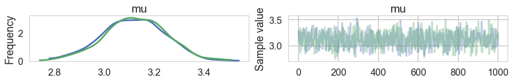


```python
mus[0]
```


    2.807525696673618


```python
np.std(tpost['mu'])
```


    0.12507126731431462


```python
pm.summary(tpost)
```


<div>
<style>
    .dataframe thead tr:only-child th {
        text-align: right;
    }

    .dataframe thead th {
        text-align: left;
    }

    .dataframe tbody tr th {
        vertical-align: top;
    }
</style>
<table border="1" class="dataframe">
  <thead>
    <tr style="text-align: right;">
      <th></th>
      <th>mean</th>
      <th>sd</th>
      <th>mc_error</th>
      <th>hpd_2.5</th>
      <th>hpd_97.5</th>
      <th>n_eff</th>
      <th>Rhat</th>
    </tr>
  </thead>
  <tbody>
    <tr>
      <th>mu</th>
      <td>3.12099</td>
      <td>0.125071</td>
      <td>0.003999</td>
      <td>2.864898</td>
      <td>3.354582</td>
      <td>758.0</td>
      <td>1.000367</td>
    </tr>
  </tbody>
</table>
</div>


```python
replicate_post=np.empty((200, 200))
for i,mu in enumerate(mus):
    if i%10==0:
        print("iter", i)
    with model_poisson1(obsv=replicate_pp[i,:]):
        temp_simdata = pm.sample(200, progressbar=False, chains=1)
    replicate_post[i,:] = temp_simdata.get_values('mu')
```


    iter 0


    Auto-assigning NUTS sampler...
    Initializing NUTS using jitter+adapt_diag...
    Sequential sampling (1 chains in 1 job)
    NUTS: [mu_log__]
    Only 200 samples in chain.
    Only one chain was sampled, this makes it impossible to run some convergence checks
    Auto-assigning NUTS sampler...
    Initializing NUTS using jitter+adapt_diag...
    Sequential sampling (1 chains in 1 job)
    NUTS: [mu_log__]
    Only 200 samples in chain.
    Only one chain was sampled, this makes it impossible to run some convergence checks
    Auto-assigning NUTS sampler...
    Initializing NUTS using jitter+adapt_diag...
    Sequential sampling (1 chains in 1 job)
    NUTS: [mu_log__]
    Only 200 samples in chain.
    Only one chain was sampled, this makes it impossible to run some convergence checks
    Auto-assigning NUTS sampler...
    Initializing NUTS using jitter+adapt_diag...
    Sequential sampling (1 chains in 1 job)
    NUTS: [mu_log__]
    Only 200 samples in chain.
    Only one chain was sampled, this makes it impossible to run some convergence checks
    Auto-assigning NUTS sampler...
    Initializing NUTS using jitter+adapt_diag...
    Sequential sampling (1 chains in 1 job)
    NUTS: [mu_log__]
    Only 200 samples in chain.
    Only one chain was sampled, this makes it impossible to run some convergence checks
    Auto-assigning NUTS sampler...
    Initializing NUTS using jitter+adapt_diag...
    Sequential sampling (1 chains in 1 job)
    NUTS: [mu_log__]
    Only 200 samples in chain.
    Only one chain was sampled, this makes it impossible to run some convergence checks
    Auto-assigning NUTS sampler...
    Initializing NUTS using jitter+adapt_diag...
    Sequential sampling (1 chains in 1 job)
    NUTS: [mu_log__]
    Only 200 samples in chain.
    Only one chain was sampled, this makes it impossible to run some convergence checks
    Auto-assigning NUTS sampler...
    Initializing NUTS using jitter+adapt_diag...
    Sequential sampling (1 chains in 1 job)
    NUTS: [mu_log__]
    Only 200 samples in chain.
    Only one chain was sampled, this makes it impossible to run some convergence checks
    Auto-assigning NUTS sampler...
    Initializing NUTS using jitter+adapt_diag...
    Sequential sampling (1 chains in 1 job)
    NUTS: [mu_log__]
    Only 200 samples in chain.
    Only one chain was sampled, this makes it impossible to run some convergence checks
    Auto-assigning NUTS sampler...
    Initializing NUTS using jitter+adapt_diag...
    Sequential sampling (1 chains in 1 job)
    NUTS: [mu_log__]
    Only 200 samples in chain.
    Only one chain was sampled, this makes it impossible to run some convergence checks


    iter 10


    Auto-assigning NUTS sampler...
    Initializing NUTS using jitter+adapt_diag...
    Sequential sampling (1 chains in 1 job)
    NUTS: [mu_log__]
    Only 200 samples in chain.
    Only one chain was sampled, this makes it impossible to run some convergence checks
    Auto-assigning NUTS sampler...
    Initializing NUTS using jitter+adapt_diag...
    Sequential sampling (1 chains in 1 job)
    NUTS: [mu_log__]
    Only 200 samples in chain.
    Only one chain was sampled, this makes it impossible to run some convergence checks
    Auto-assigning NUTS sampler...
    Initializing NUTS using jitter+adapt_diag...
    Sequential sampling (1 chains in 1 job)
    NUTS: [mu_log__]
    Only 200 samples in chain.
    Only one chain was sampled, this makes it impossible to run some convergence checks
    Auto-assigning NUTS sampler...
    Initializing NUTS using jitter+adapt_diag...
    Sequential sampling (1 chains in 1 job)
    NUTS: [mu_log__]
    Only 200 samples in chain.
    Only one chain was sampled, this makes it impossible to run some convergence checks
    Auto-assigning NUTS sampler...
    Initializing NUTS using jitter+adapt_diag...
    Sequential sampling (1 chains in 1 job)
    NUTS: [mu_log__]
    Only 200 samples in chain.
    Only one chain was sampled, this makes it impossible to run some convergence checks
    Auto-assigning NUTS sampler...
    Initializing NUTS using jitter+adapt_diag...
    Sequential sampling (1 chains in 1 job)
    NUTS: [mu_log__]
    Only 200 samples in chain.
    Only one chain was sampled, this makes it impossible to run some convergence checks
    Auto-assigning NUTS sampler...
    Initializing NUTS using jitter+adapt_diag...
    Sequential sampling (1 chains in 1 job)
    NUTS: [mu_log__]
    Only 200 samples in chain.
    Only one chain was sampled, this makes it impossible to run some convergence checks
    Auto-assigning NUTS sampler...
    Initializing NUTS using jitter+adapt_diag...
    Sequential sampling (1 chains in 1 job)
    NUTS: [mu_log__]
    Only 200 samples in chain.
    The acceptance probability does not match the target. It is 0.913442678494, but should be close to 0.8. Try to increase the number of tuning steps.
    Only one chain was sampled, this makes it impossible to run some convergence checks
    Auto-assigning NUTS sampler...
    Initializing NUTS using jitter+adapt_diag...
    Sequential sampling (1 chains in 1 job)
    NUTS: [mu_log__]
    Only 200 samples in chain.
    Only one chain was sampled, this makes it impossible to run some convergence checks
    Auto-assigning NUTS sampler...
    Initializing NUTS using jitter+adapt_diag...
    Sequential sampling (1 chains in 1 job)
    NUTS: [mu_log__]
    Only 200 samples in chain.
    Only one chain was sampled, this makes it impossible to run some convergence checks


    iter 20


    Auto-assigning NUTS sampler...
    Initializing NUTS using jitter+adapt_diag...
    Sequential sampling (1 chains in 1 job)
    NUTS: [mu_log__]
    Only 200 samples in chain.
    Only one chain was sampled, this makes it impossible to run some convergence checks
    Auto-assigning NUTS sampler...
    Initializing NUTS using jitter+adapt_diag...
    Sequential sampling (1 chains in 1 job)
    NUTS: [mu_log__]
    Only 200 samples in chain.
    The acceptance probability does not match the target. It is 0.87983360042, but should be close to 0.8. Try to increase the number of tuning steps.
    Only one chain was sampled, this makes it impossible to run some convergence checks
    Auto-assigning NUTS sampler...
    Initializing NUTS using jitter+adapt_diag...
    Sequential sampling (1 chains in 1 job)
    NUTS: [mu_log__]
    Only 200 samples in chain.
    The acceptance probability does not match the target. It is 0.8798054762, but should be close to 0.8. Try to increase the number of tuning steps.
    Only one chain was sampled, this makes it impossible to run some convergence checks
    Auto-assigning NUTS sampler...
    Initializing NUTS using jitter+adapt_diag...
    Sequential sampling (1 chains in 1 job)
    NUTS: [mu_log__]
    Only 200 samples in chain.
    Only one chain was sampled, this makes it impossible to run some convergence checks
    Auto-assigning NUTS sampler...
    Initializing NUTS using jitter+adapt_diag...
    Sequential sampling (1 chains in 1 job)
    NUTS: [mu_log__]
    Only 200 samples in chain.
    Only one chain was sampled, this makes it impossible to run some convergence checks
    Auto-assigning NUTS sampler...
    Initializing NUTS using jitter+adapt_diag...
    Sequential sampling (1 chains in 1 job)
    NUTS: [mu_log__]
    Only 200 samples in chain.
    Only one chain was sampled, this makes it impossible to run some convergence checks
    Auto-assigning NUTS sampler...
    Initializing NUTS using jitter+adapt_diag...
    Sequential sampling (1 chains in 1 job)
    NUTS: [mu_log__]
    Only 200 samples in chain.
    The acceptance probability does not match the target. It is 0.883090611023, but should be close to 0.8. Try to increase the number of tuning steps.
    Only one chain was sampled, this makes it impossible to run some convergence checks
    Auto-assigning NUTS sampler...
    Initializing NUTS using jitter+adapt_diag...
    Sequential sampling (1 chains in 1 job)
    NUTS: [mu_log__]
    Only 200 samples in chain.
    Only one chain was sampled, this makes it impossible to run some convergence checks
    Auto-assigning NUTS sampler...
    Initializing NUTS using jitter+adapt_diag...
    Sequential sampling (1 chains in 1 job)
    NUTS: [mu_log__]
    Only 200 samples in chain.
    Only one chain was sampled, this makes it impossible to run some convergence checks
    Auto-assigning NUTS sampler...
    Initializing NUTS using jitter+adapt_diag...
    Sequential sampling (1 chains in 1 job)
    NUTS: [mu_log__]
    Only 200 samples in chain.
    Only one chain was sampled, this makes it impossible to run some convergence checks


    iter 30


    Auto-assigning NUTS sampler...
    Initializing NUTS using jitter+adapt_diag...
    Sequential sampling (1 chains in 1 job)
    NUTS: [mu_log__]
    Only 200 samples in chain.
    Only one chain was sampled, this makes it impossible to run some convergence checks
    Auto-assigning NUTS sampler...
    Initializing NUTS using jitter+adapt_diag...
    Sequential sampling (1 chains in 1 job)
    NUTS: [mu_log__]
    Only 200 samples in chain.
    Only one chain was sampled, this makes it impossible to run some convergence checks
    Auto-assigning NUTS sampler...
    Initializing NUTS using jitter+adapt_diag...
    Sequential sampling (1 chains in 1 job)
    NUTS: [mu_log__]
    Only 200 samples in chain.
    Only one chain was sampled, this makes it impossible to run some convergence checks
    Auto-assigning NUTS sampler...
    Initializing NUTS using jitter+adapt_diag...
    Sequential sampling (1 chains in 1 job)
    NUTS: [mu_log__]
    Only 200 samples in chain.
    Only one chain was sampled, this makes it impossible to run some convergence checks
    Auto-assigning NUTS sampler...
    Initializing NUTS using jitter+adapt_diag...
    Sequential sampling (1 chains in 1 job)
    NUTS: [mu_log__]
    Only 200 samples in chain.
    Only one chain was sampled, this makes it impossible to run some convergence checks
    Auto-assigning NUTS sampler...
    Initializing NUTS using jitter+adapt_diag...
    Sequential sampling (1 chains in 1 job)
    NUTS: [mu_log__]
    Only 200 samples in chain.
    Only one chain was sampled, this makes it impossible to run some convergence checks
    Auto-assigning NUTS sampler...
    Initializing NUTS using jitter+adapt_diag...
    Sequential sampling (1 chains in 1 job)
    NUTS: [mu_log__]
    Only 200 samples in chain.
    The acceptance probability does not match the target. It is 0.883655862554, but should be close to 0.8. Try to increase the number of tuning steps.
    Only one chain was sampled, this makes it impossible to run some convergence checks
    Auto-assigning NUTS sampler...
    Initializing NUTS using jitter+adapt_diag...
    Sequential sampling (1 chains in 1 job)
    NUTS: [mu_log__]
    Only 200 samples in chain.
    The acceptance probability does not match the target. It is 0.885589551766, but should be close to 0.8. Try to increase the number of tuning steps.
    Only one chain was sampled, this makes it impossible to run some convergence checks
    Auto-assigning NUTS sampler...
    Initializing NUTS using jitter+adapt_diag...
    Sequential sampling (1 chains in 1 job)
    NUTS: [mu_log__]
    Only 200 samples in chain.
    The acceptance probability does not match the target. It is 0.887472349455, but should be close to 0.8. Try to increase the number of tuning steps.
    Only one chain was sampled, this makes it impossible to run some convergence checks
    Auto-assigning NUTS sampler...
    Initializing NUTS using jitter+adapt_diag...
    Sequential sampling (1 chains in 1 job)
    NUTS: [mu_log__]
    Only 200 samples in chain.
    Only one chain was sampled, this makes it impossible to run some convergence checks


    iter 40


    Auto-assigning NUTS sampler...
    Initializing NUTS using jitter+adapt_diag...
    Sequential sampling (1 chains in 1 job)
    NUTS: [mu_log__]
    Only 200 samples in chain.
    The acceptance probability does not match the target. It is 0.886364831976, but should be close to 0.8. Try to increase the number of tuning steps.
    Only one chain was sampled, this makes it impossible to run some convergence checks
    Auto-assigning NUTS sampler...
    Initializing NUTS using jitter+adapt_diag...
    Sequential sampling (1 chains in 1 job)
    NUTS: [mu_log__]
    Only 200 samples in chain.
    Only one chain was sampled, this makes it impossible to run some convergence checks
    Auto-assigning NUTS sampler...
    Initializing NUTS using jitter+adapt_diag...
    Sequential sampling (1 chains in 1 job)
    NUTS: [mu_log__]
    Only 200 samples in chain.
    Only one chain was sampled, this makes it impossible to run some convergence checks
    Auto-assigning NUTS sampler...
    Initializing NUTS using jitter+adapt_diag...
    Sequential sampling (1 chains in 1 job)
    NUTS: [mu_log__]
    Only 200 samples in chain.
    Only one chain was sampled, this makes it impossible to run some convergence checks
    Auto-assigning NUTS sampler...
    Initializing NUTS using jitter+adapt_diag...
    Sequential sampling (1 chains in 1 job)
    NUTS: [mu_log__]
    Only 200 samples in chain.
    The acceptance probability does not match the target. It is 0.898397173883, but should be close to 0.8. Try to increase the number of tuning steps.
    Only one chain was sampled, this makes it impossible to run some convergence checks
    Auto-assigning NUTS sampler...
    Initializing NUTS using jitter+adapt_diag...
    Sequential sampling (1 chains in 1 job)
    NUTS: [mu_log__]
    Only 200 samples in chain.
    Only one chain was sampled, this makes it impossible to run some convergence checks
    Auto-assigning NUTS sampler...
    Initializing NUTS using jitter+adapt_diag...
    Sequential sampling (1 chains in 1 job)
    NUTS: [mu_log__]
    Only 200 samples in chain.
    The acceptance probability does not match the target. It is 0.890151740575, but should be close to 0.8. Try to increase the number of tuning steps.
    Only one chain was sampled, this makes it impossible to run some convergence checks
    Auto-assigning NUTS sampler...
    Initializing NUTS using jitter+adapt_diag...
    Sequential sampling (1 chains in 1 job)
    NUTS: [mu_log__]
    Only 200 samples in chain.
    Only one chain was sampled, this makes it impossible to run some convergence checks
    Auto-assigning NUTS sampler...
    Initializing NUTS using jitter+adapt_diag...
    Sequential sampling (1 chains in 1 job)
    NUTS: [mu_log__]
    Only 200 samples in chain.
    Only one chain was sampled, this makes it impossible to run some convergence checks
    Auto-assigning NUTS sampler...
    Initializing NUTS using jitter+adapt_diag...
    Sequential sampling (1 chains in 1 job)
    NUTS: [mu_log__]
    Only 200 samples in chain.
    Only one chain was sampled, this makes it impossible to run some convergence checks


    iter 50


    Auto-assigning NUTS sampler...
    Initializing NUTS using jitter+adapt_diag...
    Sequential sampling (1 chains in 1 job)
    NUTS: [mu_log__]
    Only 200 samples in chain.
    Only one chain was sampled, this makes it impossible to run some convergence checks
    Auto-assigning NUTS sampler...
    Initializing NUTS using jitter+adapt_diag...
    Sequential sampling (1 chains in 1 job)
    NUTS: [mu_log__]
    Only 200 samples in chain.
    Only one chain was sampled, this makes it impossible to run some convergence checks
    Auto-assigning NUTS sampler...
    Initializing NUTS using jitter+adapt_diag...
    Sequential sampling (1 chains in 1 job)
    NUTS: [mu_log__]
    Only 200 samples in chain.
    Only one chain was sampled, this makes it impossible to run some convergence checks
    Auto-assigning NUTS sampler...
    Initializing NUTS using jitter+adapt_diag...
    Sequential sampling (1 chains in 1 job)
    NUTS: [mu_log__]
    Only 200 samples in chain.
    The acceptance probability does not match the target. It is 0.883216060125, but should be close to 0.8. Try to increase the number of tuning steps.
    Only one chain was sampled, this makes it impossible to run some convergence checks
    Auto-assigning NUTS sampler...
    Initializing NUTS using jitter+adapt_diag...
    Sequential sampling (1 chains in 1 job)
    NUTS: [mu_log__]
    Only 200 samples in chain.
    The acceptance probability does not match the target. It is 0.880730904944, but should be close to 0.8. Try to increase the number of tuning steps.
    Only one chain was sampled, this makes it impossible to run some convergence checks
    Auto-assigning NUTS sampler...
    Initializing NUTS using jitter+adapt_diag...
    Sequential sampling (1 chains in 1 job)
    NUTS: [mu_log__]
    Only 200 samples in chain.
    The acceptance probability does not match the target. It is 0.903233566383, but should be close to 0.8. Try to increase the number of tuning steps.
    Only one chain was sampled, this makes it impossible to run some convergence checks
    Auto-assigning NUTS sampler...
    Initializing NUTS using jitter+adapt_diag...
    Sequential sampling (1 chains in 1 job)
    NUTS: [mu_log__]
    Only 200 samples in chain.
    Only one chain was sampled, this makes it impossible to run some convergence checks
    Auto-assigning NUTS sampler...
    Initializing NUTS using jitter+adapt_diag...
    Sequential sampling (1 chains in 1 job)
    NUTS: [mu_log__]
    Only 200 samples in chain.
    Only one chain was sampled, this makes it impossible to run some convergence checks
    Auto-assigning NUTS sampler...
    Initializing NUTS using jitter+adapt_diag...
    Sequential sampling (1 chains in 1 job)
    NUTS: [mu_log__]
    Only 200 samples in chain.
    Only one chain was sampled, this makes it impossible to run some convergence checks
    Auto-assigning NUTS sampler...
    Initializing NUTS using jitter+adapt_diag...
    Sequential sampling (1 chains in 1 job)
    NUTS: [mu_log__]
    Only 200 samples in chain.
    Only one chain was sampled, this makes it impossible to run some convergence checks


    iter 60


    Auto-assigning NUTS sampler...
    Initializing NUTS using jitter+adapt_diag...
    Sequential sampling (1 chains in 1 job)
    NUTS: [mu_log__]
    Only 200 samples in chain.
    Only one chain was sampled, this makes it impossible to run some convergence checks
    Auto-assigning NUTS sampler...
    Initializing NUTS using jitter+adapt_diag...
    Sequential sampling (1 chains in 1 job)
    NUTS: [mu_log__]
    Only 200 samples in chain.
    Only one chain was sampled, this makes it impossible to run some convergence checks
    Auto-assigning NUTS sampler...
    Initializing NUTS using jitter+adapt_diag...
    Sequential sampling (1 chains in 1 job)
    NUTS: [mu_log__]
    Only 200 samples in chain.
    Only one chain was sampled, this makes it impossible to run some convergence checks
    Auto-assigning NUTS sampler...
    Initializing NUTS using jitter+adapt_diag...
    Sequential sampling (1 chains in 1 job)
    NUTS: [mu_log__]
    Only 200 samples in chain.
    Only one chain was sampled, this makes it impossible to run some convergence checks
    Auto-assigning NUTS sampler...
    Initializing NUTS using jitter+adapt_diag...
    Sequential sampling (1 chains in 1 job)
    NUTS: [mu_log__]
    Only 200 samples in chain.
    Only one chain was sampled, this makes it impossible to run some convergence checks
    Auto-assigning NUTS sampler...
    Initializing NUTS using jitter+adapt_diag...
    Sequential sampling (1 chains in 1 job)
    NUTS: [mu_log__]
    Only 200 samples in chain.
    Only one chain was sampled, this makes it impossible to run some convergence checks
    Auto-assigning NUTS sampler...
    Initializing NUTS using jitter+adapt_diag...
    Sequential sampling (1 chains in 1 job)
    NUTS: [mu_log__]
    Only 200 samples in chain.
    The acceptance probability does not match the target. It is 0.883250058495, but should be close to 0.8. Try to increase the number of tuning steps.
    Only one chain was sampled, this makes it impossible to run some convergence checks
    Auto-assigning NUTS sampler...
    Initializing NUTS using jitter+adapt_diag...
    Sequential sampling (1 chains in 1 job)
    NUTS: [mu_log__]
    Only 200 samples in chain.
    Only one chain was sampled, this makes it impossible to run some convergence checks
    Auto-assigning NUTS sampler...
    Initializing NUTS using jitter+adapt_diag...
    Sequential sampling (1 chains in 1 job)
    NUTS: [mu_log__]
    Only 200 samples in chain.
    Only one chain was sampled, this makes it impossible to run some convergence checks
    Auto-assigning NUTS sampler...
    Initializing NUTS using jitter+adapt_diag...
    Sequential sampling (1 chains in 1 job)
    NUTS: [mu_log__]
    Only 200 samples in chain.
    Only one chain was sampled, this makes it impossible to run some convergence checks


    iter 70


    Auto-assigning NUTS sampler...
    Initializing NUTS using jitter+adapt_diag...
    Sequential sampling (1 chains in 1 job)
    NUTS: [mu_log__]
    Only 200 samples in chain.
    Only one chain was sampled, this makes it impossible to run some convergence checks
    Auto-assigning NUTS sampler...
    Initializing NUTS using jitter+adapt_diag...
    Sequential sampling (1 chains in 1 job)
    NUTS: [mu_log__]
    Only 200 samples in chain.
    The acceptance probability does not match the target. It is 0.89484935899, but should be close to 0.8. Try to increase the number of tuning steps.
    Only one chain was sampled, this makes it impossible to run some convergence checks
    Auto-assigning NUTS sampler...
    Initializing NUTS using jitter+adapt_diag...
    Sequential sampling (1 chains in 1 job)
    NUTS: [mu_log__]
    Only 200 samples in chain.
    The acceptance probability does not match the target. It is 0.880906634377, but should be close to 0.8. Try to increase the number of tuning steps.
    Only one chain was sampled, this makes it impossible to run some convergence checks
    Auto-assigning NUTS sampler...
    Initializing NUTS using jitter+adapt_diag...
    Sequential sampling (1 chains in 1 job)
    NUTS: [mu_log__]
    Only 200 samples in chain.
    Only one chain was sampled, this makes it impossible to run some convergence checks
    Auto-assigning NUTS sampler...
    Initializing NUTS using jitter+adapt_diag...
    Sequential sampling (1 chains in 1 job)
    NUTS: [mu_log__]
    Only 200 samples in chain.
    Only one chain was sampled, this makes it impossible to run some convergence checks
    Auto-assigning NUTS sampler...
    Initializing NUTS using jitter+adapt_diag...
    Sequential sampling (1 chains in 1 job)
    NUTS: [mu_log__]
    Only 200 samples in chain.
    Only one chain was sampled, this makes it impossible to run some convergence checks
    Auto-assigning NUTS sampler...
    Initializing NUTS using jitter+adapt_diag...
    Sequential sampling (1 chains in 1 job)
    NUTS: [mu_log__]
    Only 200 samples in chain.
    The acceptance probability does not match the target. It is 0.891896368942, but should be close to 0.8. Try to increase the number of tuning steps.
    Only one chain was sampled, this makes it impossible to run some convergence checks
    Auto-assigning NUTS sampler...
    Initializing NUTS using jitter+adapt_diag...
    Sequential sampling (1 chains in 1 job)
    NUTS: [mu_log__]
    Only 200 samples in chain.
    Only one chain was sampled, this makes it impossible to run some convergence checks
    Auto-assigning NUTS sampler...
    Initializing NUTS using jitter+adapt_diag...
    Sequential sampling (1 chains in 1 job)
    NUTS: [mu_log__]
    Only 200 samples in chain.
    Only one chain was sampled, this makes it impossible to run some convergence checks
    Auto-assigning NUTS sampler...
    Initializing NUTS using jitter+adapt_diag...
    Sequential sampling (1 chains in 1 job)
    NUTS: [mu_log__]
    Only 200 samples in chain.
    Only one chain was sampled, this makes it impossible to run some convergence checks


    iter 80


    Auto-assigning NUTS sampler...
    Initializing NUTS using jitter+adapt_diag...
    Sequential sampling (1 chains in 1 job)
    NUTS: [mu_log__]
    Only 200 samples in chain.
    The acceptance probability does not match the target. It is 0.88641777936, but should be close to 0.8. Try to increase the number of tuning steps.
    Only one chain was sampled, this makes it impossible to run some convergence checks
    Auto-assigning NUTS sampler...
    Initializing NUTS using jitter+adapt_diag...
    Sequential sampling (1 chains in 1 job)
    NUTS: [mu_log__]
    Only 200 samples in chain.
    Only one chain was sampled, this makes it impossible to run some convergence checks
    Auto-assigning NUTS sampler...
    Initializing NUTS using jitter+adapt_diag...
    Sequential sampling (1 chains in 1 job)
    NUTS: [mu_log__]
    Only 200 samples in chain.
    Only one chain was sampled, this makes it impossible to run some convergence checks
    Auto-assigning NUTS sampler...
    Initializing NUTS using jitter+adapt_diag...
    Sequential sampling (1 chains in 1 job)
    NUTS: [mu_log__]
    Only 200 samples in chain.
    The acceptance probability does not match the target. It is 0.889773855712, but should be close to 0.8. Try to increase the number of tuning steps.
    Only one chain was sampled, this makes it impossible to run some convergence checks
    Auto-assigning NUTS sampler...
    Initializing NUTS using jitter+adapt_diag...
    Sequential sampling (1 chains in 1 job)
    NUTS: [mu_log__]
    Only 200 samples in chain.
    Only one chain was sampled, this makes it impossible to run some convergence checks
    Auto-assigning NUTS sampler...
    Initializing NUTS using jitter+adapt_diag...
    Sequential sampling (1 chains in 1 job)
    NUTS: [mu_log__]
    Only 200 samples in chain.
    The acceptance probability does not match the target. It is 0.88772798345, but should be close to 0.8. Try to increase the number of tuning steps.
    Only one chain was sampled, this makes it impossible to run some convergence checks
    Auto-assigning NUTS sampler...
    Initializing NUTS using jitter+adapt_diag...
    Sequential sampling (1 chains in 1 job)
    NUTS: [mu_log__]
    Only 200 samples in chain.
    Only one chain was sampled, this makes it impossible to run some convergence checks
    Auto-assigning NUTS sampler...
    Initializing NUTS using jitter+adapt_diag...
    Sequential sampling (1 chains in 1 job)
    NUTS: [mu_log__]
    Only 200 samples in chain.
    Only one chain was sampled, this makes it impossible to run some convergence checks
    Auto-assigning NUTS sampler...
    Initializing NUTS using jitter+adapt_diag...
    Sequential sampling (1 chains in 1 job)
    NUTS: [mu_log__]
    Only 200 samples in chain.
    The acceptance probability does not match the target. It is 0.885735307491, but should be close to 0.8. Try to increase the number of tuning steps.
    Only one chain was sampled, this makes it impossible to run some convergence checks
    Auto-assigning NUTS sampler...
    Initializing NUTS using jitter+adapt_diag...
    Sequential sampling (1 chains in 1 job)
    NUTS: [mu_log__]
    Only 200 samples in chain.
    Only one chain was sampled, this makes it impossible to run some convergence checks


    iter 90


    Auto-assigning NUTS sampler...
    Initializing NUTS using jitter+adapt_diag...
    Sequential sampling (1 chains in 1 job)
    NUTS: [mu_log__]
    Only 200 samples in chain.
    The acceptance probability does not match the target. It is 0.881200503138, but should be close to 0.8. Try to increase the number of tuning steps.
    Only one chain was sampled, this makes it impossible to run some convergence checks
    Auto-assigning NUTS sampler...
    Initializing NUTS using jitter+adapt_diag...
    Sequential sampling (1 chains in 1 job)
    NUTS: [mu_log__]
    Only 200 samples in chain.
    Only one chain was sampled, this makes it impossible to run some convergence checks
    Auto-assigning NUTS sampler...
    Initializing NUTS using jitter+adapt_diag...
    Sequential sampling (1 chains in 1 job)
    NUTS: [mu_log__]
    Only 200 samples in chain.
    Only one chain was sampled, this makes it impossible to run some convergence checks
    Auto-assigning NUTS sampler...
    Initializing NUTS using jitter+adapt_diag...
    Sequential sampling (1 chains in 1 job)
    NUTS: [mu_log__]
    Only 200 samples in chain.
    Only one chain was sampled, this makes it impossible to run some convergence checks
    Auto-assigning NUTS sampler...
    Initializing NUTS using jitter+adapt_diag...
    Sequential sampling (1 chains in 1 job)
    NUTS: [mu_log__]
    Only 200 samples in chain.
    Only one chain was sampled, this makes it impossible to run some convergence checks
    Auto-assigning NUTS sampler...
    Initializing NUTS using jitter+adapt_diag...
    Sequential sampling (1 chains in 1 job)
    NUTS: [mu_log__]
    Only 200 samples in chain.
    Only one chain was sampled, this makes it impossible to run some convergence checks
    Auto-assigning NUTS sampler...
    Initializing NUTS using jitter+adapt_diag...
    Sequential sampling (1 chains in 1 job)
    NUTS: [mu_log__]
    Only 200 samples in chain.
    The acceptance probability does not match the target. It is 0.889514484054, but should be close to 0.8. Try to increase the number of tuning steps.
    Only one chain was sampled, this makes it impossible to run some convergence checks
    Auto-assigning NUTS sampler...
    Initializing NUTS using jitter+adapt_diag...
    Sequential sampling (1 chains in 1 job)
    NUTS: [mu_log__]
    Only 200 samples in chain.
    Only one chain was sampled, this makes it impossible to run some convergence checks
    Auto-assigning NUTS sampler...
    Initializing NUTS using jitter+adapt_diag...
    Sequential sampling (1 chains in 1 job)
    NUTS: [mu_log__]
    Only 200 samples in chain.
    The acceptance probability does not match the target. It is 0.896001171371, but should be close to 0.8. Try to increase the number of tuning steps.
    Only one chain was sampled, this makes it impossible to run some convergence checks
    Auto-assigning NUTS sampler...
    Initializing NUTS using jitter+adapt_diag...
    Sequential sampling (1 chains in 1 job)
    NUTS: [mu_log__]
    Only 200 samples in chain.
    The acceptance probability does not match the target. It is 0.880424753311, but should be close to 0.8. Try to increase the number of tuning steps.
    Only one chain was sampled, this makes it impossible to run some convergence checks


    iter 100


    Auto-assigning NUTS sampler...
    Initializing NUTS using jitter+adapt_diag...
    Sequential sampling (1 chains in 1 job)
    NUTS: [mu_log__]
    Only 200 samples in chain.
    Only one chain was sampled, this makes it impossible to run some convergence checks
    Auto-assigning NUTS sampler...
    Initializing NUTS using jitter+adapt_diag...
    Sequential sampling (1 chains in 1 job)
    NUTS: [mu_log__]
    Only 200 samples in chain.
    Only one chain was sampled, this makes it impossible to run some convergence checks
    Auto-assigning NUTS sampler...
    Initializing NUTS using jitter+adapt_diag...
    Sequential sampling (1 chains in 1 job)
    NUTS: [mu_log__]
    Only 200 samples in chain.
    Only one chain was sampled, this makes it impossible to run some convergence checks
    Auto-assigning NUTS sampler...
    Initializing NUTS using jitter+adapt_diag...
    Sequential sampling (1 chains in 1 job)
    NUTS: [mu_log__]
    Only 200 samples in chain.
    Only one chain was sampled, this makes it impossible to run some convergence checks
    Auto-assigning NUTS sampler...
    Initializing NUTS using jitter+adapt_diag...
    Sequential sampling (1 chains in 1 job)
    NUTS: [mu_log__]
    Only 200 samples in chain.
    Only one chain was sampled, this makes it impossible to run some convergence checks
    Auto-assigning NUTS sampler...
    Initializing NUTS using jitter+adapt_diag...
    Sequential sampling (1 chains in 1 job)
    NUTS: [mu_log__]
    Only 200 samples in chain.
    Only one chain was sampled, this makes it impossible to run some convergence checks
    Auto-assigning NUTS sampler...
    Initializing NUTS using jitter+adapt_diag...
    Sequential sampling (1 chains in 1 job)
    NUTS: [mu_log__]
    Only 200 samples in chain.
    Only one chain was sampled, this makes it impossible to run some convergence checks
    Auto-assigning NUTS sampler...
    Initializing NUTS using jitter+adapt_diag...
    Sequential sampling (1 chains in 1 job)
    NUTS: [mu_log__]
    Only 200 samples in chain.
    The acceptance probability does not match the target. It is 0.883662729512, but should be close to 0.8. Try to increase the number of tuning steps.
    Only one chain was sampled, this makes it impossible to run some convergence checks
    Auto-assigning NUTS sampler...
    Initializing NUTS using jitter+adapt_diag...
    Sequential sampling (1 chains in 1 job)
    NUTS: [mu_log__]
    Only 200 samples in chain.
    Only one chain was sampled, this makes it impossible to run some convergence checks
    Auto-assigning NUTS sampler...
    Initializing NUTS using jitter+adapt_diag...
    Sequential sampling (1 chains in 1 job)
    NUTS: [mu_log__]
    Only 200 samples in chain.
    Only one chain was sampled, this makes it impossible to run some convergence checks


    iter 110


    Auto-assigning NUTS sampler...
    Initializing NUTS using jitter+adapt_diag...
    Sequential sampling (1 chains in 1 job)
    NUTS: [mu_log__]
    Only 200 samples in chain.
    The acceptance probability does not match the target. It is 0.903203993268, but should be close to 0.8. Try to increase the number of tuning steps.
    Only one chain was sampled, this makes it impossible to run some convergence checks
    Auto-assigning NUTS sampler...
    Initializing NUTS using jitter+adapt_diag...
    Sequential sampling (1 chains in 1 job)
    NUTS: [mu_log__]
    Only 200 samples in chain.
    The acceptance probability does not match the target. It is 0.882559193625, but should be close to 0.8. Try to increase the number of tuning steps.
    Only one chain was sampled, this makes it impossible to run some convergence checks
    Auto-assigning NUTS sampler...
    Initializing NUTS using jitter+adapt_diag...
    Sequential sampling (1 chains in 1 job)
    NUTS: [mu_log__]
    Only 200 samples in chain.
    Only one chain was sampled, this makes it impossible to run some convergence checks
    Auto-assigning NUTS sampler...
    Initializing NUTS using jitter+adapt_diag...
    Sequential sampling (1 chains in 1 job)
    NUTS: [mu_log__]
    Only 200 samples in chain.
    The acceptance probability does not match the target. It is 0.892503081624, but should be close to 0.8. Try to increase the number of tuning steps.
    Only one chain was sampled, this makes it impossible to run some convergence checks
    Auto-assigning NUTS sampler...
    Initializing NUTS using jitter+adapt_diag...
    Sequential sampling (1 chains in 1 job)
    NUTS: [mu_log__]
    Only 200 samples in chain.
    The acceptance probability does not match the target. It is 0.881423005449, but should be close to 0.8. Try to increase the number of tuning steps.
    Only one chain was sampled, this makes it impossible to run some convergence checks
    Auto-assigning NUTS sampler...
    Initializing NUTS using jitter+adapt_diag...
    Sequential sampling (1 chains in 1 job)
    NUTS: [mu_log__]
    Only 200 samples in chain.
    The acceptance probability does not match the target. It is 0.885596967831, but should be close to 0.8. Try to increase the number of tuning steps.
    Only one chain was sampled, this makes it impossible to run some convergence checks
    Auto-assigning NUTS sampler...
    Initializing NUTS using jitter+adapt_diag...
    Sequential sampling (1 chains in 1 job)
    NUTS: [mu_log__]
    Only 200 samples in chain.
    Only one chain was sampled, this makes it impossible to run some convergence checks
    Auto-assigning NUTS sampler...
    Initializing NUTS using jitter+adapt_diag...
    Sequential sampling (1 chains in 1 job)
    NUTS: [mu_log__]
    Only 200 samples in chain.
    Only one chain was sampled, this makes it impossible to run some convergence checks
    Auto-assigning NUTS sampler...
    Initializing NUTS using jitter+adapt_diag...
    Sequential sampling (1 chains in 1 job)
    NUTS: [mu_log__]
    Only 200 samples in chain.
    Only one chain was sampled, this makes it impossible to run some convergence checks
    Auto-assigning NUTS sampler...
    Initializing NUTS using jitter+adapt_diag...
    Sequential sampling (1 chains in 1 job)
    NUTS: [mu_log__]
    Only 200 samples in chain.
    Only one chain was sampled, this makes it impossible to run some convergence checks


    iter 120


    Auto-assigning NUTS sampler...
    Initializing NUTS using jitter+adapt_diag...
    Sequential sampling (1 chains in 1 job)
    NUTS: [mu_log__]
    Only 200 samples in chain.
    The acceptance probability does not match the target. It is 0.891550853837, but should be close to 0.8. Try to increase the number of tuning steps.
    Only one chain was sampled, this makes it impossible to run some convergence checks
    Auto-assigning NUTS sampler...
    Initializing NUTS using jitter+adapt_diag...
    Sequential sampling (1 chains in 1 job)
    NUTS: [mu_log__]
    Only 200 samples in chain.
    Only one chain was sampled, this makes it impossible to run some convergence checks
    Auto-assigning NUTS sampler...
    Initializing NUTS using jitter+adapt_diag...
    Sequential sampling (1 chains in 1 job)
    NUTS: [mu_log__]
    Only 200 samples in chain.
    Only one chain was sampled, this makes it impossible to run some convergence checks
    Auto-assigning NUTS sampler...
    Initializing NUTS using jitter+adapt_diag...
    Sequential sampling (1 chains in 1 job)
    NUTS: [mu_log__]
    Only 200 samples in chain.
    Only one chain was sampled, this makes it impossible to run some convergence checks
    Auto-assigning NUTS sampler...
    Initializing NUTS using jitter+adapt_diag...
    Sequential sampling (1 chains in 1 job)
    NUTS: [mu_log__]
    Only 200 samples in chain.
    The acceptance probability does not match the target. It is 0.889622475199, but should be close to 0.8. Try to increase the number of tuning steps.
    Only one chain was sampled, this makes it impossible to run some convergence checks
    Auto-assigning NUTS sampler...
    Initializing NUTS using jitter+adapt_diag...
    Sequential sampling (1 chains in 1 job)
    NUTS: [mu_log__]
    Only 200 samples in chain.
    Only one chain was sampled, this makes it impossible to run some convergence checks
    Auto-assigning NUTS sampler...
    Initializing NUTS using jitter+adapt_diag...
    Sequential sampling (1 chains in 1 job)
    NUTS: [mu_log__]
    Only 200 samples in chain.
    Only one chain was sampled, this makes it impossible to run some convergence checks
    Auto-assigning NUTS sampler...
    Initializing NUTS using jitter+adapt_diag...
    Sequential sampling (1 chains in 1 job)
    NUTS: [mu_log__]
    Only 200 samples in chain.
    Only one chain was sampled, this makes it impossible to run some convergence checks
    Auto-assigning NUTS sampler...
    Initializing NUTS using jitter+adapt_diag...
    Sequential sampling (1 chains in 1 job)
    NUTS: [mu_log__]
    Only 200 samples in chain.
    Only one chain was sampled, this makes it impossible to run some convergence checks
    Auto-assigning NUTS sampler...
    Initializing NUTS using jitter+adapt_diag...
    Sequential sampling (1 chains in 1 job)
    NUTS: [mu_log__]
    Only 200 samples in chain.
    Only one chain was sampled, this makes it impossible to run some convergence checks


    iter 130


    Auto-assigning NUTS sampler...
    Initializing NUTS using jitter+adapt_diag...
    Sequential sampling (1 chains in 1 job)
    NUTS: [mu_log__]
    Only 200 samples in chain.
    Only one chain was sampled, this makes it impossible to run some convergence checks
    Auto-assigning NUTS sampler...
    Initializing NUTS using jitter+adapt_diag...
    Sequential sampling (1 chains in 1 job)
    NUTS: [mu_log__]
    Only 200 samples in chain.
    Only one chain was sampled, this makes it impossible to run some convergence checks
    Auto-assigning NUTS sampler...
    Initializing NUTS using jitter+adapt_diag...
    Sequential sampling (1 chains in 1 job)
    NUTS: [mu_log__]
    Only 200 samples in chain.
    Only one chain was sampled, this makes it impossible to run some convergence checks
    Auto-assigning NUTS sampler...
    Initializing NUTS using jitter+adapt_diag...
    Sequential sampling (1 chains in 1 job)
    NUTS: [mu_log__]
    Only 200 samples in chain.
    Only one chain was sampled, this makes it impossible to run some convergence checks
    Auto-assigning NUTS sampler...
    Initializing NUTS using jitter+adapt_diag...
    Sequential sampling (1 chains in 1 job)
    NUTS: [mu_log__]
    Only 200 samples in chain.
    Only one chain was sampled, this makes it impossible to run some convergence checks
    Auto-assigning NUTS sampler...
    Initializing NUTS using jitter+adapt_diag...
    Sequential sampling (1 chains in 1 job)
    NUTS: [mu_log__]
    Only 200 samples in chain.
    Only one chain was sampled, this makes it impossible to run some convergence checks
    Auto-assigning NUTS sampler...
    Initializing NUTS using jitter+adapt_diag...
    Sequential sampling (1 chains in 1 job)
    NUTS: [mu_log__]
    Only 200 samples in chain.
    Only one chain was sampled, this makes it impossible to run some convergence checks
    Auto-assigning NUTS sampler...
    Initializing NUTS using jitter+adapt_diag...
    Sequential sampling (1 chains in 1 job)
    NUTS: [mu_log__]
    Only 200 samples in chain.
    Only one chain was sampled, this makes it impossible to run some convergence checks
    Auto-assigning NUTS sampler...
    Initializing NUTS using jitter+adapt_diag...
    Sequential sampling (1 chains in 1 job)
    NUTS: [mu_log__]
    Only 200 samples in chain.
    The acceptance probability does not match the target. It is 0.900029511311, but should be close to 0.8. Try to increase the number of tuning steps.
    Only one chain was sampled, this makes it impossible to run some convergence checks
    Auto-assigning NUTS sampler...
    Initializing NUTS using jitter+adapt_diag...
    Sequential sampling (1 chains in 1 job)
    NUTS: [mu_log__]
    Only 200 samples in chain.
    The acceptance probability does not match the target. It is 0.892799779832, but should be close to 0.8. Try to increase the number of tuning steps.
    Only one chain was sampled, this makes it impossible to run some convergence checks


    iter 140


    Auto-assigning NUTS sampler...
    Initializing NUTS using jitter+adapt_diag...
    Sequential sampling (1 chains in 1 job)
    NUTS: [mu_log__]
    Only 200 samples in chain.
    Only one chain was sampled, this makes it impossible to run some convergence checks
    Auto-assigning NUTS sampler...
    Initializing NUTS using jitter+adapt_diag...
    Sequential sampling (1 chains in 1 job)
    NUTS: [mu_log__]
    Only 200 samples in chain.
    Only one chain was sampled, this makes it impossible to run some convergence checks
    Auto-assigning NUTS sampler...
    Initializing NUTS using jitter+adapt_diag...
    Sequential sampling (1 chains in 1 job)
    NUTS: [mu_log__]
    Only 200 samples in chain.
    The acceptance probability does not match the target. It is 0.89354336552, but should be close to 0.8. Try to increase the number of tuning steps.
    Only one chain was sampled, this makes it impossible to run some convergence checks
    Auto-assigning NUTS sampler...
    Initializing NUTS using jitter+adapt_diag...
    Sequential sampling (1 chains in 1 job)
    NUTS: [mu_log__]
    Only 200 samples in chain.
    The acceptance probability does not match the target. It is 0.890826366551, but should be close to 0.8. Try to increase the number of tuning steps.
    Only one chain was sampled, this makes it impossible to run some convergence checks
    Auto-assigning NUTS sampler...
    Initializing NUTS using jitter+adapt_diag...
    Sequential sampling (1 chains in 1 job)
    NUTS: [mu_log__]
    Only 200 samples in chain.
    Only one chain was sampled, this makes it impossible to run some convergence checks
    Auto-assigning NUTS sampler...
    Initializing NUTS using jitter+adapt_diag...
    Sequential sampling (1 chains in 1 job)
    NUTS: [mu_log__]
    Only 200 samples in chain.
    Only one chain was sampled, this makes it impossible to run some convergence checks
    Auto-assigning NUTS sampler...
    Initializing NUTS using jitter+adapt_diag...
    Sequential sampling (1 chains in 1 job)
    NUTS: [mu_log__]
    Only 200 samples in chain.
    Only one chain was sampled, this makes it impossible to run some convergence checks
    Auto-assigning NUTS sampler...
    Initializing NUTS using jitter+adapt_diag...
    Sequential sampling (1 chains in 1 job)
    NUTS: [mu_log__]
    Only 200 samples in chain.
    The acceptance probability does not match the target. It is 0.880590800162, but should be close to 0.8. Try to increase the number of tuning steps.
    Only one chain was sampled, this makes it impossible to run some convergence checks
    Auto-assigning NUTS sampler...
    Initializing NUTS using jitter+adapt_diag...
    Sequential sampling (1 chains in 1 job)
    NUTS: [mu_log__]
    Only 200 samples in chain.
    Only one chain was sampled, this makes it impossible to run some convergence checks
    Auto-assigning NUTS sampler...
    Initializing NUTS using jitter+adapt_diag...
    Sequential sampling (1 chains in 1 job)
    NUTS: [mu_log__]
    Only 200 samples in chain.
    Only one chain was sampled, this makes it impossible to run some convergence checks


    iter 150


    Auto-assigning NUTS sampler...
    Initializing NUTS using jitter+adapt_diag...
    Sequential sampling (1 chains in 1 job)
    NUTS: [mu_log__]
    Only 200 samples in chain.
    Only one chain was sampled, this makes it impossible to run some convergence checks
    Auto-assigning NUTS sampler...
    Initializing NUTS using jitter+adapt_diag...
    Sequential sampling (1 chains in 1 job)
    NUTS: [mu_log__]
    Only 200 samples in chain.
    Only one chain was sampled, this makes it impossible to run some convergence checks
    Auto-assigning NUTS sampler...
    Initializing NUTS using jitter+adapt_diag...
    Sequential sampling (1 chains in 1 job)
    NUTS: [mu_log__]
    Only 200 samples in chain.
    Only one chain was sampled, this makes it impossible to run some convergence checks
    Auto-assigning NUTS sampler...
    Initializing NUTS using jitter+adapt_diag...
    Sequential sampling (1 chains in 1 job)
    NUTS: [mu_log__]
    Only 200 samples in chain.
    The acceptance probability does not match the target. It is 0.903762471064, but should be close to 0.8. Try to increase the number of tuning steps.
    Only one chain was sampled, this makes it impossible to run some convergence checks
    Auto-assigning NUTS sampler...
    Initializing NUTS using jitter+adapt_diag...
    Sequential sampling (1 chains in 1 job)
    NUTS: [mu_log__]
    Only 200 samples in chain.
    Only one chain was sampled, this makes it impossible to run some convergence checks
    Auto-assigning NUTS sampler...
    Initializing NUTS using jitter+adapt_diag...
    Sequential sampling (1 chains in 1 job)
    NUTS: [mu_log__]
    Only 200 samples in chain.
    Only one chain was sampled, this makes it impossible to run some convergence checks
    Auto-assigning NUTS sampler...
    Initializing NUTS using jitter+adapt_diag...
    Sequential sampling (1 chains in 1 job)
    NUTS: [mu_log__]
    Only 200 samples in chain.
    Only one chain was sampled, this makes it impossible to run some convergence checks
    Auto-assigning NUTS sampler...
    Initializing NUTS using jitter+adapt_diag...
    Sequential sampling (1 chains in 1 job)
    NUTS: [mu_log__]
    Only 200 samples in chain.
    Only one chain was sampled, this makes it impossible to run some convergence checks
    Auto-assigning NUTS sampler...
    Initializing NUTS using jitter+adapt_diag...
    Sequential sampling (1 chains in 1 job)
    NUTS: [mu_log__]
    Only 200 samples in chain.
    Only one chain was sampled, this makes it impossible to run some convergence checks
    Auto-assigning NUTS sampler...
    Initializing NUTS using jitter+adapt_diag...
    Sequential sampling (1 chains in 1 job)
    NUTS: [mu_log__]
    There were 1 divergences after tuning. Increase `target_accept` or reparameterize.
    Only 200 samples in chain.
    Only one chain was sampled, this makes it impossible to run some convergence checks


    iter 160


    Auto-assigning NUTS sampler...
    Initializing NUTS using jitter+adapt_diag...
    Sequential sampling (1 chains in 1 job)
    NUTS: [mu_log__]
    Only 200 samples in chain.
    Only one chain was sampled, this makes it impossible to run some convergence checks
    Auto-assigning NUTS sampler...
    Initializing NUTS using jitter+adapt_diag...
    Sequential sampling (1 chains in 1 job)
    NUTS: [mu_log__]
    Only 200 samples in chain.
    Only one chain was sampled, this makes it impossible to run some convergence checks
    Auto-assigning NUTS sampler...
    Initializing NUTS using jitter+adapt_diag...
    Sequential sampling (1 chains in 1 job)
    NUTS: [mu_log__]
    Only 200 samples in chain.
    Only one chain was sampled, this makes it impossible to run some convergence checks
    Auto-assigning NUTS sampler...
    Initializing NUTS using jitter+adapt_diag...
    Sequential sampling (1 chains in 1 job)
    NUTS: [mu_log__]
    Only 200 samples in chain.
    Only one chain was sampled, this makes it impossible to run some convergence checks
    Auto-assigning NUTS sampler...
    Initializing NUTS using jitter+adapt_diag...
    Sequential sampling (1 chains in 1 job)
    NUTS: [mu_log__]
    Only 200 samples in chain.
    Only one chain was sampled, this makes it impossible to run some convergence checks
    Auto-assigning NUTS sampler...
    Initializing NUTS using jitter+adapt_diag...
    Sequential sampling (1 chains in 1 job)
    NUTS: [mu_log__]
    Only 200 samples in chain.
    Only one chain was sampled, this makes it impossible to run some convergence checks
    Auto-assigning NUTS sampler...
    Initializing NUTS using jitter+adapt_diag...
    Sequential sampling (1 chains in 1 job)
    NUTS: [mu_log__]
    Only 200 samples in chain.
    Only one chain was sampled, this makes it impossible to run some convergence checks
    Auto-assigning NUTS sampler...
    Initializing NUTS using jitter+adapt_diag...
    Sequential sampling (1 chains in 1 job)
    NUTS: [mu_log__]
    Only 200 samples in chain.
    Only one chain was sampled, this makes it impossible to run some convergence checks
    Auto-assigning NUTS sampler...
    Initializing NUTS using jitter+adapt_diag...
    Sequential sampling (1 chains in 1 job)
    NUTS: [mu_log__]
    Only 200 samples in chain.
    Only one chain was sampled, this makes it impossible to run some convergence checks
    Auto-assigning NUTS sampler...
    Initializing NUTS using jitter+adapt_diag...
    Sequential sampling (1 chains in 1 job)
    NUTS: [mu_log__]
    Only 200 samples in chain.
    Only one chain was sampled, this makes it impossible to run some convergence checks


    iter 170


    Auto-assigning NUTS sampler...
    Initializing NUTS using jitter+adapt_diag...
    Sequential sampling (1 chains in 1 job)
    NUTS: [mu_log__]
    Only 200 samples in chain.
    Only one chain was sampled, this makes it impossible to run some convergence checks
    Auto-assigning NUTS sampler...
    Initializing NUTS using jitter+adapt_diag...
    Sequential sampling (1 chains in 1 job)
    NUTS: [mu_log__]
    Only 200 samples in chain.
    Only one chain was sampled, this makes it impossible to run some convergence checks
    Auto-assigning NUTS sampler...
    Initializing NUTS using jitter+adapt_diag...
    Sequential sampling (1 chains in 1 job)
    NUTS: [mu_log__]
    Only 200 samples in chain.
    Only one chain was sampled, this makes it impossible to run some convergence checks
    Auto-assigning NUTS sampler...
    Initializing NUTS using jitter+adapt_diag...
    Sequential sampling (1 chains in 1 job)
    NUTS: [mu_log__]
    Only 200 samples in chain.
    Only one chain was sampled, this makes it impossible to run some convergence checks
    Auto-assigning NUTS sampler...
    Initializing NUTS using jitter+adapt_diag...
    Sequential sampling (1 chains in 1 job)
    NUTS: [mu_log__]
    Only 200 samples in chain.
    Only one chain was sampled, this makes it impossible to run some convergence checks
    Auto-assigning NUTS sampler...
    Initializing NUTS using jitter+adapt_diag...
    Sequential sampling (1 chains in 1 job)
    NUTS: [mu_log__]
    Only 200 samples in chain.
    The acceptance probability does not match the target. It is 0.888955373819, but should be close to 0.8. Try to increase the number of tuning steps.
    Only one chain was sampled, this makes it impossible to run some convergence checks
    Auto-assigning NUTS sampler...
    Initializing NUTS using jitter+adapt_diag...
    Sequential sampling (1 chains in 1 job)
    NUTS: [mu_log__]
    Only 200 samples in chain.
    Only one chain was sampled, this makes it impossible to run some convergence checks
    Auto-assigning NUTS sampler...
    Initializing NUTS using jitter+adapt_diag...
    Sequential sampling (1 chains in 1 job)
    NUTS: [mu_log__]
    Only 200 samples in chain.
    Only one chain was sampled, this makes it impossible to run some convergence checks
    Auto-assigning NUTS sampler...
    Initializing NUTS using jitter+adapt_diag...
    Sequential sampling (1 chains in 1 job)
    NUTS: [mu_log__]
    Only 200 samples in chain.
    Only one chain was sampled, this makes it impossible to run some convergence checks
    Auto-assigning NUTS sampler...
    Initializing NUTS using jitter+adapt_diag...
    Sequential sampling (1 chains in 1 job)
    NUTS: [mu_log__]
    Only 200 samples in chain.
    Only one chain was sampled, this makes it impossible to run some convergence checks


    iter 180


    Auto-assigning NUTS sampler...
    Initializing NUTS using jitter+adapt_diag...
    Sequential sampling (1 chains in 1 job)
    NUTS: [mu_log__]
    Only 200 samples in chain.
    Only one chain was sampled, this makes it impossible to run some convergence checks
    Auto-assigning NUTS sampler...
    Initializing NUTS using jitter+adapt_diag...
    Sequential sampling (1 chains in 1 job)
    NUTS: [mu_log__]
    Only 200 samples in chain.
    Only one chain was sampled, this makes it impossible to run some convergence checks
    Auto-assigning NUTS sampler...
    Initializing NUTS using jitter+adapt_diag...
    Sequential sampling (1 chains in 1 job)
    NUTS: [mu_log__]
    Only 200 samples in chain.
    Only one chain was sampled, this makes it impossible to run some convergence checks
    Auto-assigning NUTS sampler...
    Initializing NUTS using jitter+adapt_diag...
    Sequential sampling (1 chains in 1 job)
    NUTS: [mu_log__]
    Only 200 samples in chain.
    Only one chain was sampled, this makes it impossible to run some convergence checks
    Auto-assigning NUTS sampler...
    Initializing NUTS using jitter+adapt_diag...
    Sequential sampling (1 chains in 1 job)
    NUTS: [mu_log__]
    Only 200 samples in chain.
    The acceptance probability does not match the target. It is 0.883810916393, but should be close to 0.8. Try to increase the number of tuning steps.
    Only one chain was sampled, this makes it impossible to run some convergence checks
    Auto-assigning NUTS sampler...
    Initializing NUTS using jitter+adapt_diag...
    Sequential sampling (1 chains in 1 job)
    NUTS: [mu_log__]
    Only 200 samples in chain.
    Only one chain was sampled, this makes it impossible to run some convergence checks
    Auto-assigning NUTS sampler...
    Initializing NUTS using jitter+adapt_diag...
    Sequential sampling (1 chains in 1 job)
    NUTS: [mu_log__]
    Only 200 samples in chain.
    Only one chain was sampled, this makes it impossible to run some convergence checks
    Auto-assigning NUTS sampler...
    Initializing NUTS using jitter+adapt_diag...
    Sequential sampling (1 chains in 1 job)
    NUTS: [mu_log__]
    Only 200 samples in chain.
    Only one chain was sampled, this makes it impossible to run some convergence checks
    Auto-assigning NUTS sampler...
    Initializing NUTS using jitter+adapt_diag...
    Sequential sampling (1 chains in 1 job)
    NUTS: [mu_log__]
    Only 200 samples in chain.
    Only one chain was sampled, this makes it impossible to run some convergence checks
    Auto-assigning NUTS sampler...
    Initializing NUTS using jitter+adapt_diag...
    Sequential sampling (1 chains in 1 job)
    NUTS: [mu_log__]
    Only 200 samples in chain.
    Only one chain was sampled, this makes it impossible to run some convergence checks


    iter 190


    Auto-assigning NUTS sampler...
    Initializing NUTS using jitter+adapt_diag...
    Sequential sampling (1 chains in 1 job)
    NUTS: [mu_log__]
    Only 200 samples in chain.
    Only one chain was sampled, this makes it impossible to run some convergence checks
    Auto-assigning NUTS sampler...
    Initializing NUTS using jitter+adapt_diag...
    Sequential sampling (1 chains in 1 job)
    NUTS: [mu_log__]
    Only 200 samples in chain.
    The acceptance probability does not match the target. It is 0.883053604825, but should be close to 0.8. Try to increase the number of tuning steps.
    Only one chain was sampled, this makes it impossible to run some convergence checks
    Auto-assigning NUTS sampler...
    Initializing NUTS using jitter+adapt_diag...
    Sequential sampling (1 chains in 1 job)
    NUTS: [mu_log__]
    Only 200 samples in chain.
    Only one chain was sampled, this makes it impossible to run some convergence checks
    Auto-assigning NUTS sampler...
    Initializing NUTS using jitter+adapt_diag...
    Sequential sampling (1 chains in 1 job)
    NUTS: [mu_log__]
    Only 200 samples in chain.
    Only one chain was sampled, this makes it impossible to run some convergence checks
    Auto-assigning NUTS sampler...
    Initializing NUTS using jitter+adapt_diag...
    Sequential sampling (1 chains in 1 job)
    NUTS: [mu_log__]
    Only 200 samples in chain.
    Only one chain was sampled, this makes it impossible to run some convergence checks
    Auto-assigning NUTS sampler...
    Initializing NUTS using jitter+adapt_diag...
    Sequential sampling (1 chains in 1 job)
    NUTS: [mu_log__]
    Only 200 samples in chain.
    Only one chain was sampled, this makes it impossible to run some convergence checks
    Auto-assigning NUTS sampler...
    Initializing NUTS using jitter+adapt_diag...
    Sequential sampling (1 chains in 1 job)
    NUTS: [mu_log__]
    Only 200 samples in chain.
    The acceptance probability does not match the target. It is 0.881493785607, but should be close to 0.8. Try to increase the number of tuning steps.
    Only one chain was sampled, this makes it impossible to run some convergence checks
    Auto-assigning NUTS sampler...
    Initializing NUTS using jitter+adapt_diag...
    Sequential sampling (1 chains in 1 job)
    NUTS: [mu_log__]
    Only 200 samples in chain.
    Only one chain was sampled, this makes it impossible to run some convergence checks
    Auto-assigning NUTS sampler...
    Initializing NUTS using jitter+adapt_diag...
    Sequential sampling (1 chains in 1 job)
    NUTS: [mu_log__]
    Only 200 samples in chain.
    Only one chain was sampled, this makes it impossible to run some convergence checks
    Auto-assigning NUTS sampler...
    Initializing NUTS using jitter+adapt_diag...
    Sequential sampling (1 chains in 1 job)
    NUTS: [mu_log__]
    Only 200 samples in chain.
    The acceptance probability does not match the target. It is 0.890479598195, but should be close to 0.8. Try to increase the number of tuning steps.
    Only one chain was sampled, this makes it impossible to run some convergence checks


```python
replicate_post.shape
```


    (200, 200)


I found this to be painfully slow in pymc3, so just simulated replicates from `scipy.stats`. The reason for this in pymc3 is that it will want to use NUTS for this.


```python
mus = halfnorm(scale=4).rvs(300)
plt.hist(mus);
```


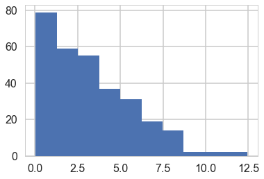


### Simulate replicate predictives directly


```python
from scipy.stats import poisson
```


```python
y.shape
```


    (365,)


```python
replicate_pp = np.zeros((300,365))
for i,mu in enumerate(mus):
    if i%100==0:
        print("iter", i)
    replicate_pp[i,:] = poisson(mu).rvs(365)
```


    iter 0
    iter 100
    iter 200


```python
replicate_pp[3,:]
```


    array([ 0.,  1.,  1.,  0.,  0.,  1.,  0.,  0.,  0.,  0.,  1.,  0.,  1.,
            0.,  0.,  1.,  1.,  1.,  0.,  0.,  0.,  0.,  0.,  0.,  0.,  0.,
            1.,  0.,  0.,  1.,  0.,  0.,  0.,  0.,  0.,  1.,  0.,  1.,  0.,
            1.,  0.,  0.,  0.,  0.,  1.,  0.,  0.,  1.,  1.,  1.,  1.,  0.,
            1.,  0.,  0.,  0.,  0.,  0.,  0.,  0.,  0.,  0.,  0.,  1.,  0.,
            0.,  1.,  0.,  0.,  0.,  1.,  1.,  0.,  0.,  0.,  0.,  0.,  1.,
            1.,  1.,  2.,  1.,  0.,  0.,  0.,  0.,  0.,  0.,  0.,  0.,  0.,
            0.,  0.,  1.,  1.,  0.,  0.,  1.,  0.,  0.,  0.,  0.,  1.,  0.,
            1.,  1.,  1.,  0.,  1.,  0.,  0.,  0.,  0.,  0.,  1.,  1.,  0.,
            0.,  1.,  0.,  1.,  0.,  0.,  0.,  0.,  0.,  0.,  0.,  0.,  0.,
            1.,  0.,  1.,  0.,  0.,  0.,  0.,  1.,  0.,  1.,  0.,  0.,  0.,
            0.,  1.,  0.,  1.,  0.,  0.,  0.,  0.,  0.,  0.,  0.,  0.,  0.,
            0.,  0.,  0.,  0.,  0.,  1.,  1.,  0.,  0.,  0.,  0.,  0.,  0.,
            0.,  0.,  0.,  0.,  2.,  0.,  0.,  0.,  0.,  0.,  0.,  0.,  1.,
            0.,  0.,  0.,  0.,  2.,  1.,  0.,  0.,  1.,  0.,  0.,  0.,  2.,
            0.,  0.,  0.,  1.,  0.,  0.,  0.,  0.,  0.,  0.,  0.,  1.,  0.,
            0.,  0.,  0.,  1.,  0.,  0.,  1.,  0.,  0.,  0.,  2.,  0.,  0.,
            0.,  0.,  1.,  0.,  0.,  0.,  0.,  0.,  0.,  0.,  0.,  0.,  0.,
            0.,  0.,  0.,  0.,  0.,  0.,  1.,  0.,  0.,  0.,  0.,  0.,  1.,
            1.,  0.,  0.,  0.,  1.,  0.,  0.,  0.,  1.,  0.,  0.,  0.,  0.,
            0.,  0.,  0.,  2.,  1.,  0.,  0.,  2.,  1.,  2.,  0.,  1.,  0.,
            0.,  0.,  0.,  0.,  0.,  0.,  1.,  0.,  1.,  1.,  1.,  0.,  0.,
            0.,  0.,  0.,  0.,  1.,  1.,  0.,  1.,  0.,  0.,  0.,  1.,  2.,
            0.,  1.,  0.,  0.,  0.,  1.,  0.,  0.,  1.,  0.,  0.,  0.,  0.,
            0.,  1.,  2.,  0.,  0.,  0.,  0.,  0.,  0.,  0.,  1.,  0.,  0.,
            1.,  0.,  0.,  0.,  0.,  0.,  0.,  1.,  1.,  0.,  1.,  0.,  0.,
            0.,  0.,  1.,  0.,  0.,  0.,  0.,  1.,  0.,  0.,  1.,  0.,  0.,
            1.,  0.,  2.,  0.,  0.,  0.,  1.,  1.,  1.,  0.,  0.,  0.,  1.,  0.])


### Simulating replicate posteriors


```python
replicate_post=np.empty((300, 2000))
for i,mu in enumerate(mus):
    if i%30==0:
        print("iter", i)
    with model_poisson1(obsv=replicate_pp[i,:]):
        temp_simdata = pm.sample(1000, tune=1000, progressbar=False)
    replicate_post[i,:] = temp_simdata.get_values('mu')
```


    iter 0


    Auto-assigning NUTS sampler...
    Initializing NUTS using jitter+adapt_diag...
    Multiprocess sampling (2 chains in 2 jobs)
    NUTS: [mu_log__]
    Auto-assigning NUTS sampler...
    Initializing NUTS using jitter+adapt_diag...
    Multiprocess sampling (2 chains in 2 jobs)
    NUTS: [mu_log__]
    Auto-assigning NUTS sampler...
    Initializing NUTS using jitter+adapt_diag...
    Multiprocess sampling (2 chains in 2 jobs)
    NUTS: [mu_log__]
    Auto-assigning NUTS sampler...
    Initializing NUTS using jitter+adapt_diag...
    Multiprocess sampling (2 chains in 2 jobs)
    NUTS: [mu_log__]
    Auto-assigning NUTS sampler...
    Initializing NUTS using jitter+adapt_diag...
    Multiprocess sampling (2 chains in 2 jobs)
    NUTS: [mu_log__]
    Auto-assigning NUTS sampler...
    Initializing NUTS using jitter+adapt_diag...
    Multiprocess sampling (2 chains in 2 jobs)
    NUTS: [mu_log__]
    Auto-assigning NUTS sampler...
    Initializing NUTS using jitter+adapt_diag...
    Multiprocess sampling (2 chains in 2 jobs)
    NUTS: [mu_log__]
    Auto-assigning NUTS sampler...
    Initializing NUTS using jitter+adapt_diag...
    Multiprocess sampling (2 chains in 2 jobs)
    NUTS: [mu_log__]
    Auto-assigning NUTS sampler...
    Initializing NUTS using jitter+adapt_diag...
    Multiprocess sampling (2 chains in 2 jobs)
    NUTS: [mu_log__]
    INFO (theano.gof.compilelock): Refreshing lock /Users/rahul/.theano/compiledir_Darwin-16.1.0-x86_64-i386-64bit-i386-3.6.1-64/lock_dir/lock
    Auto-assigning NUTS sampler...
    Initializing NUTS using jitter+adapt_diag...
    Multiprocess sampling (2 chains in 2 jobs)
    NUTS: [mu_log__]
    Auto-assigning NUTS sampler...
    Initializing NUTS using jitter+adapt_diag...
    Multiprocess sampling (2 chains in 2 jobs)
    NUTS: [mu_log__]
    Auto-assigning NUTS sampler...
    Initializing NUTS using jitter+adapt_diag...
    Multiprocess sampling (2 chains in 2 jobs)
    NUTS: [mu_log__]
    Auto-assigning NUTS sampler...
    Initializing NUTS using jitter+adapt_diag...
    Multiprocess sampling (2 chains in 2 jobs)
    NUTS: [mu_log__]
    Auto-assigning NUTS sampler...
    Initializing NUTS using jitter+adapt_diag...
    Multiprocess sampling (2 chains in 2 jobs)
    NUTS: [mu_log__]
    Auto-assigning NUTS sampler...
    Initializing NUTS using jitter+adapt_diag...
    Multiprocess sampling (2 chains in 2 jobs)
    NUTS: [mu_log__]
    Auto-assigning NUTS sampler...
    Initializing NUTS using jitter+adapt_diag...
    Multiprocess sampling (2 chains in 2 jobs)
    NUTS: [mu_log__]
    Auto-assigning NUTS sampler...
    Initializing NUTS using jitter+adapt_diag...
    Multiprocess sampling (2 chains in 2 jobs)
    NUTS: [mu_log__]
    Auto-assigning NUTS sampler...
    Initializing NUTS using jitter+adapt_diag...
    Multiprocess sampling (2 chains in 2 jobs)
    NUTS: [mu_log__]
    Auto-assigning NUTS sampler...
    Initializing NUTS using jitter+adapt_diag...
    Multiprocess sampling (2 chains in 2 jobs)
    NUTS: [mu_log__]
    Auto-assigning NUTS sampler...
    Initializing NUTS using jitter+adapt_diag...
    Multiprocess sampling (2 chains in 2 jobs)
    NUTS: [mu_log__]
    Auto-assigning NUTS sampler...
    Initializing NUTS using jitter+adapt_diag...
    Multiprocess sampling (2 chains in 2 jobs)
    NUTS: [mu_log__]
    Auto-assigning NUTS sampler...
    Initializing NUTS using jitter+adapt_diag...
    Multiprocess sampling (2 chains in 2 jobs)
    NUTS: [mu_log__]
    Auto-assigning NUTS sampler...
    Initializing NUTS using jitter+adapt_diag...
    Multiprocess sampling (2 chains in 2 jobs)
    NUTS: [mu_log__]
    INFO (theano.gof.compilelock): Refreshing lock /Users/rahul/.theano/compiledir_Darwin-16.1.0-x86_64-i386-64bit-i386-3.6.1-64/lock_dir/lock
    Auto-assigning NUTS sampler...
    Initializing NUTS using jitter+adapt_diag...
    Multiprocess sampling (2 chains in 2 jobs)
    NUTS: [mu_log__]
    Auto-assigning NUTS sampler...
    Initializing NUTS using jitter+adapt_diag...
    Multiprocess sampling (2 chains in 2 jobs)
    NUTS: [mu_log__]
    Auto-assigning NUTS sampler...
    Initializing NUTS using jitter+adapt_diag...
    Multiprocess sampling (2 chains in 2 jobs)
    NUTS: [mu_log__]
    The acceptance probability does not match the target. It is 0.883342812173, but should be close to 0.8. Try to increase the number of tuning steps.
    Auto-assigning NUTS sampler...
    Initializing NUTS using jitter+adapt_diag...
    Multiprocess sampling (2 chains in 2 jobs)
    NUTS: [mu_log__]
    Auto-assigning NUTS sampler...
    Initializing NUTS using jitter+adapt_diag...
    Multiprocess sampling (2 chains in 2 jobs)
    NUTS: [mu_log__]
    Auto-assigning NUTS sampler...
    Initializing NUTS using jitter+adapt_diag...
    Multiprocess sampling (2 chains in 2 jobs)
    NUTS: [mu_log__]
    Auto-assigning NUTS sampler...
    Initializing NUTS using jitter+adapt_diag...
    Multiprocess sampling (2 chains in 2 jobs)
    NUTS: [mu_log__]


    iter 30


    Auto-assigning NUTS sampler...
    Initializing NUTS using jitter+adapt_diag...
    Multiprocess sampling (2 chains in 2 jobs)
    NUTS: [mu_log__]
    Auto-assigning NUTS sampler...
    Initializing NUTS using jitter+adapt_diag...
    Multiprocess sampling (2 chains in 2 jobs)
    NUTS: [mu_log__]
    Auto-assigning NUTS sampler...
    Initializing NUTS using jitter+adapt_diag...
    Multiprocess sampling (2 chains in 2 jobs)
    NUTS: [mu_log__]
    The acceptance probability does not match the target. It is 0.886002157963, but should be close to 0.8. Try to increase the number of tuning steps.
    Auto-assigning NUTS sampler...
    Initializing NUTS using jitter+adapt_diag...
    Multiprocess sampling (2 chains in 2 jobs)
    NUTS: [mu_log__]
    Auto-assigning NUTS sampler...
    Initializing NUTS using jitter+adapt_diag...
    Multiprocess sampling (2 chains in 2 jobs)
    NUTS: [mu_log__]
    Auto-assigning NUTS sampler...
    Initializing NUTS using jitter+adapt_diag...
    Multiprocess sampling (2 chains in 2 jobs)
    NUTS: [mu_log__]
    The number of effective samples is smaller than 25% for some parameters.
    Auto-assigning NUTS sampler...
    Initializing NUTS using jitter+adapt_diag...
    Multiprocess sampling (2 chains in 2 jobs)
    NUTS: [mu_log__]
    INFO (theano.gof.compilelock): Refreshing lock /Users/rahul/.theano/compiledir_Darwin-16.1.0-x86_64-i386-64bit-i386-3.6.1-64/lock_dir/lock
    Auto-assigning NUTS sampler...
    Initializing NUTS using jitter+adapt_diag...
    Multiprocess sampling (2 chains in 2 jobs)
    NUTS: [mu_log__]
    Auto-assigning NUTS sampler...
    Initializing NUTS using jitter+adapt_diag...
    Multiprocess sampling (2 chains in 2 jobs)
    NUTS: [mu_log__]
    Auto-assigning NUTS sampler...
    Initializing NUTS using jitter+adapt_diag...
    Multiprocess sampling (2 chains in 2 jobs)
    NUTS: [mu_log__]
    Auto-assigning NUTS sampler...
    Initializing NUTS using jitter+adapt_diag...
    Multiprocess sampling (2 chains in 2 jobs)
    NUTS: [mu_log__]
    The acceptance probability does not match the target. It is 0.894084884845, but should be close to 0.8. Try to increase the number of tuning steps.
    Auto-assigning NUTS sampler...
    Initializing NUTS using jitter+adapt_diag...
    Multiprocess sampling (2 chains in 2 jobs)
    NUTS: [mu_log__]
    Auto-assigning NUTS sampler...
    Initializing NUTS using jitter+adapt_diag...
    Multiprocess sampling (2 chains in 2 jobs)
    NUTS: [mu_log__]
    Auto-assigning NUTS sampler...
    Initializing NUTS using jitter+adapt_diag...
    Multiprocess sampling (2 chains in 2 jobs)
    NUTS: [mu_log__]
    Auto-assigning NUTS sampler...
    Initializing NUTS using jitter+adapt_diag...
    Multiprocess sampling (2 chains in 2 jobs)
    NUTS: [mu_log__]
    The acceptance probability does not match the target. It is 0.899187012185, but should be close to 0.8. Try to increase the number of tuning steps.
    Auto-assigning NUTS sampler...
    Initializing NUTS using jitter+adapt_diag...
    Multiprocess sampling (2 chains in 2 jobs)
    NUTS: [mu_log__]
    Auto-assigning NUTS sampler...
    Initializing NUTS using jitter+adapt_diag...
    Multiprocess sampling (2 chains in 2 jobs)
    NUTS: [mu_log__]
    Auto-assigning NUTS sampler...
    Initializing NUTS using jitter+adapt_diag...
    Multiprocess sampling (2 chains in 2 jobs)
    NUTS: [mu_log__]
    Auto-assigning NUTS sampler...
    Initializing NUTS using jitter+adapt_diag...
    INFO (theano.gof.compilelock): Refreshing lock /Users/rahul/.theano/compiledir_Darwin-16.1.0-x86_64-i386-64bit-i386-3.6.1-64/lock_dir/lock
    Multiprocess sampling (2 chains in 2 jobs)
    NUTS: [mu_log__]
    Auto-assigning NUTS sampler...
    Initializing NUTS using jitter+adapt_diag...
    Multiprocess sampling (2 chains in 2 jobs)
    NUTS: [mu_log__]
    Auto-assigning NUTS sampler...
    Initializing NUTS using jitter+adapt_diag...
    Multiprocess sampling (2 chains in 2 jobs)
    NUTS: [mu_log__]
    Auto-assigning NUTS sampler...
    Initializing NUTS using jitter+adapt_diag...
    Multiprocess sampling (2 chains in 2 jobs)
    NUTS: [mu_log__]
    Auto-assigning NUTS sampler...
    Initializing NUTS using jitter+adapt_diag...
    Multiprocess sampling (2 chains in 2 jobs)
    NUTS: [mu_log__]
    The acceptance probability does not match the target. It is 0.886911937841, but should be close to 0.8. Try to increase the number of tuning steps.
    Auto-assigning NUTS sampler...
    Initializing NUTS using jitter+adapt_diag...
    Multiprocess sampling (2 chains in 2 jobs)
    NUTS: [mu_log__]
    Auto-assigning NUTS sampler...
    Initializing NUTS using jitter+adapt_diag...
    Multiprocess sampling (2 chains in 2 jobs)
    NUTS: [mu_log__]
    Auto-assigning NUTS sampler...
    Initializing NUTS using jitter+adapt_diag...
    Multiprocess sampling (2 chains in 2 jobs)
    NUTS: [mu_log__]
    The acceptance probability does not match the target. It is 0.879794148759, but should be close to 0.8. Try to increase the number of tuning steps.
    Auto-assigning NUTS sampler...
    Initializing NUTS using jitter+adapt_diag...
    Multiprocess sampling (2 chains in 2 jobs)
    NUTS: [mu_log__]
    Auto-assigning NUTS sampler...
    Initializing NUTS using jitter+adapt_diag...
    Multiprocess sampling (2 chains in 2 jobs)
    NUTS: [mu_log__]
    Auto-assigning NUTS sampler...
    Initializing NUTS using jitter+adapt_diag...
    Multiprocess sampling (2 chains in 2 jobs)
    NUTS: [mu_log__]
    Auto-assigning NUTS sampler...
    Initializing NUTS using jitter+adapt_diag...
    Multiprocess sampling (2 chains in 2 jobs)
    NUTS: [mu_log__]


    iter 60


    Auto-assigning NUTS sampler...
    Initializing NUTS using jitter+adapt_diag...
    Multiprocess sampling (2 chains in 2 jobs)
    NUTS: [mu_log__]
    Auto-assigning NUTS sampler...
    Initializing NUTS using jitter+adapt_diag...
    Multiprocess sampling (2 chains in 2 jobs)
    NUTS: [mu_log__]
    INFO (theano.gof.compilelock): Refreshing lock /Users/rahul/.theano/compiledir_Darwin-16.1.0-x86_64-i386-64bit-i386-3.6.1-64/lock_dir/lock
    Auto-assigning NUTS sampler...
    Initializing NUTS using jitter+adapt_diag...
    Multiprocess sampling (2 chains in 2 jobs)
    NUTS: [mu_log__]
    Auto-assigning NUTS sampler...
    Initializing NUTS using jitter+adapt_diag...
    Multiprocess sampling (2 chains in 2 jobs)
    NUTS: [mu_log__]
    Auto-assigning NUTS sampler...
    Initializing NUTS using jitter+adapt_diag...
    Multiprocess sampling (2 chains in 2 jobs)
    NUTS: [mu_log__]
    Auto-assigning NUTS sampler...
    Initializing NUTS using jitter+adapt_diag...
    Multiprocess sampling (2 chains in 2 jobs)
    NUTS: [mu_log__]
    Auto-assigning NUTS sampler...
    Initializing NUTS using jitter+adapt_diag...
    Multiprocess sampling (2 chains in 2 jobs)
    NUTS: [mu_log__]
    Auto-assigning NUTS sampler...
    Initializing NUTS using jitter+adapt_diag...
    Multiprocess sampling (2 chains in 2 jobs)
    NUTS: [mu_log__]
    Auto-assigning NUTS sampler...
    Initializing NUTS using jitter+adapt_diag...
    Multiprocess sampling (2 chains in 2 jobs)
    NUTS: [mu_log__]
    Auto-assigning NUTS sampler...
    Initializing NUTS using jitter+adapt_diag...
    Multiprocess sampling (2 chains in 2 jobs)
    NUTS: [mu_log__]
    Auto-assigning NUTS sampler...
    Initializing NUTS using jitter+adapt_diag...
    Multiprocess sampling (2 chains in 2 jobs)
    NUTS: [mu_log__]
    Auto-assigning NUTS sampler...
    Initializing NUTS using jitter+adapt_diag...
    Multiprocess sampling (2 chains in 2 jobs)
    NUTS: [mu_log__]
    Auto-assigning NUTS sampler...
    Initializing NUTS using jitter+adapt_diag...
    Multiprocess sampling (2 chains in 2 jobs)
    NUTS: [mu_log__]
    Auto-assigning NUTS sampler...
    Initializing NUTS using jitter+adapt_diag...
    Multiprocess sampling (2 chains in 2 jobs)
    NUTS: [mu_log__]
    Auto-assigning NUTS sampler...
    Initializing NUTS using jitter+adapt_diag...
    Multiprocess sampling (2 chains in 2 jobs)
    NUTS: [mu_log__]
    Auto-assigning NUTS sampler...
    Initializing NUTS using jitter+adapt_diag...
    Multiprocess sampling (2 chains in 2 jobs)
    NUTS: [mu_log__]
    INFO (theano.gof.compilelock): Refreshing lock /Users/rahul/.theano/compiledir_Darwin-16.1.0-x86_64-i386-64bit-i386-3.6.1-64/lock_dir/lock
    Auto-assigning NUTS sampler...
    Initializing NUTS using jitter+adapt_diag...
    Multiprocess sampling (2 chains in 2 jobs)
    NUTS: [mu_log__]
    Auto-assigning NUTS sampler...
    Initializing NUTS using jitter+adapt_diag...
    Multiprocess sampling (2 chains in 2 jobs)
    NUTS: [mu_log__]
    Auto-assigning NUTS sampler...
    Initializing NUTS using jitter+adapt_diag...
    Multiprocess sampling (2 chains in 2 jobs)
    NUTS: [mu_log__]
    Auto-assigning NUTS sampler...
    Initializing NUTS using jitter+adapt_diag...
    Multiprocess sampling (2 chains in 2 jobs)
    NUTS: [mu_log__]
    Auto-assigning NUTS sampler...
    Initializing NUTS using jitter+adapt_diag...
    Multiprocess sampling (2 chains in 2 jobs)
    NUTS: [mu_log__]
    Auto-assigning NUTS sampler...
    Initializing NUTS using jitter+adapt_diag...
    Multiprocess sampling (2 chains in 2 jobs)
    NUTS: [mu_log__]
    Auto-assigning NUTS sampler...
    Initializing NUTS using jitter+adapt_diag...
    Multiprocess sampling (2 chains in 2 jobs)
    NUTS: [mu_log__]
    Auto-assigning NUTS sampler...
    Initializing NUTS using jitter+adapt_diag...
    Multiprocess sampling (2 chains in 2 jobs)
    NUTS: [mu_log__]
    Auto-assigning NUTS sampler...
    Initializing NUTS using jitter+adapt_diag...
    Multiprocess sampling (2 chains in 2 jobs)
    NUTS: [mu_log__]
    The acceptance probability does not match the target. It is 0.885474429987, but should be close to 0.8. Try to increase the number of tuning steps.
    Auto-assigning NUTS sampler...
    Initializing NUTS using jitter+adapt_diag...
    Multiprocess sampling (2 chains in 2 jobs)
    NUTS: [mu_log__]
    Auto-assigning NUTS sampler...
    Initializing NUTS using jitter+adapt_diag...
    Multiprocess sampling (2 chains in 2 jobs)
    NUTS: [mu_log__]
    Auto-assigning NUTS sampler...
    Initializing NUTS using jitter+adapt_diag...
    Multiprocess sampling (2 chains in 2 jobs)
    NUTS: [mu_log__]
    Auto-assigning NUTS sampler...
    Initializing NUTS using jitter+adapt_diag...
    Multiprocess sampling (2 chains in 2 jobs)
    NUTS: [mu_log__]
    The acceptance probability does not match the target. It is 0.888380537416, but should be close to 0.8. Try to increase the number of tuning steps.
    INFO (theano.gof.compilelock): Refreshing lock /Users/rahul/.theano/compiledir_Darwin-16.1.0-x86_64-i386-64bit-i386-3.6.1-64/lock_dir/lock
    Auto-assigning NUTS sampler...
    Initializing NUTS using jitter+adapt_diag...
    Multiprocess sampling (2 chains in 2 jobs)
    NUTS: [mu_log__]


    iter 90


    Auto-assigning NUTS sampler...
    Initializing NUTS using jitter+adapt_diag...
    Multiprocess sampling (2 chains in 2 jobs)
    NUTS: [mu_log__]
    Auto-assigning NUTS sampler...
    Initializing NUTS using jitter+adapt_diag...
    Multiprocess sampling (2 chains in 2 jobs)
    NUTS: [mu_log__]
    Auto-assigning NUTS sampler...
    Initializing NUTS using jitter+adapt_diag...
    Multiprocess sampling (2 chains in 2 jobs)
    NUTS: [mu_log__]
    Auto-assigning NUTS sampler...
    Initializing NUTS using jitter+adapt_diag...
    Multiprocess sampling (2 chains in 2 jobs)
    NUTS: [mu_log__]
    Auto-assigning NUTS sampler...
    Initializing NUTS using jitter+adapt_diag...
    Multiprocess sampling (2 chains in 2 jobs)
    NUTS: [mu_log__]
    The acceptance probability does not match the target. It is 0.712667601545, but should be close to 0.8. Try to increase the number of tuning steps.
    Auto-assigning NUTS sampler...
    Initializing NUTS using jitter+adapt_diag...
    Multiprocess sampling (2 chains in 2 jobs)
    NUTS: [mu_log__]
    Auto-assigning NUTS sampler...
    Initializing NUTS using jitter+adapt_diag...
    Multiprocess sampling (2 chains in 2 jobs)
    NUTS: [mu_log__]
    Auto-assigning NUTS sampler...
    Initializing NUTS using jitter+adapt_diag...
    Multiprocess sampling (2 chains in 2 jobs)
    NUTS: [mu_log__]
    Auto-assigning NUTS sampler...
    Initializing NUTS using jitter+adapt_diag...
    Multiprocess sampling (2 chains in 2 jobs)
    NUTS: [mu_log__]
    Auto-assigning NUTS sampler...
    Initializing NUTS using jitter+adapt_diag...
    Multiprocess sampling (2 chains in 2 jobs)
    NUTS: [mu_log__]
    Auto-assigning NUTS sampler...
    Initializing NUTS using jitter+adapt_diag...
    Multiprocess sampling (2 chains in 2 jobs)
    NUTS: [mu_log__]
    Auto-assigning NUTS sampler...
    Initializing NUTS using jitter+adapt_diag...
    Multiprocess sampling (2 chains in 2 jobs)
    NUTS: [mu_log__]
    INFO (theano.gof.compilelock): Refreshing lock /Users/rahul/.theano/compiledir_Darwin-16.1.0-x86_64-i386-64bit-i386-3.6.1-64/lock_dir/lock
    Auto-assigning NUTS sampler...
    Initializing NUTS using jitter+adapt_diag...
    Multiprocess sampling (2 chains in 2 jobs)
    NUTS: [mu_log__]
    Auto-assigning NUTS sampler...
    Initializing NUTS using jitter+adapt_diag...
    Multiprocess sampling (2 chains in 2 jobs)
    NUTS: [mu_log__]
    Auto-assigning NUTS sampler...
    Initializing NUTS using jitter+adapt_diag...
    Multiprocess sampling (2 chains in 2 jobs)
    NUTS: [mu_log__]
    The acceptance probability does not match the target. It is 0.88947428108, but should be close to 0.8. Try to increase the number of tuning steps.
    Auto-assigning NUTS sampler...
    Initializing NUTS using jitter+adapt_diag...
    Multiprocess sampling (2 chains in 2 jobs)
    NUTS: [mu_log__]
    The acceptance probability does not match the target. It is 0.887087941922, but should be close to 0.8. Try to increase the number of tuning steps.
    Auto-assigning NUTS sampler...
    Initializing NUTS using jitter+adapt_diag...
    Multiprocess sampling (2 chains in 2 jobs)
    NUTS: [mu_log__]
    The acceptance probability does not match the target. It is 0.891767169364, but should be close to 0.8. Try to increase the number of tuning steps.
    Auto-assigning NUTS sampler...
    Initializing NUTS using jitter+adapt_diag...
    Multiprocess sampling (2 chains in 2 jobs)
    NUTS: [mu_log__]
    Auto-assigning NUTS sampler...
    Initializing NUTS using jitter+adapt_diag...
    Multiprocess sampling (2 chains in 2 jobs)
    NUTS: [mu_log__]
    Auto-assigning NUTS sampler...
    Initializing NUTS using jitter+adapt_diag...
    Multiprocess sampling (2 chains in 2 jobs)
    NUTS: [mu_log__]
    Auto-assigning NUTS sampler...
    Initializing NUTS using jitter+adapt_diag...
    Multiprocess sampling (2 chains in 2 jobs)
    NUTS: [mu_log__]
    Auto-assigning NUTS sampler...
    Initializing NUTS using jitter+adapt_diag...
    Multiprocess sampling (2 chains in 2 jobs)
    NUTS: [mu_log__]
    Auto-assigning NUTS sampler...
    Initializing NUTS using jitter+adapt_diag...
    Multiprocess sampling (2 chains in 2 jobs)
    NUTS: [mu_log__]
    Auto-assigning NUTS sampler...
    Initializing NUTS using jitter+adapt_diag...
    Multiprocess sampling (2 chains in 2 jobs)
    NUTS: [mu_log__]
    Auto-assigning NUTS sampler...
    Initializing NUTS using jitter+adapt_diag...
    Multiprocess sampling (2 chains in 2 jobs)
    NUTS: [mu_log__]
    Auto-assigning NUTS sampler...
    Initializing NUTS using jitter+adapt_diag...
    INFO (theano.gof.compilelock): Refreshing lock /Users/rahul/.theano/compiledir_Darwin-16.1.0-x86_64-i386-64bit-i386-3.6.1-64/lock_dir/lock
    Multiprocess sampling (2 chains in 2 jobs)
    NUTS: [mu_log__]
    Auto-assigning NUTS sampler...
    Initializing NUTS using jitter+adapt_diag...
    Multiprocess sampling (2 chains in 2 jobs)
    NUTS: [mu_log__]
    Auto-assigning NUTS sampler...
    Initializing NUTS using jitter+adapt_diag...
    Multiprocess sampling (2 chains in 2 jobs)
    NUTS: [mu_log__]
    Auto-assigning NUTS sampler...
    Initializing NUTS using jitter+adapt_diag...
    Multiprocess sampling (2 chains in 2 jobs)
    NUTS: [mu_log__]
    Auto-assigning NUTS sampler...
    Initializing NUTS using jitter+adapt_diag...
    Multiprocess sampling (2 chains in 2 jobs)
    NUTS: [mu_log__]


    iter 120


    Auto-assigning NUTS sampler...
    Initializing NUTS using jitter+adapt_diag...
    Multiprocess sampling (2 chains in 2 jobs)
    NUTS: [mu_log__]
    The number of effective samples is smaller than 25% for some parameters.
    Auto-assigning NUTS sampler...
    Initializing NUTS using jitter+adapt_diag...
    Multiprocess sampling (2 chains in 2 jobs)
    NUTS: [mu_log__]
    Auto-assigning NUTS sampler...
    Initializing NUTS using jitter+adapt_diag...
    Multiprocess sampling (2 chains in 2 jobs)
    NUTS: [mu_log__]
    Auto-assigning NUTS sampler...
    Initializing NUTS using jitter+adapt_diag...
    Multiprocess sampling (2 chains in 2 jobs)
    NUTS: [mu_log__]
    Auto-assigning NUTS sampler...
    Initializing NUTS using jitter+adapt_diag...
    Multiprocess sampling (2 chains in 2 jobs)
    NUTS: [mu_log__]
    Auto-assigning NUTS sampler...
    Initializing NUTS using jitter+adapt_diag...
    Multiprocess sampling (2 chains in 2 jobs)
    NUTS: [mu_log__]
    Auto-assigning NUTS sampler...
    Initializing NUTS using jitter+adapt_diag...
    Multiprocess sampling (2 chains in 2 jobs)
    NUTS: [mu_log__]
    Auto-assigning NUTS sampler...
    Initializing NUTS using jitter+adapt_diag...
    Multiprocess sampling (2 chains in 2 jobs)
    NUTS: [mu_log__]
    INFO (theano.gof.compilelock): Refreshing lock /Users/rahul/.theano/compiledir_Darwin-16.1.0-x86_64-i386-64bit-i386-3.6.1-64/lock_dir/lock
    Auto-assigning NUTS sampler...
    Initializing NUTS using jitter+adapt_diag...
    Multiprocess sampling (2 chains in 2 jobs)
    NUTS: [mu_log__]
    Auto-assigning NUTS sampler...
    Initializing NUTS using jitter+adapt_diag...
    Multiprocess sampling (2 chains in 2 jobs)
    NUTS: [mu_log__]
    Auto-assigning NUTS sampler...
    Initializing NUTS using jitter+adapt_diag...
    Multiprocess sampling (2 chains in 2 jobs)
    NUTS: [mu_log__]
    Auto-assigning NUTS sampler...
    Initializing NUTS using jitter+adapt_diag...
    Multiprocess sampling (2 chains in 2 jobs)
    NUTS: [mu_log__]
    Auto-assigning NUTS sampler...
    Initializing NUTS using jitter+adapt_diag...
    Multiprocess sampling (2 chains in 2 jobs)
    NUTS: [mu_log__]
    Auto-assigning NUTS sampler...
    Initializing NUTS using jitter+adapt_diag...
    Multiprocess sampling (2 chains in 2 jobs)
    NUTS: [mu_log__]
    Auto-assigning NUTS sampler...
    Initializing NUTS using jitter+adapt_diag...
    Multiprocess sampling (2 chains in 2 jobs)
    NUTS: [mu_log__]
    Auto-assigning NUTS sampler...
    Initializing NUTS using jitter+adapt_diag...
    Multiprocess sampling (2 chains in 2 jobs)
    NUTS: [mu_log__]
    Auto-assigning NUTS sampler...
    Initializing NUTS using jitter+adapt_diag...
    Multiprocess sampling (2 chains in 2 jobs)
    NUTS: [mu_log__]
    Auto-assigning NUTS sampler...
    Initializing NUTS using jitter+adapt_diag...
    Multiprocess sampling (2 chains in 2 jobs)
    NUTS: [mu_log__]
    The number of effective samples is smaller than 25% for some parameters.
    Auto-assigning NUTS sampler...
    Initializing NUTS using jitter+adapt_diag...
    Multiprocess sampling (2 chains in 2 jobs)
    NUTS: [mu_log__]
    Auto-assigning NUTS sampler...
    Initializing NUTS using jitter+adapt_diag...
    Multiprocess sampling (2 chains in 2 jobs)
    NUTS: [mu_log__]
    INFO (theano.gof.compilelock): Refreshing lock /Users/rahul/.theano/compiledir_Darwin-16.1.0-x86_64-i386-64bit-i386-3.6.1-64/lock_dir/lock
    Auto-assigning NUTS sampler...
    Initializing NUTS using jitter+adapt_diag...
    Multiprocess sampling (2 chains in 2 jobs)
    NUTS: [mu_log__]
    The acceptance probability does not match the target. It is 0.87907924255, but should be close to 0.8. Try to increase the number of tuning steps.
    Auto-assigning NUTS sampler...
    Initializing NUTS using jitter+adapt_diag...
    Multiprocess sampling (2 chains in 2 jobs)
    NUTS: [mu_log__]
    Auto-assigning NUTS sampler...
    Initializing NUTS using jitter+adapt_diag...
    Multiprocess sampling (2 chains in 2 jobs)
    NUTS: [mu_log__]
    Auto-assigning NUTS sampler...
    Initializing NUTS using jitter+adapt_diag...
    Multiprocess sampling (2 chains in 2 jobs)
    NUTS: [mu_log__]
    The acceptance probability does not match the target. It is 0.905429105167, but should be close to 0.8. Try to increase the number of tuning steps.
    Auto-assigning NUTS sampler...
    Initializing NUTS using jitter+adapt_diag...
    Multiprocess sampling (2 chains in 2 jobs)
    NUTS: [mu_log__]
    Auto-assigning NUTS sampler...
    Initializing NUTS using jitter+adapt_diag...
    Multiprocess sampling (2 chains in 2 jobs)
    NUTS: [mu_log__]
    Auto-assigning NUTS sampler...
    Initializing NUTS using jitter+adapt_diag...
    Multiprocess sampling (2 chains in 2 jobs)
    NUTS: [mu_log__]
    Auto-assigning NUTS sampler...
    Initializing NUTS using jitter+adapt_diag...
    Multiprocess sampling (2 chains in 2 jobs)
    NUTS: [mu_log__]
    Auto-assigning NUTS sampler...
    Initializing NUTS using jitter+adapt_diag...
    Multiprocess sampling (2 chains in 2 jobs)
    NUTS: [mu_log__]
    Auto-assigning NUTS sampler...
    Initializing NUTS using jitter+adapt_diag...
    Multiprocess sampling (2 chains in 2 jobs)
    NUTS: [mu_log__]


    iter 150


    Auto-assigning NUTS sampler...
    Initializing NUTS using jitter+adapt_diag...
    Multiprocess sampling (2 chains in 2 jobs)
    NUTS: [mu_log__]
    Auto-assigning NUTS sampler...
    Initializing NUTS using jitter+adapt_diag...
    Multiprocess sampling (2 chains in 2 jobs)
    NUTS: [mu_log__]
    INFO (theano.gof.compilelock): Refreshing lock /Users/rahul/.theano/compiledir_Darwin-16.1.0-x86_64-i386-64bit-i386-3.6.1-64/lock_dir/lock
    Auto-assigning NUTS sampler...
    Initializing NUTS using jitter+adapt_diag...
    Multiprocess sampling (2 chains in 2 jobs)
    NUTS: [mu_log__]
    Auto-assigning NUTS sampler...
    Initializing NUTS using jitter+adapt_diag...
    Multiprocess sampling (2 chains in 2 jobs)
    NUTS: [mu_log__]
    Auto-assigning NUTS sampler...
    Initializing NUTS using jitter+adapt_diag...
    Multiprocess sampling (2 chains in 2 jobs)
    NUTS: [mu_log__]
    Auto-assigning NUTS sampler...
    Initializing NUTS using jitter+adapt_diag...
    Multiprocess sampling (2 chains in 2 jobs)
    NUTS: [mu_log__]
    Auto-assigning NUTS sampler...
    Initializing NUTS using jitter+adapt_diag...
    Multiprocess sampling (2 chains in 2 jobs)
    NUTS: [mu_log__]
    Auto-assigning NUTS sampler...
    Initializing NUTS using jitter+adapt_diag...
    Multiprocess sampling (2 chains in 2 jobs)
    NUTS: [mu_log__]
    Auto-assigning NUTS sampler...
    Initializing NUTS using jitter+adapt_diag...
    Multiprocess sampling (2 chains in 2 jobs)
    NUTS: [mu_log__]
    Auto-assigning NUTS sampler...
    Initializing NUTS using jitter+adapt_diag...
    Multiprocess sampling (2 chains in 2 jobs)
    NUTS: [mu_log__]
    Auto-assigning NUTS sampler...
    Initializing NUTS using jitter+adapt_diag...
    Multiprocess sampling (2 chains in 2 jobs)
    NUTS: [mu_log__]
    Auto-assigning NUTS sampler...
    Initializing NUTS using jitter+adapt_diag...
    Multiprocess sampling (2 chains in 2 jobs)
    NUTS: [mu_log__]
    Auto-assigning NUTS sampler...
    Initializing NUTS using jitter+adapt_diag...
    Multiprocess sampling (2 chains in 2 jobs)
    NUTS: [mu_log__]
    Auto-assigning NUTS sampler...
    Initializing NUTS using jitter+adapt_diag...
    Multiprocess sampling (2 chains in 2 jobs)
    NUTS: [mu_log__]
    INFO (theano.gof.compilelock): Refreshing lock /Users/rahul/.theano/compiledir_Darwin-16.1.0-x86_64-i386-64bit-i386-3.6.1-64/lock_dir/lock
    Auto-assigning NUTS sampler...
    Initializing NUTS using jitter+adapt_diag...
    Multiprocess sampling (2 chains in 2 jobs)
    NUTS: [mu_log__]
    Auto-assigning NUTS sampler...
    Initializing NUTS using jitter+adapt_diag...
    Multiprocess sampling (2 chains in 2 jobs)
    NUTS: [mu_log__]
    Auto-assigning NUTS sampler...
    Initializing NUTS using jitter+adapt_diag...
    Multiprocess sampling (2 chains in 2 jobs)
    NUTS: [mu_log__]
    Auto-assigning NUTS sampler...
    Initializing NUTS using jitter+adapt_diag...
    Multiprocess sampling (2 chains in 2 jobs)
    NUTS: [mu_log__]
    Auto-assigning NUTS sampler...
    Initializing NUTS using jitter+adapt_diag...
    Multiprocess sampling (2 chains in 2 jobs)
    NUTS: [mu_log__]
    The acceptance probability does not match the target. It is 0.886311372445, but should be close to 0.8. Try to increase the number of tuning steps.
    Auto-assigning NUTS sampler...
    Initializing NUTS using jitter+adapt_diag...
    Multiprocess sampling (2 chains in 2 jobs)
    NUTS: [mu_log__]
    Auto-assigning NUTS sampler...
    Initializing NUTS using jitter+adapt_diag...
    Multiprocess sampling (2 chains in 2 jobs)
    NUTS: [mu_log__]
    Auto-assigning NUTS sampler...
    Initializing NUTS using jitter+adapt_diag...
    Multiprocess sampling (2 chains in 2 jobs)
    NUTS: [mu_log__]
    Auto-assigning NUTS sampler...
    Initializing NUTS using jitter+adapt_diag...
    Multiprocess sampling (2 chains in 2 jobs)
    NUTS: [mu_log__]
    Auto-assigning NUTS sampler...
    Initializing NUTS using jitter+adapt_diag...
    Multiprocess sampling (2 chains in 2 jobs)
    NUTS: [mu_log__]
    Auto-assigning NUTS sampler...
    Initializing NUTS using jitter+adapt_diag...
    Multiprocess sampling (2 chains in 2 jobs)
    NUTS: [mu_log__]
    Auto-assigning NUTS sampler...
    Initializing NUTS using jitter+adapt_diag...
    Multiprocess sampling (2 chains in 2 jobs)
    NUTS: [mu_log__]
    Auto-assigning NUTS sampler...
    Initializing NUTS using jitter+adapt_diag...
    Multiprocess sampling (2 chains in 2 jobs)
    NUTS: [mu_log__]
    Auto-assigning NUTS sampler...
    Initializing NUTS using jitter+adapt_diag...
    INFO (theano.gof.compilelock): Refreshing lock /Users/rahul/.theano/compiledir_Darwin-16.1.0-x86_64-i386-64bit-i386-3.6.1-64/lock_dir/lock
    Multiprocess sampling (2 chains in 2 jobs)
    NUTS: [mu_log__]
    Auto-assigning NUTS sampler...
    Initializing NUTS using jitter+adapt_diag...
    Multiprocess sampling (2 chains in 2 jobs)
    NUTS: [mu_log__]
    Auto-assigning NUTS sampler...
    Initializing NUTS using jitter+adapt_diag...
    Multiprocess sampling (2 chains in 2 jobs)
    NUTS: [mu_log__]


    iter 180


    Auto-assigning NUTS sampler...
    Initializing NUTS using jitter+adapt_diag...
    Multiprocess sampling (2 chains in 2 jobs)
    NUTS: [mu_log__]
    Auto-assigning NUTS sampler...
    Initializing NUTS using jitter+adapt_diag...
    Multiprocess sampling (2 chains in 2 jobs)
    NUTS: [mu_log__]
    The acceptance probability does not match the target. It is 0.881796219178, but should be close to 0.8. Try to increase the number of tuning steps.
    Auto-assigning NUTS sampler...
    Initializing NUTS using jitter+adapt_diag...
    Multiprocess sampling (2 chains in 2 jobs)
    NUTS: [mu_log__]
    Auto-assigning NUTS sampler...
    Initializing NUTS using jitter+adapt_diag...
    Multiprocess sampling (2 chains in 2 jobs)
    NUTS: [mu_log__]
    Auto-assigning NUTS sampler...
    Initializing NUTS using jitter+adapt_diag...
    Multiprocess sampling (2 chains in 2 jobs)
    NUTS: [mu_log__]
    Auto-assigning NUTS sampler...
    Initializing NUTS using jitter+adapt_diag...
    Multiprocess sampling (2 chains in 2 jobs)
    NUTS: [mu_log__]
    Auto-assigning NUTS sampler...
    Initializing NUTS using jitter+adapt_diag...
    Multiprocess sampling (2 chains in 2 jobs)
    NUTS: [mu_log__]
    Auto-assigning NUTS sampler...
    Initializing NUTS using jitter+adapt_diag...
    Multiprocess sampling (2 chains in 2 jobs)
    NUTS: [mu_log__]
    Auto-assigning NUTS sampler...
    Initializing NUTS using jitter+adapt_diag...
    Multiprocess sampling (2 chains in 2 jobs)
    NUTS: [mu_log__]
    INFO (theano.gof.compilelock): Refreshing lock /Users/rahul/.theano/compiledir_Darwin-16.1.0-x86_64-i386-64bit-i386-3.6.1-64/lock_dir/lock
    Auto-assigning NUTS sampler...
    Initializing NUTS using jitter+adapt_diag...
    Multiprocess sampling (2 chains in 2 jobs)
    NUTS: [mu_log__]
    Auto-assigning NUTS sampler...
    Initializing NUTS using jitter+adapt_diag...
    Multiprocess sampling (2 chains in 2 jobs)
    NUTS: [mu_log__]
    Auto-assigning NUTS sampler...
    Initializing NUTS using jitter+adapt_diag...
    Multiprocess sampling (2 chains in 2 jobs)
    NUTS: [mu_log__]
    Auto-assigning NUTS sampler...
    Initializing NUTS using jitter+adapt_diag...
    Multiprocess sampling (2 chains in 2 jobs)
    NUTS: [mu_log__]
    Auto-assigning NUTS sampler...
    Initializing NUTS using jitter+adapt_diag...
    Multiprocess sampling (2 chains in 2 jobs)
    NUTS: [mu_log__]
    Auto-assigning NUTS sampler...
    Initializing NUTS using jitter+adapt_diag...
    Multiprocess sampling (2 chains in 2 jobs)
    NUTS: [mu_log__]
    Auto-assigning NUTS sampler...
    Initializing NUTS using jitter+adapt_diag...
    Multiprocess sampling (2 chains in 2 jobs)
    NUTS: [mu_log__]
    Auto-assigning NUTS sampler...
    Initializing NUTS using jitter+adapt_diag...
    Multiprocess sampling (2 chains in 2 jobs)
    NUTS: [mu_log__]
    Auto-assigning NUTS sampler...
    Initializing NUTS using jitter+adapt_diag...
    Multiprocess sampling (2 chains in 2 jobs)
    NUTS: [mu_log__]
    Auto-assigning NUTS sampler...
    Initializing NUTS using jitter+adapt_diag...
    Multiprocess sampling (2 chains in 2 jobs)
    NUTS: [mu_log__]
    Auto-assigning NUTS sampler...
    Initializing NUTS using jitter+adapt_diag...
    Multiprocess sampling (2 chains in 2 jobs)
    NUTS: [mu_log__]
    Auto-assigning NUTS sampler...
    Initializing NUTS using jitter+adapt_diag...
    Multiprocess sampling (2 chains in 2 jobs)
    NUTS: [mu_log__]
    Auto-assigning NUTS sampler...
    Initializing NUTS using jitter+adapt_diag...
    Multiprocess sampling (2 chains in 2 jobs)
    NUTS: [mu_log__]
    INFO (theano.gof.compilelock): Refreshing lock /Users/rahul/.theano/compiledir_Darwin-16.1.0-x86_64-i386-64bit-i386-3.6.1-64/lock_dir/lock
    Auto-assigning NUTS sampler...
    Initializing NUTS using jitter+adapt_diag...
    Multiprocess sampling (2 chains in 2 jobs)
    NUTS: [mu_log__]
    Auto-assigning NUTS sampler...
    Initializing NUTS using jitter+adapt_diag...
    Multiprocess sampling (2 chains in 2 jobs)
    NUTS: [mu_log__]
    The acceptance probability does not match the target. It is 0.881608506348, but should be close to 0.8. Try to increase the number of tuning steps.
    Auto-assigning NUTS sampler...
    Initializing NUTS using jitter+adapt_diag...
    Multiprocess sampling (2 chains in 2 jobs)
    NUTS: [mu_log__]
    The acceptance probability does not match the target. It is 0.879968438331, but should be close to 0.8. Try to increase the number of tuning steps.
    Auto-assigning NUTS sampler...
    Initializing NUTS using jitter+adapt_diag...
    Multiprocess sampling (2 chains in 2 jobs)
    NUTS: [mu_log__]
    Auto-assigning NUTS sampler...
    Initializing NUTS using jitter+adapt_diag...
    Multiprocess sampling (2 chains in 2 jobs)
    NUTS: [mu_log__]
    The acceptance probability does not match the target. It is 0.880073746673, but should be close to 0.8. Try to increase the number of tuning steps.
    Auto-assigning NUTS sampler...
    Initializing NUTS using jitter+adapt_diag...
    Multiprocess sampling (2 chains in 2 jobs)
    NUTS: [mu_log__]
    Auto-assigning NUTS sampler...
    Initializing NUTS using jitter+adapt_diag...
    Multiprocess sampling (2 chains in 2 jobs)
    NUTS: [mu_log__]
    Auto-assigning NUTS sampler...
    Initializing NUTS using jitter+adapt_diag...
    Multiprocess sampling (2 chains in 2 jobs)
    NUTS: [mu_log__]


    iter 210


    Auto-assigning NUTS sampler...
    Initializing NUTS using jitter+adapt_diag...
    Multiprocess sampling (2 chains in 2 jobs)
    NUTS: [mu_log__]
    Auto-assigning NUTS sampler...
    Initializing NUTS using jitter+adapt_diag...
    Multiprocess sampling (2 chains in 2 jobs)
    NUTS: [mu_log__]
    Auto-assigning NUTS sampler...
    Initializing NUTS using jitter+adapt_diag...
    Multiprocess sampling (2 chains in 2 jobs)
    NUTS: [mu_log__]
    Auto-assigning NUTS sampler...
    Initializing NUTS using jitter+adapt_diag...
    Multiprocess sampling (2 chains in 2 jobs)
    NUTS: [mu_log__]
    Auto-assigning NUTS sampler...
    Initializing NUTS using jitter+adapt_diag...
    Multiprocess sampling (2 chains in 2 jobs)
    NUTS: [mu_log__]
    INFO (theano.gof.compilelock): Refreshing lock /Users/rahul/.theano/compiledir_Darwin-16.1.0-x86_64-i386-64bit-i386-3.6.1-64/lock_dir/lock
    Auto-assigning NUTS sampler...
    Initializing NUTS using jitter+adapt_diag...
    Multiprocess sampling (2 chains in 2 jobs)
    NUTS: [mu_log__]
    Auto-assigning NUTS sampler...
    Initializing NUTS using jitter+adapt_diag...
    Multiprocess sampling (2 chains in 2 jobs)
    NUTS: [mu_log__]
    Auto-assigning NUTS sampler...
    Initializing NUTS using jitter+adapt_diag...
    Multiprocess sampling (2 chains in 2 jobs)
    NUTS: [mu_log__]
    Auto-assigning NUTS sampler...
    Initializing NUTS using jitter+adapt_diag...
    Multiprocess sampling (2 chains in 2 jobs)
    NUTS: [mu_log__]
    Auto-assigning NUTS sampler...
    Initializing NUTS using jitter+adapt_diag...
    Multiprocess sampling (2 chains in 2 jobs)
    NUTS: [mu_log__]
    Auto-assigning NUTS sampler...
    Initializing NUTS using jitter+adapt_diag...
    Multiprocess sampling (2 chains in 2 jobs)
    NUTS: [mu_log__]
    Auto-assigning NUTS sampler...
    Initializing NUTS using jitter+adapt_diag...
    Multiprocess sampling (2 chains in 2 jobs)
    NUTS: [mu_log__]
    Auto-assigning NUTS sampler...
    Initializing NUTS using jitter+adapt_diag...
    Multiprocess sampling (2 chains in 2 jobs)
    NUTS: [mu_log__]
    The acceptance probability does not match the target. It is 0.879071395441, but should be close to 0.8. Try to increase the number of tuning steps.
    Auto-assigning NUTS sampler...
    Initializing NUTS using jitter+adapt_diag...
    Multiprocess sampling (2 chains in 2 jobs)
    NUTS: [mu_log__]
    Auto-assigning NUTS sampler...
    Initializing NUTS using jitter+adapt_diag...
    Multiprocess sampling (2 chains in 2 jobs)
    NUTS: [mu_log__]
    Auto-assigning NUTS sampler...
    Initializing NUTS using jitter+adapt_diag...
    Multiprocess sampling (2 chains in 2 jobs)
    NUTS: [mu_log__]
    Auto-assigning NUTS sampler...
    Initializing NUTS using jitter+adapt_diag...
    Multiprocess sampling (2 chains in 2 jobs)
    NUTS: [mu_log__]
    Auto-assigning NUTS sampler...
    Initializing NUTS using jitter+adapt_diag...
    Multiprocess sampling (2 chains in 2 jobs)
    NUTS: [mu_log__]
    INFO (theano.gof.compilelock): Refreshing lock /Users/rahul/.theano/compiledir_Darwin-16.1.0-x86_64-i386-64bit-i386-3.6.1-64/lock_dir/lock
    Auto-assigning NUTS sampler...
    Initializing NUTS using jitter+adapt_diag...
    Multiprocess sampling (2 chains in 2 jobs)
    NUTS: [mu_log__]
    Auto-assigning NUTS sampler...
    Initializing NUTS using jitter+adapt_diag...
    Multiprocess sampling (2 chains in 2 jobs)
    NUTS: [mu_log__]
    Auto-assigning NUTS sampler...
    Initializing NUTS using jitter+adapt_diag...
    Multiprocess sampling (2 chains in 2 jobs)
    NUTS: [mu_log__]
    Auto-assigning NUTS sampler...
    Initializing NUTS using jitter+adapt_diag...
    Multiprocess sampling (2 chains in 2 jobs)
    NUTS: [mu_log__]
    Auto-assigning NUTS sampler...
    Initializing NUTS using jitter+adapt_diag...
    Multiprocess sampling (2 chains in 2 jobs)
    NUTS: [mu_log__]
    Auto-assigning NUTS sampler...
    Initializing NUTS using jitter+adapt_diag...
    Multiprocess sampling (2 chains in 2 jobs)
    NUTS: [mu_log__]
    Auto-assigning NUTS sampler...
    Initializing NUTS using jitter+adapt_diag...
    Multiprocess sampling (2 chains in 2 jobs)
    NUTS: [mu_log__]
    Auto-assigning NUTS sampler...
    Initializing NUTS using jitter+adapt_diag...
    Multiprocess sampling (2 chains in 2 jobs)
    NUTS: [mu_log__]
    Auto-assigning NUTS sampler...
    Initializing NUTS using jitter+adapt_diag...
    Multiprocess sampling (2 chains in 2 jobs)
    NUTS: [mu_log__]
    Auto-assigning NUTS sampler...
    Initializing NUTS using jitter+adapt_diag...
    Multiprocess sampling (2 chains in 2 jobs)
    NUTS: [mu_log__]
    Auto-assigning NUTS sampler...
    Initializing NUTS using jitter+adapt_diag...
    Multiprocess sampling (2 chains in 2 jobs)
    NUTS: [mu_log__]
    INFO (theano.gof.compilelock): Refreshing lock /Users/rahul/.theano/compiledir_Darwin-16.1.0-x86_64-i386-64bit-i386-3.6.1-64/lock_dir/lock
    Auto-assigning NUTS sampler...
    Initializing NUTS using jitter+adapt_diag...
    Multiprocess sampling (2 chains in 2 jobs)
    NUTS: [mu_log__]


    iter 240


    Auto-assigning NUTS sampler...
    Initializing NUTS using jitter+adapt_diag...
    Multiprocess sampling (2 chains in 2 jobs)
    NUTS: [mu_log__]
    Auto-assigning NUTS sampler...
    Initializing NUTS using jitter+adapt_diag...
    Multiprocess sampling (2 chains in 2 jobs)
    NUTS: [mu_log__]
    Auto-assigning NUTS sampler...
    Initializing NUTS using jitter+adapt_diag...
    Multiprocess sampling (2 chains in 2 jobs)
    NUTS: [mu_log__]
    Auto-assigning NUTS sampler...
    Initializing NUTS using jitter+adapt_diag...
    Multiprocess sampling (2 chains in 2 jobs)
    NUTS: [mu_log__]
    Auto-assigning NUTS sampler...
    Initializing NUTS using jitter+adapt_diag...
    Multiprocess sampling (2 chains in 2 jobs)
    NUTS: [mu_log__]
    Auto-assigning NUTS sampler...
    Initializing NUTS using jitter+adapt_diag...
    Multiprocess sampling (2 chains in 2 jobs)
    NUTS: [mu_log__]
    Auto-assigning NUTS sampler...
    Initializing NUTS using jitter+adapt_diag...
    Multiprocess sampling (2 chains in 2 jobs)
    NUTS: [mu_log__]
    Auto-assigning NUTS sampler...
    Initializing NUTS using jitter+adapt_diag...
    Multiprocess sampling (2 chains in 2 jobs)
    NUTS: [mu_log__]
    Auto-assigning NUTS sampler...
    Initializing NUTS using jitter+adapt_diag...
    Multiprocess sampling (2 chains in 2 jobs)
    NUTS: [mu_log__]
    Auto-assigning NUTS sampler...
    Initializing NUTS using jitter+adapt_diag...
    Multiprocess sampling (2 chains in 2 jobs)
    NUTS: [mu_log__]
    Auto-assigning NUTS sampler...
    Initializing NUTS using jitter+adapt_diag...
    Multiprocess sampling (2 chains in 2 jobs)
    NUTS: [mu_log__]
    INFO (theano.gof.compilelock): Refreshing lock /Users/rahul/.theano/compiledir_Darwin-16.1.0-x86_64-i386-64bit-i386-3.6.1-64/lock_dir/lock
    Auto-assigning NUTS sampler...
    Initializing NUTS using jitter+adapt_diag...
    Multiprocess sampling (2 chains in 2 jobs)
    NUTS: [mu_log__]
    Auto-assigning NUTS sampler...
    Initializing NUTS using jitter+adapt_diag...
    Multiprocess sampling (2 chains in 2 jobs)
    NUTS: [mu_log__]
    The acceptance probability does not match the target. It is 0.90230643238, but should be close to 0.8. Try to increase the number of tuning steps.
    Auto-assigning NUTS sampler...
    Initializing NUTS using jitter+adapt_diag...
    Multiprocess sampling (2 chains in 2 jobs)
    NUTS: [mu_log__]
    Auto-assigning NUTS sampler...
    Initializing NUTS using jitter+adapt_diag...
    Multiprocess sampling (2 chains in 2 jobs)
    NUTS: [mu_log__]
    Auto-assigning NUTS sampler...
    Initializing NUTS using jitter+adapt_diag...
    Multiprocess sampling (2 chains in 2 jobs)
    NUTS: [mu_log__]
    Auto-assigning NUTS sampler...
    Initializing NUTS using jitter+adapt_diag...
    Multiprocess sampling (2 chains in 2 jobs)
    NUTS: [mu_log__]
    Auto-assigning NUTS sampler...
    Initializing NUTS using jitter+adapt_diag...
    Multiprocess sampling (2 chains in 2 jobs)
    NUTS: [mu_log__]
    Auto-assigning NUTS sampler...
    Initializing NUTS using jitter+adapt_diag...
    Multiprocess sampling (2 chains in 2 jobs)
    NUTS: [mu_log__]
    The acceptance probability does not match the target. It is 0.886455310721, but should be close to 0.8. Try to increase the number of tuning steps.
    Auto-assigning NUTS sampler...
    Initializing NUTS using jitter+adapt_diag...
    Multiprocess sampling (2 chains in 2 jobs)
    NUTS: [mu_log__]
    The acceptance probability does not match the target. It is 0.883103326168, but should be close to 0.8. Try to increase the number of tuning steps.
    Auto-assigning NUTS sampler...
    Initializing NUTS using jitter+adapt_diag...
    Multiprocess sampling (2 chains in 2 jobs)
    NUTS: [mu_log__]
    Auto-assigning NUTS sampler...
    Initializing NUTS using jitter+adapt_diag...
    Multiprocess sampling (2 chains in 2 jobs)
    NUTS: [mu_log__]
    INFO (theano.gof.compilelock): Refreshing lock /Users/rahul/.theano/compiledir_Darwin-16.1.0-x86_64-i386-64bit-i386-3.6.1-64/lock_dir/lock
    Auto-assigning NUTS sampler...
    Initializing NUTS using jitter+adapt_diag...
    Multiprocess sampling (2 chains in 2 jobs)
    NUTS: [mu_log__]
    Auto-assigning NUTS sampler...
    Initializing NUTS using jitter+adapt_diag...
    Multiprocess sampling (2 chains in 2 jobs)
    NUTS: [mu_log__]
    Auto-assigning NUTS sampler...
    Initializing NUTS using jitter+adapt_diag...
    Multiprocess sampling (2 chains in 2 jobs)
    NUTS: [mu_log__]
    Auto-assigning NUTS sampler...
    Initializing NUTS using jitter+adapt_diag...
    Multiprocess sampling (2 chains in 2 jobs)
    NUTS: [mu_log__]
    Auto-assigning NUTS sampler...
    Initializing NUTS using jitter+adapt_diag...
    Multiprocess sampling (2 chains in 2 jobs)
    NUTS: [mu_log__]
    The acceptance probability does not match the target. It is 0.895292599169, but should be close to 0.8. Try to increase the number of tuning steps.
    Auto-assigning NUTS sampler...
    Initializing NUTS using jitter+adapt_diag...
    Multiprocess sampling (2 chains in 2 jobs)
    NUTS: [mu_log__]
    Auto-assigning NUTS sampler...
    Initializing NUTS using jitter+adapt_diag...
    Multiprocess sampling (2 chains in 2 jobs)
    NUTS: [mu_log__]
    Auto-assigning NUTS sampler...
    Initializing NUTS using jitter+adapt_diag...
    Multiprocess sampling (2 chains in 2 jobs)
    NUTS: [mu_log__]


    iter 270


    Auto-assigning NUTS sampler...
    Initializing NUTS using jitter+adapt_diag...
    Multiprocess sampling (2 chains in 2 jobs)
    NUTS: [mu_log__]
    Auto-assigning NUTS sampler...
    Initializing NUTS using jitter+adapt_diag...
    Multiprocess sampling (2 chains in 2 jobs)
    NUTS: [mu_log__]
    INFO (theano.gof.compilelock): Refreshing lock /Users/rahul/.theano/compiledir_Darwin-16.1.0-x86_64-i386-64bit-i386-3.6.1-64/lock_dir/lock
    Auto-assigning NUTS sampler...
    Initializing NUTS using jitter+adapt_diag...
    Multiprocess sampling (2 chains in 2 jobs)
    NUTS: [mu_log__]
    Auto-assigning NUTS sampler...
    Initializing NUTS using jitter+adapt_diag...
    Multiprocess sampling (2 chains in 2 jobs)
    NUTS: [mu_log__]
    Auto-assigning NUTS sampler...
    Initializing NUTS using jitter+adapt_diag...
    Multiprocess sampling (2 chains in 2 jobs)
    NUTS: [mu_log__]
    Auto-assigning NUTS sampler...
    Initializing NUTS using jitter+adapt_diag...
    Multiprocess sampling (2 chains in 2 jobs)
    NUTS: [mu_log__]
    Auto-assigning NUTS sampler...
    Initializing NUTS using jitter+adapt_diag...
    Multiprocess sampling (2 chains in 2 jobs)
    NUTS: [mu_log__]
    Auto-assigning NUTS sampler...
    Initializing NUTS using jitter+adapt_diag...
    Multiprocess sampling (2 chains in 2 jobs)
    NUTS: [mu_log__]
    Auto-assigning NUTS sampler...
    Initializing NUTS using jitter+adapt_diag...
    Multiprocess sampling (2 chains in 2 jobs)
    NUTS: [mu_log__]
    Auto-assigning NUTS sampler...
    Initializing NUTS using jitter+adapt_diag...
    Multiprocess sampling (2 chains in 2 jobs)
    NUTS: [mu_log__]
    Auto-assigning NUTS sampler...
    Initializing NUTS using jitter+adapt_diag...
    Multiprocess sampling (2 chains in 2 jobs)
    NUTS: [mu_log__]
    Auto-assigning NUTS sampler...
    Initializing NUTS using jitter+adapt_diag...
    Multiprocess sampling (2 chains in 2 jobs)
    NUTS: [mu_log__]
    Auto-assigning NUTS sampler...
    Initializing NUTS using jitter+adapt_diag...
    INFO (theano.gof.compilelock): Refreshing lock /Users/rahul/.theano/compiledir_Darwin-16.1.0-x86_64-i386-64bit-i386-3.6.1-64/lock_dir/lock
    Multiprocess sampling (2 chains in 2 jobs)
    NUTS: [mu_log__]
    Auto-assigning NUTS sampler...
    Initializing NUTS using jitter+adapt_diag...
    Multiprocess sampling (2 chains in 2 jobs)
    NUTS: [mu_log__]
    The acceptance probability does not match the target. It is 0.879569995307, but should be close to 0.8. Try to increase the number of tuning steps.
    Auto-assigning NUTS sampler...
    Initializing NUTS using jitter+adapt_diag...
    Multiprocess sampling (2 chains in 2 jobs)
    NUTS: [mu_log__]
    Auto-assigning NUTS sampler...
    Initializing NUTS using jitter+adapt_diag...
    Multiprocess sampling (2 chains in 2 jobs)
    NUTS: [mu_log__]
    Auto-assigning NUTS sampler...
    Initializing NUTS using jitter+adapt_diag...
    Multiprocess sampling (2 chains in 2 jobs)
    NUTS: [mu_log__]
    Auto-assigning NUTS sampler...
    Initializing NUTS using jitter+adapt_diag...
    Multiprocess sampling (2 chains in 2 jobs)
    NUTS: [mu_log__]
    Auto-assigning NUTS sampler...
    Initializing NUTS using jitter+adapt_diag...
    Multiprocess sampling (2 chains in 2 jobs)
    NUTS: [mu_log__]
    Auto-assigning NUTS sampler...
    Initializing NUTS using jitter+adapt_diag...
    Multiprocess sampling (2 chains in 2 jobs)
    NUTS: [mu_log__]
    Auto-assigning NUTS sampler...
    Initializing NUTS using jitter+adapt_diag...
    Multiprocess sampling (2 chains in 2 jobs)
    NUTS: [mu_log__]
    Auto-assigning NUTS sampler...
    Initializing NUTS using jitter+adapt_diag...
    Multiprocess sampling (2 chains in 2 jobs)
    NUTS: [mu_log__]
    INFO (theano.gof.compilelock): Refreshing lock /Users/rahul/.theano/compiledir_Darwin-16.1.0-x86_64-i386-64bit-i386-3.6.1-64/lock_dir/lock
    Auto-assigning NUTS sampler...
    Initializing NUTS using jitter+adapt_diag...
    Multiprocess sampling (2 chains in 2 jobs)
    NUTS: [mu_log__]
    Auto-assigning NUTS sampler...
    Initializing NUTS using jitter+adapt_diag...
    Multiprocess sampling (2 chains in 2 jobs)
    NUTS: [mu_log__]
    Auto-assigning NUTS sampler...
    Initializing NUTS using jitter+adapt_diag...
    Multiprocess sampling (2 chains in 2 jobs)
    NUTS: [mu_log__]
    The acceptance probability does not match the target. It is 0.890719860616, but should be close to 0.8. Try to increase the number of tuning steps.
    Auto-assigning NUTS sampler...
    Initializing NUTS using jitter+adapt_diag...
    Multiprocess sampling (2 chains in 2 jobs)
    NUTS: [mu_log__]
    Auto-assigning NUTS sampler...
    Initializing NUTS using jitter+adapt_diag...
    Multiprocess sampling (2 chains in 2 jobs)
    NUTS: [mu_log__]
    The acceptance probability does not match the target. It is 0.898114471665, but should be close to 0.8. Try to increase the number of tuning steps.
    Auto-assigning NUTS sampler...
    Initializing NUTS using jitter+adapt_diag...
    Multiprocess sampling (2 chains in 2 jobs)
    NUTS: [mu_log__]
    Auto-assigning NUTS sampler...
    Initializing NUTS using jitter+adapt_diag...
    Multiprocess sampling (2 chains in 2 jobs)
    NUTS: [mu_log__]
    Auto-assigning NUTS sampler...
    Initializing NUTS using jitter+adapt_diag...
    Multiprocess sampling (2 chains in 2 jobs)
    NUTS: [mu_log__]
    The acceptance probability does not match the target. It is 0.879331114624, but should be close to 0.8. Try to increase the number of tuning steps.


### Calculating simulated posterior statistics


```python
def sbc_rank(source_param, param_post):
    return np.sum(source_param < param_post)
def z_scores(source_param, param_post):
    mean_param = np.mean(param_post)
    std_param = np.std(param_post)
    zs = np.abs(mean_param - source_param)/std_param
    return zs
def shrinkages(std_source, source_param, param_post):
    std_param = np.std(param_post)
    zs = 1. - (std_param*std_param)/(std_source*std_source)
    return zs    
```


```python
ranks=np.empty(300, dtype='int')
for i, mu in enumerate(mus):
    ranks[i] = sbc_rank(mus[i], replicate_post[i,:])
ranks
```


    array([1149,  563,  203,  424, 1904,    7,   50,  946, 1637,  286,  222,
            237,  336,  433, 1659, 1913,  887, 1732,  947,  972,  163,  435,
            447, 1876,  191, 1656, 1303, 1373,  262,  318,  558,  878,  690,
            545, 1380, 1062, 1291, 1095,  911, 1251,  502, 1827, 1864, 1552,
           1263, 1663, 1783,  479,  465,  891,  210,   20, 1159, 1661, 1685,
            107,  600, 1958, 1982, 1129, 1412,  602, 1752,  913,   64,   84,
            278,  329,  985, 1144,  344,  345, 1996,  655,  984,  749,  247,
            985,  921, 1091, 1589,  691,  831,  199, 1015, 1055, 1038,  487,
           1631,  680, 1757,  658, 1957,  809, 1689, 1135, 1143, 1118, 1137,
           1695, 1500,  851,  560,  174, 1723,  941, 1577,  536,  278,  148,
            842,  853,  949,  739,  695, 1489, 1387,  575,   62, 1608,  631,
           1105,  677,  503, 1164,  112, 1413, 1638, 1017, 1376,  409, 1181,
           1167, 1618,  710, 1087, 1397,  238, 1028, 1011,  372,  849, 1091,
            389, 1341, 1354, 1930,  644,  241,   48,  897, 1444,   81,  384,
           1167,  765,  375, 1793, 1581, 1816,  401,  678, 1842,  292,  468,
           1562, 1622,   77,  340,  357, 1324, 1822,  254, 1902, 1227,  645,
            698,   75,  353,  602, 1626,  838,  614,  752,  309,  459,  696,
            349, 1598, 1228, 1293,  939,  356, 1941, 1584,  186, 1133,  424,
           1830,  267, 1820, 1978,  887,  909,  476, 1563, 1901,  474, 1900,
            198, 1564, 1991, 1419,  407,  829,  718, 1067,  735, 1069, 1427,
            388,  752,   20,  443, 1210, 1565,  948, 1522, 1381, 1336, 1878,
           1314, 1430, 1898,  739, 1233,  536,   43, 1983, 1139,  455,   24,
            952, 1709, 1141, 1306, 1162, 1187,  735, 1583,  961,  585, 1866,
           1067, 1842,  218,  794,  678,  447, 1296,   92, 1904,  239,   15,
           1780, 1611,  825,  271, 1053,  867,  769, 1274,  574,   30, 1747,
            823,  821, 1593, 1982, 1423,   60,  170, 1950,  971,  478, 1053,
           1454, 1318, 1150, 1430,  251, 1858, 1402,  841,  123, 1653, 1095,
            252, 1454, 1331])


```python
plt.hist(ranks, bins=20);
```


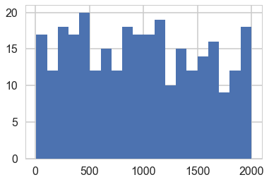


```python
zs=np.empty(300)
for i, mu in enumerate(mus):
    zs[i] = z_scores(mus[i], replicate_post[i,:])
zs
```


    array([ 0.20875485,  0.6016904 ,  1.30960137,  0.78702808,  1.61928975,
            2.72716747,  1.92635271,  0.06241117,  0.93301711,  1.07425741,
            1.2487615 ,  1.16310945,  0.95943601,  0.80353487,  0.93391784,
            1.70004167,  0.09650991,  1.12731801,  0.01417322,  0.02712168,
            1.39434016,  0.77834144,  0.73487566,  1.46121666,  1.3120801 ,
            0.93363934,  0.41220237,  0.46541861,  1.09927987,  1.01407185,
            0.5912949 ,  0.14615846,  0.43049123,  0.60427031,  0.51333796,
            0.06269162,  0.35575461,  0.13648075,  0.07075337,  0.31533356,
            0.62646438,  1.36797655,  1.51295293,  0.75373567,  0.3587438 ,
            0.97089641,  1.24595026,  0.705806  ,  0.73371445,  0.10486241,
            1.29165145,  2.24159285,  0.22603826,  0.98767204,  1.00203528,
            1.62795917,  0.51463461,  1.92874092,  2.33878002,  0.20150074,
            0.54585983,  0.49362192,  1.1776072 ,  0.0998092 ,  1.85516996,
            1.73873001,  1.10442061,  0.94528093,  0.00685128,  0.16762791,
            0.89380005,  0.92498372,  2.66013776,  0.43001692,  0.01887145,
            0.27556404,  1.21043763,  0.00664065,  0.06259851,  0.10718859,
            0.79789518,  0.39236966,  0.18769305,  1.28916629,  0.03402082,
            0.09216981,  0.07075202,  0.68210809,  0.88387212,  0.40234211,
            1.19168411,  0.44753407,  2.07081453,  0.21609071,  0.98654428,
            0.25436728,  0.20371194,  0.14700343,  0.1606457 ,  1.05883812,
            0.67714738,  0.18197943,  0.57752559,  1.34163628,  1.09768093,
            0.06688782,  0.81177843,  0.65437409,  1.10100921,  1.43003988,
            0.24361329,  0.13448844,  0.03061459,  0.31948667,  0.36295879,
            0.65131722,  0.5338194 ,  0.56830677,  1.96553328,  0.82910981,
            0.47197781,  0.17999585,  0.415339  ,  0.66622149,  0.20862327,
            1.63827921,  0.53869752,  0.89706166,  0.05718172,  0.50802267,
            0.85201784,  0.22964725,  0.24619877,  0.89072976,  0.35939367,
            0.0983755 ,  0.54449807,  1.16235277,  0.06288202,  0.0395065 ,
            0.91237329,  0.17301441,  0.15188504,  0.83369612,  0.45482876,
            0.49037451,  1.79006236,  0.43690133,  1.11908655,  2.09209412,
            0.11579875,  0.62858649,  1.7834343 ,  0.87472903,  0.21791388,
            0.27672538,  0.88353047,  1.19541132,  0.79253429,  1.3423345 ,
            0.81820488,  0.42601122,  1.40125068,  1.0798831 ,  0.73333241,
            0.7756078 ,  0.92665724,  1.77770312,  0.95193246,  0.93897834,
            0.42090601,  1.35259294,  1.11255789,  1.66007719,  0.31153483,
            0.5066361 ,  0.37838736,  1.79521268,  0.96432111,  0.51187318,
            0.90052143,  0.19316422,  0.48848618,  0.31839763,  1.0412067 ,
            0.71013068,  0.38763803,  0.92243532,  0.82072053,  0.31276889,
            0.36107007,  0.05373277,  0.96404458,  1.78332887,  0.83191757,
            1.39002052,  0.19324279,  0.80054279,  1.33909815,  1.1280094 ,
            1.3258022 ,  2.14297087,  0.14802282,  0.0532837 ,  0.67471852,
            0.71767772,  1.52585087,  0.68867836,  1.58922037,  1.31577878,
            0.74382568,  2.40009952,  0.56679843,  0.78642716,  0.20372789,
            0.31762528,  0.12118858,  0.30448752,  0.11392841,  0.59999142,
            0.84905492,  0.3126218 ,  2.35455518,  0.75832952,  0.29850165,
            0.77609667,  0.09257672,  0.70504988,  0.51029465,  0.41373034,
            1.52622856,  0.40828562,  0.57369712,  1.61118788,  0.3253966 ,
            0.26536607,  0.59199269,  2.02381439,  2.41717773,  0.20783751,
            0.75954152,  2.23609789,  0.05381934,  1.03857446,  0.15128711,
            0.4205374 ,  0.20824507,  0.23621713,  0.31825574,  0.81370616,
            0.0480646 ,  0.52075214,  1.48752778,  0.1101137 ,  1.41047692,
            1.24667734,  0.26215521,  0.4022564 ,  0.75993891,  0.42946829,
            1.71284736,  1.64781401,  1.16095486,  2.56294249,  1.23681047,
            0.87069596,  0.17116752,  1.13531338,  0.08766663,  0.19648858,
            0.27723119,  0.40023848,  0.54533924,  2.24327419,  1.18696125,
            0.2314685 ,  0.21705051,  0.83111355,  2.3128497 ,  0.54563585,
            1.92711888,  1.37108809,  1.95848512,  0.0328257 ,  0.68839201,
            0.03419648,  0.58140161,  0.39057566,  0.1791572 ,  0.58330552,
            1.12205262,  1.47521508,  0.54123031,  0.194957  ,  1.60156986,
            0.90647313,  0.14091793,  1.14610422,  0.63244525,  0.43186317])


```python
shrinks=np.empty(300)
for i, mu in enumerate(mus):
    shrinks[i] = shrinkages(3, mus[i], replicate_post[i,:])
shrinks
```


    array([ 0.99977506,  0.99896202,  0.99900691,  0.99990726,  0.99797211,
            0.99813254,  0.99961598,  0.9991045 ,  0.99871173,  0.99895253,
            0.9984847 ,  0.99985669,  0.99952059,  0.99988587,  0.99899191,
            0.99941079,  0.99768422,  0.99902108,  0.99925125,  0.99893121,
            0.99973892,  0.99839893,  0.99867078,  0.99989354,  0.99947806,
            0.99866525,  0.99940548,  0.999391  ,  0.99922751,  0.99795002,
            0.99943871,  0.99817535,  0.99834013,  0.99937265,  0.99899361,
            0.99833735,  0.99897109,  0.99816391,  0.99991506,  0.998935  ,
            0.99994518,  0.99923426,  0.99970918,  0.99933279,  0.99976849,
            0.99810943,  0.99742328,  0.99996801,  0.99782177,  0.99866496,
            0.99962818,  0.99799427,  0.99976425,  0.99746803,  0.99951758,
            0.99957197,  0.99740765,  0.99993072,  0.99920324,  0.9982549 ,
            0.99917911,  0.99978575,  0.99804508,  0.99943873,  0.99944222,
            0.99957388,  0.99957655,  0.99975464,  0.99995165,  0.99967886,
            0.99973034,  0.99862781,  0.99847049,  0.99899268,  0.99882597,
            0.99983466,  0.99972088,  0.99975927,  0.99914425,  0.99886315,
            0.99971745,  0.99897043,  0.9998607 ,  0.99923503,  0.99909198,
            0.99844385,  0.99863446,  0.99952735,  0.99954988,  0.99969543,
            0.99884294,  0.99992219,  0.99958101,  0.99945533,  0.99823404,
            0.99998864,  0.99983447,  0.99964773,  0.9985266 ,  0.99933629,
            0.99851382,  0.99894904,  0.9998073 ,  0.99927112,  0.99976369,
            0.99813454,  0.99843751,  0.9993373 ,  0.99995068,  0.99910101,
            0.99927561,  0.99965261,  0.99996983,  0.99976094,  0.99868009,
            0.99775858,  0.99623435,  0.99937242,  0.99821987,  0.999706  ,
            0.9996397 ,  0.99751527,  0.99863857,  0.99913201,  0.99993183,
            0.9985371 ,  0.99789617,  0.99969111,  0.99946761,  0.99839626,
            0.99988724,  0.99797016,  0.999533  ,  0.99937455,  0.99818778,
            0.99933874,  0.99984532,  0.99967278,  0.99979515,  0.99890828,
            0.99994165,  0.99720212,  0.99964609,  0.99994657,  0.99990982,
            0.99895797,  0.9990955 ,  0.99854   ,  0.99931861,  0.99874773,
            0.99764101,  0.99983512,  0.99864291,  0.99987332,  0.99889449,
            0.99869404,  0.99839361,  0.99954914,  0.99958074,  0.99873551,
            0.99879395,  0.99827394,  0.99973792,  0.9976794 ,  0.99765033,
            0.99884994,  0.9976025 ,  0.99909832,  0.99930909,  0.99886186,
            0.99871204,  0.99762024,  0.9994201 ,  0.99800757,  0.99952869,
            0.99853194,  0.99848643,  0.99974908,  0.99930897,  0.99834262,
            0.99962509,  0.99837292,  0.99826715,  0.99927357,  0.99803775,
            0.99898646,  0.99767628,  0.99894606,  0.99967097,  0.99836621,
            0.99960743,  0.99950068,  0.9996865 ,  0.99775952,  0.99874261,
            0.99911063,  0.99972301,  0.99925549,  0.99971507,  0.99840182,
            0.99944096,  0.99909362,  0.99853356,  0.99982637,  0.99889355,
            0.99971078,  0.99996136,  0.99947856,  0.99890129,  0.99900323,
            0.99929062,  0.99921268,  0.99809608,  0.9978801 ,  0.99975814,
            0.99996862,  0.99650213,  0.99904628,  0.99856243,  0.9996639 ,
            0.99997151,  0.99939094,  0.99849445,  0.99934602,  0.99946495,
            0.99819081,  0.9987231 ,  0.99978873,  0.99978931,  0.99939787,
            0.99976264,  0.99975234,  0.99977944,  0.99977032,  0.99872433,
            0.99927031,  0.99945793,  0.99883735,  0.99880764,  0.99914335,
            0.99968435,  0.99783409,  0.99810953,  0.99872469,  0.99769568,
            0.9987453 ,  0.99991734,  0.9992987 ,  0.99965624,  0.99912328,
            0.99872834,  0.99940822,  0.99897567,  0.99840587,  0.99912349,
            0.99834478,  0.99872549,  0.99990934,  0.99765548,  0.9986538 ,
            0.9982166 ,  0.99917476,  0.9997153 ,  0.99946964,  0.99973684,
            0.99930153,  0.99987499,  0.99849411,  0.99824761,  0.9983117 ,
            0.99858787,  0.99963123,  0.99960197,  0.99711376,  0.99936327,
            0.99952705,  0.99891724,  0.99912691,  0.99869404,  0.99895025,
            0.99882399,  0.99825011,  0.99892287,  0.99745931,  0.99953974,
            0.99897533,  0.99799003,  0.99968414,  0.99867478,  0.99811734,
            0.99896973,  0.99928803,  0.99884256,  0.99891604,  0.9995332 ,
            0.9998689 ,  0.99824226,  0.99690782,  0.99966623,  0.99837936])


```python
plt.plot(shrinks, zs, '.');
plt.xlim([0,1]);
```


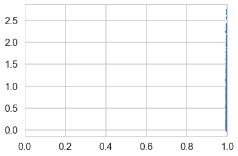


```python
mpo = model_poisson1(obsv=y)
with mpo:
    samples = pm.sample(2000, tune=1000)
posterior = samples.get_values('mu')
```


    Auto-assigning NUTS sampler...
    Initializing NUTS using jitter+adapt_diag...
    Multiprocess sampling (2 chains in 2 jobs)
    NUTS: [mu_log__]
    100%|██████████| 3000/3000 [00:01<00:00, 1696.50it/s]


```python
pm.traceplot(samples)
```


    array([[<matplotlib.axes._subplots.AxesSubplot object at 0x127a5fe48>,
            <matplotlib.axes._subplots.AxesSubplot object at 0x129060dd8>]], dtype=object)


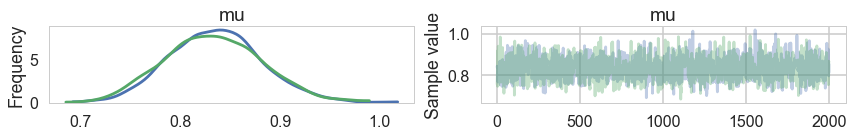


```python
with mpo:
    samples_ppc = pm.sample_ppc(samples)
```


    100%|██████████| 2000/2000 [00:00<00:00, 5438.02it/s]


```python
plt.hist(y,  normed=True, histtype='step', lw=3, label="y");
plt.hist(samples_ppc['obsv'],  normed=True, histtype='step', lw=3, label="pp")
plt.legend();
```


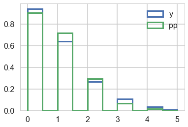


## A second model: 0 inflated poisson

The likelihood that combines the two cases considered above is called the **Zero Inflated poisson**. It has two arguments, the Poisson rate parameter, and the proportion of poisson variates (theta and psi in pymc).


```python
def tinvlogit(x):
    return t.exp(x) / (1 + t.exp(x))
```


```python
with pm.Model() as model2:
    alphalam=pm.Normal("alphalam", 0,10)
    alphap=pm.Normal("alphap", 0,1)
    #regression models with intercept only
    logmu = alphalam
    logitp = alphap
    like = pm.ZeroInflatedPoisson("obsv", theta=t.exp(logmu), psi=tinvlogit(logitp), observed=y)
    lam = pm.Deterministic("lam", t.exp(logmu))
    p = pm.Deterministic("p", tinvlogit(logitp))
```


```python
with model2:
    trace2=pm.sample(3000, tune=1000)
```


    Auto-assigning NUTS sampler...
    Initializing NUTS using jitter+adapt_diag...
    Multiprocess sampling (2 chains in 2 jobs)
    NUTS: [alphap, alphalam]
    100%|██████████| 4000/4000 [00:04<00:00, 814.49it/s]


```python
pm.traceplot(trace2);
```


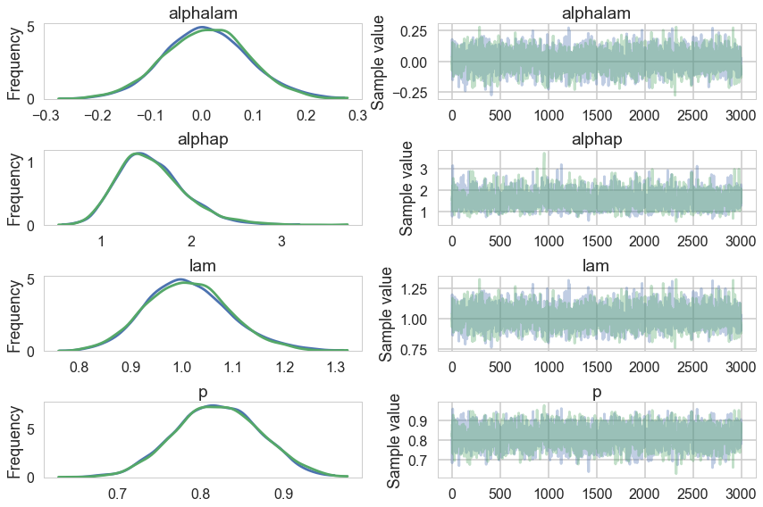


```python
pm.summary(trace2)
```


<div>
<style>
    .dataframe thead tr:only-child th {
        text-align: right;
    }

    .dataframe thead th {
        text-align: left;
    }

    .dataframe tbody tr th {
        vertical-align: top;
    }
</style>
<table border="1" class="dataframe">
  <thead>
    <tr style="text-align: right;">
      <th></th>
      <th>mean</th>
      <th>sd</th>
      <th>mc_error</th>
      <th>hpd_2.5</th>
      <th>hpd_97.5</th>
      <th>n_eff</th>
      <th>Rhat</th>
    </tr>
  </thead>
  <tbody>
    <tr>
      <th>alphalam</th>
      <td>0.008825</td>
      <td>0.080045</td>
      <td>0.001699</td>
      <td>-0.149465</td>
      <td>0.168037</td>
      <td>2226.0</td>
      <td>1.000092</td>
    </tr>
    <tr>
      <th>alphap</th>
      <td>1.560670</td>
      <td>0.371543</td>
      <td>0.008146</td>
      <td>0.911753</td>
      <td>2.296434</td>
      <td>2046.0</td>
      <td>1.000071</td>
    </tr>
    <tr>
      <th>lam</th>
      <td>1.012106</td>
      <td>0.081300</td>
      <td>0.001713</td>
      <td>0.845978</td>
      <td>1.166795</td>
      <td>2234.0</td>
      <td>1.000102</td>
    </tr>
    <tr>
      <th>p</th>
      <td>0.820273</td>
      <td>0.050259</td>
      <td>0.001066</td>
      <td>0.723801</td>
      <td>0.917328</td>
      <td>2257.0</td>
      <td>0.999963</td>
    </tr>
  </tbody>
</table>
</div>


